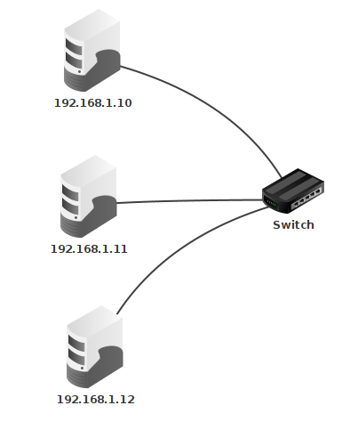
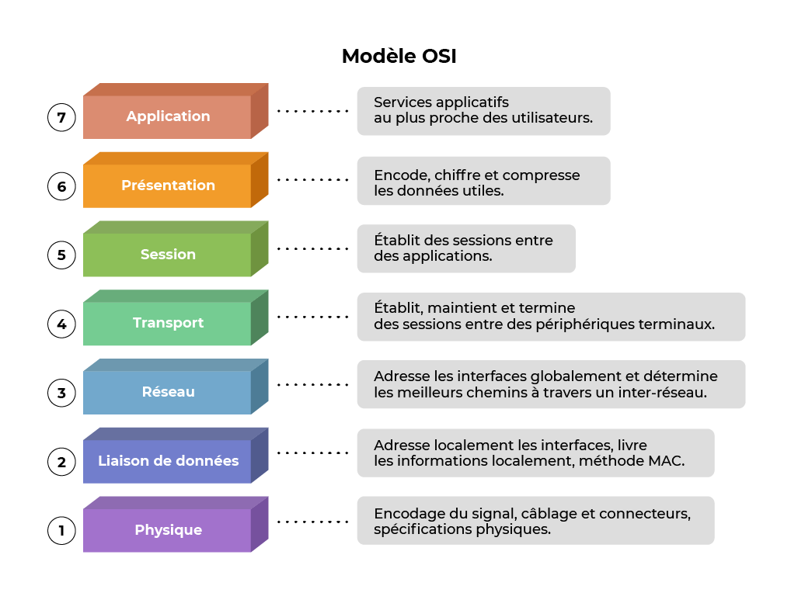
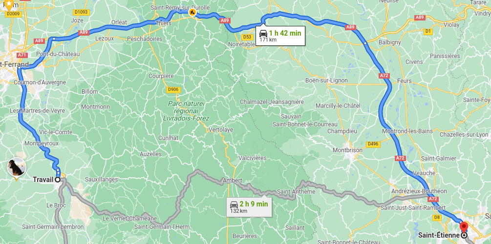

---
title : Thème 3 - Architecture matérielle
subtitle: Protocole de routage
subsubtitle: Terminale NSI
author : M.Meyroneinc-Condy
numbersections: true
fontsize: 10pt
geometry:
- top=20mm
- left=20mm
- right=20mm
- heightrounded    
--- 

Thème 3 - Architecture matérielle
===

<br>
<table  class="redTable">
        <tr >
            <th width="20%"; style="background-color: #3B444B;color:white;text-align:center;border:none;font-size:40pt;">
            06
            </th>
            <th class="redTh"; width="80%"; style="text-align:center;border:none;font-size:25pt;">Protocole de Routage</th>
        </tr>
</table>

!!! progNSI "Programme Terminale"

    |Contenus|Capacités attendues|Commentaires|
    |:---:|:---:|:---:|
    |Protocole de routage| Identifier, suivant le protocole de routage utilisé, la route empruntée par un paquet. | En mode débranché, les tables de routage étant données, on se réfère au nombre de sauts (protocole RIP) ou au coût des routes (protocole OSPF) |
    |  |  | Le lien avec les algorihtmes de recherche de chemion sur un graphe est mis en évidence. |


{{ initexo(0) }}


{:.center}

## Résumé des épisodes précédents


{{ titre_activite("Adresse IP, masque",[],0) }}

!!! rappel
    - Deux machines ne peuvent communiquer que si elles sont sur le même réseau, c'est à dire que leurs adresses {{sc("ip")}} démarre par une partie commune. La longueur de cette partie commune est définie par le **masque de sous réseau**.  
    - Pour la connaître, on écrit le masque de sous réseau en binaire. Le nombre de 1 en début de masque donne la longueur de la partie commune dans les adresses IP.  
    - Par exemple  le masque {{sc("255.255.254.0")}}  donne en écriture binaire `11111111.11111111.111111110.00000000`. La partie commune doit donc être de 23 bits car cette écriture débute par 23 fois le chiffre `1`. Un masque de 23 bits peut se noter de façon plus concise `/23` (notation {{sc("cidr")}}). Pour savoir si deux machines de ce réseau peuvent communiquer on écrit leurs adresses IP en binaire et on regarde si les 23 premiers bits sont identiques ou non.

!!! rappel
    L'adresse du réseau s'obtient en réalisant un *et* logique entre l'adresse IP d'un ordinateur du réseau et le masque de sous réseau.

1. Lancer [Filius](https://www.lernsoftware-filius.de/), un outil de simulation de réseaux, et créer un simple réseau constitué de deux ordinateurs. Dans chacun des cas suivants, prévoir si les deux ordinateurs peuvent communiquer et le vérifier à l'aide d'une commande `ping`
    
    | IP ordinateur 1 | Masque Ordinateur 1 | IP ordinateur 2 | Masque ordinateur 2|
    |-----------------|---------------------|-----------------|--------------------|
    | 203.147.154.100 | 255.255.255.192     | 203.147.154.119 |  255.255.255.192   |
    | 203.147.154.100 | 255.255.255.192     | 203.147.154.129 |  255.255.255.192   |
    | 172.19.247.15   | 255.255.240.0       | 172.19.230.150  |  255.255.240.0     |
    | 172.19.247.15   | 255.255.240.0       | 172.19.248.118  |  255.255.240.0     | 

!!! aide
    En cas de difficultés pour utiliser Filius, faire la [première activité du cours de première](https://nsimeyroneinc.github.io/siteNSI1ere/Archi_Materielle/TD13_Reseaux/#programme-officiel){target=_blank}.

2. Un *switch* sert à connecter plusieurs ordinateurs d'un même sous réseau, ainsi chez un particulier, une box internet joue le rôle de switch et permet de connecter les divers appareils de la maison (téléphone, ordinateur, imprimante, ...). Connecter trois ordinateurs au même sous réseau comme ci-dessous et vérifier à l'aide de la commande `ping` qu'ils peuvent communiquer.  

{:.center width=200px}

3. Un *routeur* permet d'interconnecter plusieurs sous réseau. Réaliser dans filius le réseau ci-dessous (le routeur a deux interfaces). Attribuer les mêmes adresses {{sc("ip")}} que sur le schéma et remarquer bien que les ordinateurs de droite et de gauche ne font pas partie du même sous réseau. C'est le routeur qui permet leur interconnection, pour cela il faut indiquer pour chaque machine du réseau de gauche l'adresse du routeur dans le champ passerelle et faire de même, pour chaque machine du sous réseau de droite.  

{:.center width=460px }

!!! aide
    En cas de difficultés, se référer à la vidéo suivante :
    <div class="centre">
    <iframe width="560" height="315" src="https://www.youtube.com/embed/xyK6ThdQeR0" title="YouTube video player" frameborder="0" allow="accelerometer; autoplay; clipboard-write; encrypted-media; gyroscope; picture-in-picture" allowfullscreen></iframe>
    </div>


## Protocoles de routage

{{ titre_activite("Protocoles de routage",[]) }}

On peut assimiler un réseau à un graphe, les noeuds sont les routeurs et les arcs les liaisons entre ces routeurs. Par exemple :  

<div class="centre">
```mermaid
    graph TD
        A(("A"))
        B(("B"))
        C(("C"))
        D(("D"))
        E(("E"))
        A --- B
        A --- E
        B --- E
        B --- D
        C --- E
        C --- D
```
</div>

Dans cet exemple, plusieurs chemins permettent de relier `A` à `C`. Un *protocole de routage* est un mécanisme permettant de choisir l'un de ces chemins. Pour mettre en place un protocole de routage, chaque routeur doit être doté d'une *table de routage* qui indique le routeur suivant selon la destination du paquet.

1.  Le protocole {{sc("rip")}} : **R**outing **I**nformation **P**rotocol

    1.  Sachant que dans ce protocole, on tente de minimiser le  nombre de routeurs traversés, quel serait les chemins empruntés pour :

        1.  relier `A` et `E` ?
        2.  relier `A` et `C` ?
        3.  relier `E` et `D` ?

    2.  De plus dans ce protocole, à l'initialisation, la table de routage de chaque routeur ne contient que ses voisins immédiats associés à une distance de 1. Par exemple la table de routage de `A` est :

        | Destination | Distance |
        |:-------------:|:----------:|
        | B | 1 |
        | E | 1 |

        et celle de `B` est :

        | Destination | Distance |
        |:-------------:|:----------:|
        | A | 1 |
        | D | 1 |
        | E | 1 |


        Donner à l'initialisation, les tables de routages des autres routeurs : `C`, `D` et `E`.
    
    3. Les tables de routages sont mises à jour à intervalles réguliers, en effet chaque routeur consulte la table de routage de ses voisins et met la sienne à jour en conséquence. Par exemple, `A` reçoit la table de routage de `B`, il y trouve `D` qui ne figure pas encore dans sa table et le rajoute donc en augmentant sa distance de 1. La table de `A` devient donc :

        | Destination | Distance |
        |:-------------:|:----------:|
        | B | 1 |
        | E | 1 |
        | D (via B) | 2 |
        
        Le routeur `E` figure déjà dans la table avec une distance plus courte, il n'est pas mis à jour.
        Construire la table de routage de `B` après la première mise à jour.

2.  Le protocole {{sc("ospf")}}  
    La qualité des liaisons entre différents routeurs dépend du type de connection, on peut donc représenter un réseau par un graphe pondéré. Dans l'exemple suivant, la qualité de la liason entre `A` et `E` (poids 1) est bien meilleure que celle entre `A` et `B` (poids 5) 
    <div class="centre">
                ```mermaid
                graph TD
                A(("A"))
                B(("B"))
                C(("C"))
                D(("D"))
                E(("E"))
                A-- 5 ---B
                A-- 1 --- E
                B-- 2 --- E
                B-- 2 --- D
                C-- 1 --- E
                C-- 4 --- D
                ```
    </div>

    1.  Sachant que dans ce protocole, on tente de minimiser le poids du chemin parcouru, quel serait les chemins empruntés pour :

        1.  relier `A` et `E` ?
        2.  relier `A` et `C` ?
        3.  relier `E` et `D` ?


## COURS - Protocoles de Routage


!!! histoire "Quelques dates clés de l'historique d'internet"
	- Début des années 1960 : idée de la création d'un réseau informatique global permettant d'interconnecter de multiples sous-réseaux.  
    - Début des années 1970 : naissance d'_arpanet_, ancêtre d'internet.  
    - 1973 : définition des protocoles _tcp_ (Transmission Control Protol) et ip (Internet Protocol)  
    - 1983 : premier serveur de noms de domaines (_dns_ pour domain name server)  
    - 1989 : Naissance du _web_  
    - 2010 : Plus de 5 milliards de machines connectés.

### Protocole TCP/IP

!!! voc "Protocoles TCP/IP"
	Internet fonctionne suivant une architecture réseau en 4 couches :  

	| Modéle en 4 couches| | 
    |:---:|:---|
	| Application | http, pop, ftp ...|
    | Transport   | tcp, udp   |
    | Réseau      | ipv4, ipv6 |
    | Liaison     | Ethernet, wifi|


- Chaque couche  ne communique qu'avec les couches voisines.   
- Chaque couche ajoute les données dont il a besoin pour fonctionner à l'information transmise. C'est ce qu'on appelle l'**encapsulation** des données.  
- Un autre modèle en 7 couches existe : le modèle **osi**.  

{:.center width=50%}


### Adresses MAC et IP

!!! savoir "Adresse MAC (_Media Access Control_)"
    Une adresse matérielle, ou **adresse MAC**, parfois nommée adresse physique, est un identifiant physique stocké dans une carte réseau ou une interface réseau similaire (Wifi par exemple). À moins qu’elle n’ait été modifiée par l’utilisateur, elle est unique au monde.  
    Elle constitue la couche inférieure de la couche de liaison, c'est-à-dire la couche deux du modèle OSI. Elle est constituée de six octets, il existe donc potentiellement $2^{48}$ (environ 281 000 milliards) d'adresses MAC possibles.

- On considère un réseau local, de deux ordinateurs (reliés par un simple cable) ou de plusieurs ordinateurs (reliés par un _switch_)  
- Les adresses **MAC** (pour _Media Access Control_)  permettent d'identifier de façon unique un élément du réseau. Elle sont composées de six nombres en hexadécimal séparé par le caractère deux points :, par exemple 1A:B2:EC:AE:B0:DE.  
- Le protocole **ARP** permet d'associer l'adresse**MAC** à l'adresse **IP**.  
- Une commande **ping** entre deux de ces machines, commence donc par un appel au protocole **ARP** afin d'obtenir l'adresse **MAC** de la machine cible.  


!!! savoir "Adresse IP"
    Une **adresse IP (Internet Protocol)** est un numéro d'identification qui est attribué de façon permanente ou provisoire à chaque périphérique relié à un réseau informatique qui utilise l'Internet Protocol. L'adresse IP est à la base du système d'acheminement (le routage) des paquets de données sur Internet.

Deux machines ne peuvent communiquer que si elles sont sur le même réseau, c'est à dire que leur adresse IP débute par une partie commune. La longueur de cette partie commune dépend du masque de sous réseau.  

- Par exemple si le masque de sous réseau est `255.255.255.0`, cela signifie que les trois premiers octets de l'adresse IP doivent être communs.  
- Un masque de sous réseau se note aussi en notation **CIDR** (pour Classless Inter-Domain Routing) en indiquant simplement le nombre de bits communs. Comme 3 octects = 24 bits, Le masque précédent se note donc plus simplement `/24`.  
-  Si le masque de sous réseau est {\tt 255.255.255.0}, le nombre maximal de machines sur le réseau est de 254 (parmi les 256 possibilités, deux sont réservées. L'une pour le **_broadcast_** (envoi à tout le réseau) et l'autre pour le sous-réseau lui-même.

!!! example "Exemple : "
	On considère trois machines : A (`192.168.130.10`), B (`192.168.155.100`) et C (`192.168.144.203`) et on suppose qu'on a défini pour ces machines le masque de sous réseau `255.255.240.0`  

    - Donner ce masque de sous réseau en notation **CIDR**.

    ??? check "Réponse"
        On convertit 240 en binaire : $(240)_{10} = (11110000)_2$, il y a donc 20 bits (8+8+4) en commun le masque est donc `/20`.}
	
    - Indiquer les machines qui peuvent communiquer entre elles.  

    ??? check "Réponse"
        Le problème porte sur le troisième octet, les adresses IP doivent avoir leur 4 premier octet communs pour pouvoir communiquer :  

        - A : `192.168.130.10`, or $(130)_{10} = (100000010)_2$  
        - B : `192.168.155.100`, or $(155)_{10} = (10011011)_2$  
        - C : `192.168.144.203`, or $(144)_{10} = (10010000)_2$  

		B et C peuvent communiquer entre elles mais pas avec A.  

	- Confirmer éventuellement par un test dans Filius


### Les Routeurs  

!!! savoir "Routeurs"
    Les routeurs permettent de faire communiquer des ordinateurs appartenant à des sous réseaux différents.  

	- A titre d'exemple une _box internet_ dans une maison joue le rôle de switch (elle permet aux différents ordinateurs du foyer de communiquer entre eux) mais aussi de routeur (elle permet de communiquer avec des ordinateurs hors de la maison).  
    - Les _tables de routage_ sont des informations stockés localement dans chaque routeur et lui permettant d'orienter les paquets qu'ils reçoit vers un autre routeur ou un sous réseau avec lequel il communique.

### Protocoles de routages

#### Comment sont construites les tables de routage ?  


!!! savoir "Protocoles de routage"
	- Pour des réseaux de petites tailles, les tables de routage peuvent être écrites "à la main".  
    - Les inconvénients sont nombreux car les tables sont alors statiques et ne s'adaptent pas (par exemple lors d'une panne ou de l'ajout de nouveaux éléments au réseau).  
    -  Des protocoles de routage permettant de générer de façon automatique les tables de routage ont donc été mis au point, nous allons en présenter deux :  
        - Le protocole de routage **RIP** (Routing Information Protocol) transmet les paquets de proche en proche en essayant de minimiser le nombre de routeurs traversé.  
        - Le protocole de routage **OSPF** (Open Shortest Path First) transmet les paquets en tenant compte de la vitesse de connection entre les routeurs
			      
   

## Le protocole RIP 


!!! savoir "Le protocole RIP :" 

	- A l'origine les routeurs ne connaissent que les réseaux auxquels ils sont directement connectés  
    - Puis régulièrement (toutes les 30 secondes), chaque routeur reçoit la table de routage de ses voisins et il met alors à jour sa propre table :  
        - S'il y découvre une route vers un réseau inconnu, il l'ajoute à sa propre table en augmentant de 1 la distance.  
        - S'il y découvre une route vers un réseau connu mais plus courte, il met à jour sa table.
	- Si un routeur ne reçoit pas d'information d'un voisin figurant dans sa table (pendant 3 min), il considère celui ci comme en panne (et lui affecte la distance maximale de 16).
	


!!! remarque "Remarques et incovénients :"

    - L'échange régulier des tables de routage augmente la quantité d'information qui circule sur le réseau  
    - Le protocole se limite au réseau de petites tailles car un distance maximale de 15 sauts est imposée (ceci explique que 16 soit considéré comme la distance infinie).  
    - Chaque routeur n'a jamais connaissance de la topologie du réseau tout entier : il ne le connaît que par ce que les autres routeurs lui ont raconté. On dit que ce protocole de routage est du _routing by rumor_.  
    - Le protocole se base uniquement sur le nombre de sauts et pas sur la qualité de la liaison entre deux routeurs qui peut être très différentes :  

    | Technologie  | BP descendante     | BP montante     |
    |:---|:---|:---|
    | Bluetooth     | 3 Mbit/s               | 3 Mbit/s               |
	| Ethernet      | 10 Mbit/s              | 10 Mbit/s              |
	| Wi-Fi         | 10 Mbit/s ~ 10 Gbits/s | 10 Mbit/s ~ 10 Gbits/s |
	| ADSL          | 13 Mbit/s              | 1 Mbit/s               |
	| 4G            | 100 Mbit/s             | 50 Mbit/s              |
	| Satellite     | 50 Mbit/s              | 1 Mbit/s               |
	| Fast Ethernet | 100 Mbit/s             | 100 Mbit/s             |
	| FFTH (fibre)  | 10 Gbit/s              | 10 Gbit/s              |
	| 5G            | 20 Gbit/s              | 10 Gbit/s              |
	


- La _métrique_ utilisée (le nombre de sauts) ne tient pas compte de la qualité de la liaison, contrairement au protocole OSPF.    

En voiture, le chemin le plus rapide n'est pas forcément le plus court.

{:.center}

_En gris, le chemin RIP. En bleu, l'OSPF._


## Le protocole OSPF


!!! voc "OSPF : Open Shortest Path First"
    On commence par attribuer un coût **_inversement proportionnel à la qualité de la connection_** à chaque liaison.  

    - Cette formule qui calcule le coût $c$ d'une liaison ayant un débit $d$ (en bit/s) peut être par exemple :  
    - $c = \dfrac{10^8}{d}$. Mais elle peut-être différente et sera donné à chaque exercice.  
    - On transforme donc le réseau en un **graphe pondéré** (plus tard) dans lequel on doit rechercher le plus court chemin entre deux sommets.  
    - Dans les cas simples de petits graphes, la réponse est intuitive.  
    - Sinon, on dispose d'un algorithme permettant de répondre à ce problème : l'algorithme de **_Dijkstra_** (informaticien néerlandais, 1930--2002).
	


### Exemple

Reprenons le réseau suivant :

{:.center}

et simplifions-le en ne gardant que les liens entre routeurs, en indiquant leur débit :

```mermaid
graph LR
O(("Ordinateur"))
R1(("R1"))
R3(("R3"))
R2(("R2"))
R4(("R4"))
S(("Serveur 10.7.3.8"))
O-- 25 Mbit/s ---R1 
R1-- 20 Mbit/s ---R3
R1-- 50 Mbit/s ---R2
R2-- 50 Mbit/s ---R4
R4-- 10 Mbit/s ---S
R3-- 10 Mbit/s ---S
```


Notre réseau est devenu un **graphe**. Nous allons pondérer ses arêtes avec la fonction coût introduite précédemment. L'unité étant le Mbit/s, l'arête entre R1 et R3 aura un poids de 100/20=5.

Le graphe pondéré est donc :

```mermaid
graph LR
O(("Ordinateur"))
R1(("R1"))
R3(("R3"))
R2(("R2"))
R4(("R4"))
S(("Serveur 10.7.3.8"))
O-- 4 ---R1 
R1-- 5 ---R3
R1-- 2 ---R2
R2-- 2 ---R4
R4-- 10 ---S
R3-- 10 ---S
```

Le chemin le plus rapide pour aller de l'ordinateur au serveur est donc R1-R2-R4, et non plus R1-R3 comme l'aurait indiqué le protocole RIP.

### Trouver le plus court chemin dans un graphe pondéré


Utilisation de **l'algorithme de Dijkstra**, pour le comprendre, vous pouvez regarder la vidéo d'un célèbre YouTuber :

??? video "Algorithme de Dijstra"
    <iframe width="913" height="522" src="https://www.youtube.com/embed/rHylCtXtdNs" title="Utiliser l'algorithme de Dijkstra - PostBac" frameborder="0" allow="accelerometer; autoplay; clipboard-write; encrypted-media; gyroscope; picture-in-picture" allowfullscreen></iframe>


{:.center}</a>

Cet algorithme, ici exécuté de manière manuelle, est bien sûr programmable. Et c'est donc grâce à lui que chaque routeur calcule la route la plus rapide pour acheminer les données qu'il reçoit.

**Exemple** d'application de l'algorithme de Dijkstra : donner le plus court chemin de A jusqu'à F

```mermaid
graph LR
A(("A"))
B(("B"))
C(("C"))
D(("D"))
E(("E"))
F(("F"))
A-- 1 ---C 
A-- 5 ---B
B-- 3 ---C
B-- 4 ---D
C-- 7 ---F
B-- 2 ---E
C-- 5 ---E
D-- 3 ---F
E-- 1 ---F
```

??? check "Réponse"
    {:.center}

{:.center}

Donner le plus court chemin pour aller de A à H.
