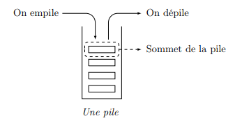
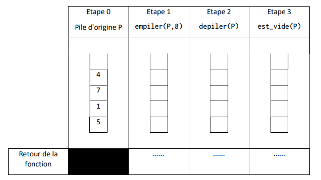
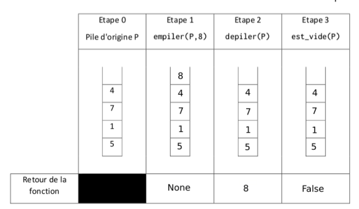
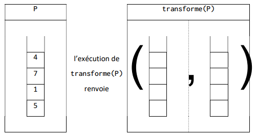
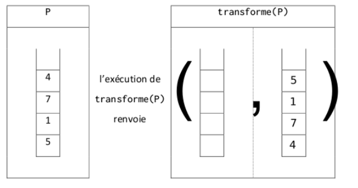
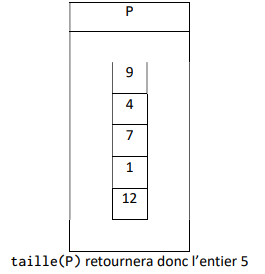
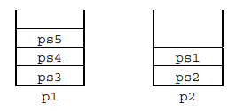
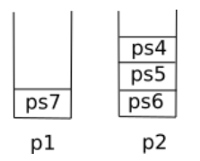
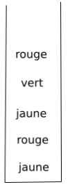
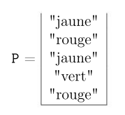







{{ titre_chapitre(num,titre,theme,niveau)}}

{{ initexo(0) }}

{{ aff_cours(num) }}

# Exercices sur les piles - Sujet BAC

## Sujet zéro

!!! exo 
    

**Cet exercice porte sur la notion de pile et sur la programmation de base en Python.**  

On rappelle qu’une pile est une structure de données abstraite fondée sur le principe « dernier arrivé, premier
sorti » :



On munit la structure de données Pile de quatre fonctions primitives définies dans le tableau ci-dessous. :  

**Structure de données abstraite : Pile**  
___
Utilise : Éléments, Booléen
***

Opérations :  

- **creer_pile_vide** : ∅ → Pile  
    creer_pile_vide() renvoie une pile vide
- **est_vide** : Pile → Booléen   
    est_vide(pile) renvoie True si pile est vide, False sinon
- **empiler** : Pile, Élément → Rien  
    empiler(pile, element) ajoute element au sommet de la pile
- **depiler** : Pile → Élément  
    depiler(pile) renvoie l’élément au sommet de la pile en le retirant de la pile
    
***

!!! question "Question 1 :"
    On suppose dans cette question que le contenu de la pile P est le suivant (les éléments étant empilés par le haut) :

    {:.center}

    Quel sera le contenu de la pile Q après exécution de la suite d’instructions suivante ?  

    ```python
    1  Q = creer_pile_vide ()
    2    while not est_vide ( P ):
    3       empiler (Q , depiler ( P ))
    ```
??? solution "Réponse" 
    {:.center}


!!! question "Question 2 :"

    1. On appelle hauteur d’une pile le nombre d’éléments qu’elle contient. La fonction hauteur_pile prend en paramètre une pile P et renvoie sa hauteur. Après appel de cette fonction, la pile P doit avoir retrouvé son état d’origine.   
    *Exemple :* si P est la pile de la question 1 : `hauteur_pile(P) = 4`.  
    Recopier et compléter sur votre copie le programme Python suivant implémentant la fonction `hauteur_pile` en remplaçant les ??? par les bonnes instructions.

    ```python linenums="1" 
    def hauteur_pile ( P ):
       Q = creer_pile_vide ()
       n = 0
       while not ( est_vide ( P )):
            ???
            x = depiler (P )
            empiler (Q ,x )
        while not ( est_vide ( Q )):
            ???
            empiler (P , x )
        return ???
    ```
    2. Créer une fonction `max_pile` ayant pour paramètres une pile P et un entier i. Cette fonction renvoie la position j de l’élément maximum parmi les i derniers éléments empilés de la pile P.  
    Après appel de cette fonction, la pile P devra avoir retrouvé son état d’origine. La position du sommet de la pile est 1.  
    Exemple : si P est la pile de la question 1 : `max_pile(P, 2) = 1`
    
??? solution "Réponse" 
    1.  

    ```python linenums="1"
    def hauteur_pile(P):
        Q=creer_pile_vide()
        n=0
        while not est_vide(P):
            n+=1
            x=depiler(P)
            empiler(Q,x)
        while not est_vide(Q):
            x=depiler(Q)
            empiler(P,x)
        return n
    ```

    **Explication**  
        
    ```python
    Q=creer_pile_vide()
    n=0
    ```
    On initialise Q est vide et n = 0

    ```python
    while not est_vide(P):
        n+=1
        x=depiler(P)
        empiler(Q,x)
    ```
    {:.center}

    Maintenant il faut remettre la pile P à l’état initial, d’où la deuxième partie du programme :  

    ```python
    while not est_vide(Q):
        x=depiler(Q)
        empiler(P,x)
    ```

??? solution "Réponse" 
    ```python
    def max_pile(P,i):
        # si la pile comporte moins de i élément ou que i=0 on renvoie 0
        if i > hauteur_pile(P) or i==0:
            return 0
        maxi = depiler(P)
        Q = creer_pile_vide()
        empiler(Q,maxi)
        j = 1
        indice = 1
        while j < i:
            j = j + 1
            x = depiler(P)
            if x > maxi:
                maxi = x
                indice = j
            empiler(Q,x)
        while not est_vide(Q):
            empiler(P, depiler(Q))
        return indice
    ```

!!! question "Question 3 :"
    Créer une fonction `retourner` ayant pour paramètres une pile P et un entier j. Cette fonction inverse l’ordre des j derniers éléments empilés et ne renvoie rien. On pourra utiliser deux piles auxiliaires.  
    Exemple : si P est la pile de laquestion 1(a), après l’appel de retourner(P, 3), l’état de la pile P
    sera :

    {:.center}
    
??? solution "Réponse" 
    ```python
    def retourner(P,j):
        Q1 = creer_pile_vide()
        Q2 = creer_pile_vide()
        i = 0
        while not est_vide(P) and i < j:
            i = i + 1
            x = depiler(P)
            empiler(Q1, x)
        while not est_vide(Q1):
            x = depiler(Q1)
            empiler(Q2, x)
        while not est_vide(Q2):
            x = depiler(Q2)
            empiler(P, x)
    ```

!!! question "Question 4 :"
    L’**objectif** de cette question est **de trier une pile de crêpes**.  
    On modélise une pile de crêpes par une pile d’entiers représentant le diamètre de chaque crêpe. On
    souhaite réordonner les crêpes de la plus grande (placée en bas de la pile) à la plus petite (placée en haut de la pile).  
    On dispose uniquement d’une spatule que l’on peut insérer dans la pile de crêpes de façon à retourner l’ensemble des crêpes qui lui sont au-dessus.  
    Le principe est le suivant :  

    - On recherche la plus grande crêpe.
    - On retourne la pile à partir de cette crêpe de façon à mettre cette plus grande crêpe tout en haut de la pile.
    - On retourne l’ensemble de la pile de façon à ce que cette plus grande crêpe se retrouve tout en bas.
    - La plus grande crêpe étant à sa place, on recommence le principe avec le reste de la pile

    **Exemple :**  

    {:.center}

    Créer la fonction `tri_crepes` ayant pour paramètre une pile P. Cette fonction trie la pile P selon la méthode du tri crêpes et ne renvoie rien.  
    On utilisera les fonctions créées dans les questions précédentes.

    **Exemple :**  

    Si la pile P est  après l’appel de `tri_crepes(P)`, la pile P devient 

??? solution "Réponse" 
    ```python
    def tri_crepes(P):
        N = hauteur_pile(P)
        i = N
        while i > 1:
            j = max_pile(P,i)
            retourner(P,j)
            retourner(P,i)
            i -= 1
    ```

## Sujet Métropole 7 Juin 2021 - Exercice 2
    
!!! exo

**Cet exercice traite des notions de piles et de programmation orientée objet.**  

On crée une classe Pile qui modélise la structure d'une pile d'entiers.  

Le constructeur de la classe initialise une pile vide.  

La définition de cette classe sans l’implémentation de ses méthodes est donnée ci-dessous.

```python
class Pile:
    def __init__(self):
        """Initialise la pile comme une pile vide."""
        
    def est_vide(self):
        """Renvoie True si la liste est vide, False sinon."""
        
    def empiler(self, e):
        """Ajoute l'élément e sur le sommet de la pile, ne renvoie rien."""
        
    def depiler(self):
        """Retire l’élément au sommet de la pile et le renvoie."""
        
    def nb_elements(self):
        """Renvoie le nombre d'éléments de la pile. """
        
    def afficher(self):
        """Affiche de gauche à droite les éléments de la pile, du fond
        de la pile vers son sommet. Le sommet est alors l’élément
        affiché le plus à droite. Les éléments sont séparés par une
        virgule. Si la pile est vide la méthode affiche « pile
        vide »."""
        
```        

Seules les méthodes de la classe ci-dessus doivent être utilisées pour manipuler les objets
Pile. 

!!! question "Question 1.a"
    Écrire une suite d’instructions permettant de créer une instance de la classe Pile affectée à une variable `pile1` contenant les éléments 7, 5 et 2 insérés dans cet ordre.  
    Ainsi, à l’issue de ces instructions, l’instruction `pile1.afficher()` produit l’affichage : 7, 5, 2. 
    
??? solution "Réponse" 
    ```python
    pile1 = Pile()
    pile1.empiler(7)
    pile1.empiler(5)
    pile1.empiler(2)
    ```

!!! question "Question 1.b"
    Donner l’affichage produit après l’exécution des instructions suivantes.
    ```python
    element1 = pile1.depiler()
    pile1.empiler(5)
    pile1.empiler(element1)
    pile1.afficher()
    ```
    
??? solution "Réponse" 
    7,5,5,2

!!! question "Question 2."
    On donne la fonction mystere suivante :  

    ```python
    def mystere(pile, element):
        pile2 = Pile()
        nb_elements = pile.nb_elements()
        for i in range(nb_elements):
            elem = pile.depiler()
            pile2.empiler(elem)
            if elem == element:
                return pile2
        return pile2 
    ```

    a. Dans chacun des quatre cas suivants, quel est l’affichage obtenu dans la console ?  

    - Cas n°1  
    ```python
    >>>pile.afficher()
    7, 5, 2, 3
    >>>mystere(pile, 2).afficher()
    ```
    - Cas n°2  
    ```python
    >>>pile.afficher()
    7, 5, 2, 3
    >>>mystere(pile, 9).afficher()
    ```

    - Cas n°3  
    ```python
    >>>pile.afficher()
    7, 5, 2, 3
    >>>mystere(pile, 3).afficher()
    ```

    - Cas n°4 
    ```python
    >>>pile.est_vide()
    True
    >>>mystere(pile, 3).afficher() 
    ```


    b. Expliquer ce que permet d’obtenir la fonction `mystere`.

??? solution "Réponse" 
    **a)**  

    - cas n°1 : 3, 2
        
    - cas n°2 : 3, 2, 5, 7
        
    - cas n°3 : 3

    - cas n°4 : pile vide

    **b)**  

    La fonction mystere renvoie une pile qui contiendra tous les éléments de la pile passée en paramètre (pile) à condition qu’ils soient situés au-dessus de l’élément passé en paramètre (element). L’élément element sera lui aussi présent dans la pile renvoyée par la fonction.

!!! question "Question 3."
    Écrire une fonction `etendre(pile1, pile2)` qui prend en arguments deux objets Pile appelés pile1 et pile2 et qui modifie pile1 en lui ajoutant les éléments de pile2 rangés dans l'ordre inverse. Cette fonction ne renvoie rien.  
    On donne ci-dessous les résultats attendus pour certaines instructions.

    ```python
    >>>pile1.afficher()
    7, 5, 2, 3
    >>>pile2.afficher()
    1, 3, 4
    >>>etendre(pile1, pile2)
    >>>pile1.afficher()
    7, 5, 2, 3, 4, 3, 1
    >>>pile2.est_vide()
    True 
    ```

  
??? solution "Réponse" 
    ```python
    def etendre(pile1, pile2):
        while not pile2.est_vide():
            x = pile2.depiler()
            pile1.empiler(x)
    ```

!!! question "Question 4."
    Écrire une fonction supprime_toutes_occurences(pile, element) qui prend en arguments un objet Pile appelé pile et un élément element et supprime tous les éléments element de pile.  
    On donne ci-dessous les résultats attendus pour certaines instructions.  

    ```python
    >>>pile.afficher()
    7, 5, 2, 3, 5
    >>>supprime_toutes_occurences (pile, 5)
    >>>pile.afficher()
    7, 2, 3
    ```

??? solution "Réponse" 
    ```python
    def supprime_toutes_occurences(pile, element):
        p2 = Pile()
        while not pile.est_vide():
            x = pile.depiler()
            if x != element:
                p2.empiler(x)
        while not p2.est_vide():
            x = p2.depiler()
            pile.empiler(x)
    ```

## Sujet Centres-Etrangers 2021 - Exercice 5
    
!!! exo 

**Notion abordée : structures de données : les piles.**  

Dans cet exercice, on considère une pile d'entiers positifs. On suppose que les quatre fonctions suivantes ont été programmées préalablement en langage Python :
```python
        empiler(P, e) : ajoute l'élément e sur la pile P ;
        depiler(P) : enlève le sommet de la pile P et retourne la valeur de ce sommet ;
        est_vide(P) : retourne True si la pile est vide et False sinon ;
        creer_pile() : retourne une pile vide.
```

**Dans cet exercice, seule l'utilisation de ces quatre fonctions sur la structure de données pile est autorisée.**

!!! question "Question 1."
    Recopier le schéma ci-dessous et le compléter sur votre copie en exécutant les appels de fonctions donnés. On écrira ce que renvoie la fonction utilisée dans chaque cas, et on indiquera None si la fonction ne retourne aucune valeur. 

    {:.center}
    

??? solution "Réponse" 
    {:.center}


!!! question "Question 2."
    On propose la fonction ci-dessous, qui prend en argument une pile P et renvoie un couple de piles :


    ```python
        def transforme(P) :
            Q = creer_pile()
            while not est_vide(P) :
                v = depile(P)
                empile(Q,v)
            return (P,Q)
    ```

    Recopier et compléter sur votre copie le document ci-dessous 

    {:.center}


??? solution "Réponse" 
    {:.center width = 75%}


!!! question "Question 3."
    Ecrire une fonction en langage Python `maximum(P)` recevant une pile P comme argument et qui renvoie la valeur maximale de cette pile. On ne s’interdit pas qu’après exécution de la fonction, la pile soit vide.  

    On souhaite connaître le nombre d’éléments d’une pile à l’aide de la fonction `taille(P)`
    
    {:.center}

  

??? solution "Réponse" 
    ```python
    def maximum(P):
        m=depiler(P)
        while not est_vide(P):
            v = depiler(P)
            if v > m:
                m = v
        return m
    ```


!!! question "Question 4." 
    a. Proposer une stratégie écrite en langage naturel et/ou expliquée à l’aide de schémas, qui permette de mettre en place une telle fonction.  
    b. Donner le code Python de cette fonction `taille(P)` (on pourra utiliser les cinq fonctions déjà programmées).


??? solution "Réponse" 
    ```python
    def taille(P):
        cmp = 0
        Q = creer_pile()
        while not est_vide(P):
            v = depiler(P)
            empiler(Q,v)
            cmp = cmp + 1
        while not est_vide(Q):
            v = depiler(Q)
            empiler(P,v)
        return cmp
    ```


## Métropole Juin 2021 - Sujet 2

!!! exo 

**Cet exercice porte sur les structures de données linéaires**  

Une méthode simple pour gérer l'ordonnancement des processus est d'exécuter les processus en une seule fois et dans leur ordre d'arrivée.

!!! question "Question 1"
    Parmi les propositions suivantes, quelle est la structure de données la plus appropriée pour mettre en œuvre le mode FIFO (First In First Out) ?  

    a. liste  
    b. dictionnaire  
    c. pile  
    d. file   

??? solution "Réponse"  
    réponse d une file

!!! question "Question 2"
    On choisit de stocker les données des processus en attente à l'aide d'une liste Python lst.  
    On dispose déjà d'une fonction `retirer(lst)` qui renvoie l'élément `lst[0]` puis le supprime de la liste `lst`.  
    Écrire en Python le code d'une fonction `ajouter(lst, proc)` qui ajoute à la fin de la liste `lst` le nouveau processus en attente `proc`. 
    
??? solution "Réponse"  

    ```python
    def ajouter(lst,proc)
        lst.append(proc)
    ```

On choisit maintenant d'implémenter une file `file` à l'aide d'un couple (`p1,p2)`où `p1` et `p2` sont des piles.  
Ainsi `file[0]` et `file[1]` sont respectivement les piles `p1` et `p2`.  
Pour enfiler un nouvel élément `elt` dans `file`, on l'empile dans `p1`.  
Pour défiler `file`, deux cas se présentent. 

- La pile `p2` n'est pas vide : on dépile `p2`.
- La pile `p2` est vide : on dépile les éléments de `p1` en les empilant dans `p2` jusqu'à ce que `p1` soit vide, puis on dépile `p2`.

{:.center}

!!! question "Question 3"
    On considère la situation représentée ci-dessous.  

    {:.center}

    On exécute la séquence d'instructions suivante :

    ```python
    enfiler(file,ps6)
    defiler(file)
    defiler(file)
    defiler(file)
    enfiler(file,ps7)
    ```


    Représenter le contenu final des deux piles à la suite de ces instructions. 

??? solution "Réponse" 
    {:.center} 

!!! question "Question 4"
    On dispose des fonctions :

    - `empiler(p,elt)` qui empile l'élément `elt` dans la pile `p`,  
    - `depiler(p)` qui renvoie le sommet de la pile `p` si `p` n'est pas vide et le supprime,  
    - `pile_vide(p)` qui renvoie `True` si la pile `p` est vide, `False` si la pile `p` n'est pas vide.   

    a. Écrire en Python une fonction est_`vide(f)` qui prend en argument un couple de piles `f` et qui renvoie `True` si la file représentée par `f` est vide, `False` sinon. 

    b. Écrire en Python une fonction `enfiler(f,elt)` qui prend en arguments un couple de piles `f` et un élément `elt` et qui ajoute `elt` en queue de la file représentée par `f`. 

    c. Écrire en Python une fonction `defiler(f)` qui prend en argument un couple de piles `f` et qui renvoie l'élement en tête de la file représentée par `f` en le retirant. 

??? solution "Réponse" 
    **4.a**  
    ```python  
    def est_vide(f):
        return pile_vide(f[0]) and pile_vide(f[1])
    ```
    **4.b**  
    ```python  
    def enfiler(f,elt):
        empiler(f[0],elt)
    ```
    
    *4.c**
    ```python  
    def defiler(f):
        p1 = f[0]
        p2 = f[1]
        if pile_vide(p2):
            while not pile_vide(p1):
                v = depiler(p1)
                empiler(p2,v)
        return depiler(p2)
    ```


## Amérique du Nord 2021 - Sujet 2 

**Cet exercice porte sur la notion de pile, de file et sur la programmation de base en Python.**

Les interfaces des structures de données abstraites Pile et File sont proposées ci-dessous.

On utilisera uniquement les fonctions ci-dessous :

**Structure de données abstraite : Pile** 
___
Utilise : 

- Éléments, Booléen
***

Opérations :  

- **creer_pile_vide** : ∅ → Pile  
    creer_pile_vide() renvoie une pile vide
- **est_vide** : Pile → Booléen   
    est_vide(pile) renvoie True si pile est vide, False sinon
- **empiler** : Pile, Élément → Rien  
    empiler(pile, element) ajoute element au sommet de la pile
- **depiler** : Pile → Élément  
    depiler(pile) renvoie l’élément au sommet de la pile en le retirant de la pile
    
***

**Structure de données abstraite : File**  
___
Utilise : 

- Éléments, Booléen
***

Opérations :  

- **creer_file_vide** : ∅ → File  
    creer_file_vide() renvoie une file vide
- **est_vide** : File → Booléen   
    est_vide(file) renvoie True si file est vide, False sinon
- **empiler** : File, Élément → Rien  
    empiler(file, element) ajoute element dans la file
- **depiler** : File → Élément  
    depiler(file) renvoie l’élément au sommet de la file en le retirant de la file
    
***

!!! question "Question 1"
    (a) On considère la file F suivante :  

    {:.center}

    Quel sera le contenu de la pile P et de la file F après l’exécution du programme Python suivant ?

    ```python linenums="1"
    P = creer_pile_vide ()
    while not( est_vide (F )):
        empiler (P, defiler (F))
    ```

    (b) Créer une fonction `taille_file` qui prend en paramètre une file `F` et qui renvoie le nombre d’éléments qu’elle contient. Après appel de cette fonction la file `F` doit avoir retrouvé son état d’origine.

    ```python linenums="1"
    def taille_file (F):
        """ File -> Int """
    ```

??? solution "Réponse" 
    1.a**
    

    **1.b**
    ```python
    def taille_file(F):
        t = 0
        ft = creer_file_vide()
        while not est_vide(F):
            t = t + 1
            enfiler(ft, defiler(F))
        while not est_vide(ft):
            enfiler(F, defiler(ft))
        return t   
    ```

!!! question "Question 2"
    Écrire une fonction former_pile qui prend en paramètre une file `F` et qui renvoie une pile `P` contenant les mêmes éléments que la file.  
    Le premier élément sorti de la file devra se trouver au sommet de la pile ; le deuxième élément sorti de la file devra se trouver juste en-dessous du sommet, etc.  
    Exemple :  `former_pile(F)` va renvoyer la pile P ci-dessous :

    

??? solution "Réponse" 
    ```python
    def former_pile(F):
        p = creer_pile_vide()
        pt = creer_pile_vide()
        while not est_vide(F):
            empiler(pt,defiler(F))
        while not est_vide(pt):
            empiler(p,depiler(pt))
        return p
    ```

!!! question "Question 3"
    Écrire une fonction `nb_elements` qui prend en paramètres une file `F` et un élément `elt` et qui renvoie le nombre de fois où `elt` est présent dans la file `F`.    
    Après appel de cette fonction la file `F` doit avoir retrouvé son état d’origine.
    
??? solution "Réponse" 
    ```python
    def nb_elements(F, ele):
        nb = 0
        ft = creer_file_vide()
        while not est_vide(F):
            x = defiler(F)
            if x==ele:
                nb = nb + 1
            enfiler(ft, x)
        while not est_vide(ft):
            enfiler(F, defiler(ft))
        return nb
    ```


!!! question "Question 4"
    Écrire une fonction `verifier_contenu` qui prend en paramètres une file F et trois entiers :  
    `nb_rouge`, `nb_vert` et `nb_jaune`.  
    Cette fonction renvoie le booléen `True` si "rouge" apparaît au plus `nb_rouge` fois dans la file `F`, "vert" apparaît au plus `nb_vert` fois dans la file `F` et "jaune" apparaît au plus `nb_jaune` fois dans la file `F`.  
    Elle renvoie `False` sinon. On pourra utiliser les fonctions précédentes.

??? solution "Réponse" 
    ```python
    def verifier_contenu(F, nb_rouge, nb_vert, nb_jaune):
        return nb_elements(F, "rouge") <= nb_rouge and nb_elements(F,"vert") <= nb_vert and nb_elements(F, "jaune") <= nb_jaune
    ```

    

