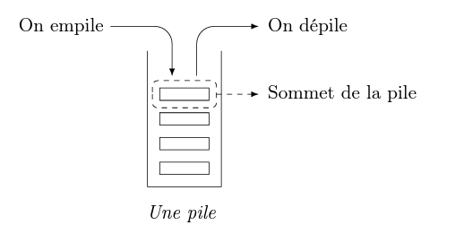
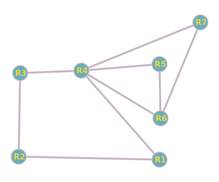
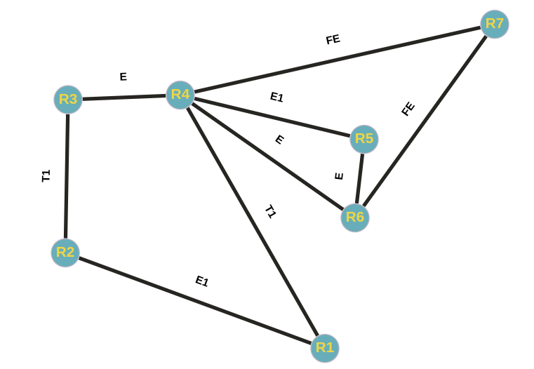
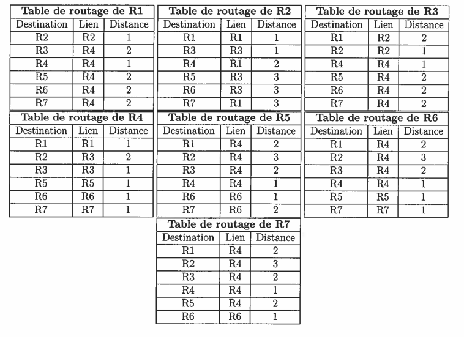

---
title : Thème 
subtitle: Protocole de routage - Pile et File
subsubtitle: Terminale NSI
author : M.Meyroneinc-Condy
numbersections: true
fontsize: 10pt
geometry:
- top=20mm
- left=20mm
- right=20mm
- heightrounded    
--- 

<br>
<table  class="redTable">
        <tr >
            <th width="20%"; style="background-color: #3B444B;color:white;text-align:center;border:none;font-size:40pt;">
            DS
            </th>
            <th class="redTh"; width="80%"; style="text-align:center;border:none;font-size:25pt;">Devoir : Pile -File et Routage</th>
        </tr>
</table>


!!! exo "Pile - File"


On rappelle qu’une pile est une structure de données abstraite fondée sur le principe «dernier arrivé, premier sorti» :  

{:.center width=50%}

On munit la structure de données Pile de quatre fonctions primitives définies dans le tableau ci-dessous :

!!! interface "Structure de données abstraite : Pile"
    Opérations :
    
    - `creer_pile_vide` :  $\varnothing$ $\rightarrow$ Pile
        - `creer_pile_vide()` renvoie une file vide
    - `est_vide` : Pile $\rightarrow$ Booléen
        - `est_vide(pile)` renvoie True si pile est vide, False sinon
    - `empiler` : Pile, Élément $\rightarrow$ Rien
        - `empiler(pile, element)` ajoute element au sommet de la pile
    - `depiler` : Pile $\rightarrow$ Élément
        - `depiler(pile)` renvoie l’élément eau sommet de la pile en le retirant de la pile

1.  On suppose dans cette question que le contenu de la pile P est le suivant  (les élèments étant empilés par le haut) :  

    {:.center}

    Quel serait le contenu de la pile Q aprés l'exécution de la suite d'instruction suivante ?

    ```python
    Q=creer_pile_vide()
    while not est_vide(P):
        empiler(Q, depiler(P))
    ```
   
2.  
    1.   On appelle **hauteur** d’une pile le nombre d’éléments qu’elle contient. La fonction `hauteur_pile` prend en paramètre une pile P et renvoie sa hauteur.  Après appel de cette fonction, la pile P doit avoir retrouvé son état d’origine.
        
        **Exemple :** si P est la pile de la question 1 : `hauteur_pile(P)` = 4.
        
        Recopier et compléter sur votre copie le programme Python suivant implémentant la fonction `hauteur_pile` en remplaçant les ??? par les bonnes instructions.

        ```python
        def hauteur_pile(P):
            Q = creer_pile_vide ()
            n = 0
            while not (est_vide (P)):
                ???
                x = depiler(P)
                empiler(Q,x)
            while not (est_vide(Q)):
                ???
                empiler(P,x)
            return ???
        ```
 
    2.  Créer une fonction `max_pile` ayant pour paramètre une pile P et un entier i. Cette fonction renvoie la position j de l’élément maximum de la pile P.
        
        Après appel de cette fonction, la pile P devra avoir retrouvé son état d’origine.  La position du sommet de la pile est 1.  

        **Exemple :** 
        si P est la pile de la question 1 : `max_pile(P,2)` = 1.


3.   Créer une fonction `retourner` ayant pour paramètres une pile P et un entier j. Cette fonction inverse l’ordre des j derniers éléments empilés et ne renvoie rien. On pourra utiliser deux piles auxiliaires.  

    **Exemple :**  
    si P est la pile de la question 1(a), après l’appel de `retourner(P, 3)`, l’état de la pile P sera :

    

4.  L’objectif de cette question est de trier une pile de crêpes. On modélise une pile de crêpes par une pile d’entiers représentant le diamètre de chaque crêpe. On souhaite réordonner les crêpes de la plus grande (placée en bas de la pile) à la plus petite (placée en haut de la pile).  
    On dispose uniquement d’une spatule que l’on peut insérer dans la pile de crêpes de façon à retourner l’ensemble des crêpes qui lui sont au-dessus.  
    Le principe est le suivant :  
    
    - On recherche la plus grande crêpe.  
    - On retourne la pile à partir de cette crêpe de façon à mettre cette plus grande crêpe tout en haut de la pile.  
    - On retourne l’ensemble de la pile de façon à ce que cette plus grande crêpe se retrouve tout en bas.  
    - La plus grande crêpe étant à sa place, on recommence le principe avec le reste de la pile.

    **Exemple :**  
    

    Créer la fonction `tri_crepes` ayant pour paramètre une pile P. Cette fonction trie la pile P selon la méthode du tri crêpes et ne renvoie rien.  
    
    On utilisera les fonctions créées dans les questions précédentes.   
    
    Exemple : Si la pile P est   ,après l’appel de `tri_crepes(P)`, la pile P devient  .


!!! exo "Routage"

On considère le réseau suivant composé de sept routeurs.

{:.center}

On donne les tables de routage préalablement construites ci-dessous avec le protocole RIP (Routing Information Protocole). Le protocole RIP permet de construire les tables de routage des différents routeurs, en indiquant pour chaque routeur, la distance, en nombr de sauts, qui le sépare d'un autre routeur.  

Voir ANNEXE

1.  Le routeur R2 doit envoyer un paquet de données au routeur R7 qui accuse réception.  
    Déterminer le chemin parcouru par le paquet de données ainsi que celui parcouru par l'éaccusé de réception.  

2.  a.  Indiquer la faiblesse que représente ce réseau en cas de panne du routeur R4.  
    b. Proposer une solution pour y remédier.  

3.  Dans cette question uniquement, on décide de rajouter un routeur R8 qui sera relié aux routeurs R2 et R6.  
    a. Donner la table de routage pour R8 qui minimise le nombre de saut.  
    b. Donner une nouvelle table de routage pour R2.  

4. **Pour la suite de l'exercice on considère le réseau sans le routeur R8**.  
    Il a été décidé de modifier les règles de routage de ce réseau en appliquant le protocole de routage OSPF qui pren en compte la bande passante.  
    Ce protocole attribue un coût à chaque liaison afin de privilégier le choix de certaines routes plus rapide. Plus le coût est faible, plus le lien est intéressant.  
    Le coût d'une liaison est calculé par la formule :  
    $coût=\dfrac{10^8\text{ bit/s}}{\text{ bande passante du lien en bit/s}}$

    Voici le tableau référençant les coûts des liaisons en fonction du type de liaison entre deux routeurs :  

    |Type de laiison| bande passante | Coût|
    |:---:|:---:|:---:|
    |FastEthernet (FE)| ? | 1|
    |Ethernet (E) | 10 Mb/s| ? |
    | (E1)| 2,048 Mb/s|49|
    |(T1)| 1.544 Mb/s| 65|  

    On rappelle que 1 Mb/s = 1 000 kb/s = $10^6$ bit/s.

    1.  Déterminer la bande passante di FastEthernet (FE) et justifier que le coût du réseau de type Ethernet (E) est de 10.  
    2. On précise sur le graphe ci-dessous les types de liaison dans notre réseau :  

    {:.center width=60%}   

    Le coût d'un chemin est la somme des coûts des liaisons rencontrés. Donner en justifiant le chemin le moins coûteux pour relier R2 à R5. Préciser le coût.

ANNEXE :  

{:.center}