<table  style="table-layout: fixed;background-color:#87A96B; border:solid;color:black;width:100%;">
        <tr>
            <th style="background-color: #3B444B;color:white;text-align:center;border:none;font-size:12pt;">
            Thème 3 : Architecture matérielle
            </th>
        </tr>
</table>
<table  style="table-layout: fixed;background-color:#87A96B; border:solid;color:black;width:100%;">
        <tr >
            <th width="25%"; style="background-color: #3B444B;color:white;text-align:center;border:none;font-size:30pt;">
            23
            </th>
            <th  width="75%"; style="text-align:center;border:none;font-size:20pt;">Cours : Gestion des processus</th>
        </tr>
</table>


# Introduction

Dans les années 1970 les ordinateurs personnels étaient incapables d'exécuter plusieurs tâches à la fois : il fallait attendre qu'un programme lancé se termine pour en exécuter un autre.

Les systèmes d'exploitations récents (GNU/Linux, macOS, iOS, Android, Windows...) permettent d'exécuter des tâches "simultanément". En effet, la plupart du temps, lorsque l'on utilise un ordinateur, plusieurs programmes sont exécutés "en même temps" : par exemple, on peut très bien ouvrir simultanément un navigateur Web, un traitement de texte, un IDE Python, un logiciel de musique (sans parler de tous les programmes exécutés en arrière-plan) ...

Ces programmes en cours d'exécution s'appellent des **processus**. Une des tâches du système d'exploitation est d'allouer à chacun des processus les ressources dont il a besoin en termes de mémoire, entrées-sorties ou temps d'accès au processeur, et de s'assurer que les processus ne se gênent pas les uns les autres.

Pourtant, on rappelle qu'un programme n'est qu'une suite d'instructions machine exécutées l'une après l'autre par le processeur et qu'un processeur n'est capable d'exécuter qu'une seule instruction à la fois.

Pour rappel, voici les étapes d'exécution d'une instruction.

- l'instruction pointée par le pointeur d'instruction est chargée en mémoire  
- Le pointeur d'instruction est incrémenté vers l'adresse suivante  
- l'instruction est décodée  
- l'instruction est exécutée

 Comment est-il alors possible que plusieurs programmes soient exécutés en même temps ? 


# Processus

## Qu'est-ce qu'un *processus* ?

Il ne faut pas confondre **programme** et **processus** :

- Un **programme** est un fichier binaire (on dit aussi un *exécutable*) contenant des instructions machines que seul le processeur peut comprendre.
- Un **processus** est un *programme en cours d'exécution*, autrement dit le phénomène dynamique lié à l'exécution d'un programme par l'ordinateur.

Ainsi, lorsque nous cliquons sur l'icône d'un programme (ou lorsque nous exécutons une instruction dans la console pour lancer un programme), nous provoquons la naissance d'un ou plusieurs processus liés au programme que nous lançons.

Un processus est donc une *instance d'un programme* auquel est associé :

- du code
- des données/variables manipulées
- des ressources : processeur, mémoire, périphériques d'entrée/sortie (voir paragraphe suivant)

Il n'est d'ailleurs pas rare qu'un même programme soit exécuté plusieurs fois sur une machine au même moment en occupant des espaces mémoires différents : par exemple deux documents ouverts avec un traitement de texte, ou trois consoles distinctes... qui correspondent à autant d'instances du même programme et donc à des processus différents. 


## Observer les processus

Il est très facile de voir les différents processus s'exécutant sur une machine.

Sous GNU/Linux, on peut utiliser la commande `ps` (comme **p**roces**s**, la traduction anglaise de *processus*) pour afficher les informations sur les processus (sous windows : talklist). En passant des options à cette commande on peut obtenir des choses intéressantes.

Par exemple, en exécutant dans un terminal la commande `ps -aef`, on peut visualiser tous les processus en cours sur notre ordinateur :

## Création d'un processus

Un processus peut être créé :

- au démarrage du système
- par un autre processus
- par une action d'un utilisateur (lancement d'un programme)

Sous GNU/Linux, un tout premier processus est créé au démarrage (c'est le processus 0 ou encore *Swapper*). Ce processus crée un processus souvent appelé *init* qui est le fils du processus 0. Ensuite, à partir de *init*, les autres processus nécessaires au fonctionnement du système sont créés. Ces processus créent ensuite eux-mêmes d'autres processus, etc.

Un processus peut créer un ou plusieurs processus, ce qui aboutit à une structure arborescente comme nous allons le voir maintenant.


## PID et PPID

La commande précédente permet de voir que chaque processus est identifié par un numéro : son **PID** (pour *Process Identifier*). Ce numéro est donné à chaque processus par le système d'exploitation.

On constate également que chaque processus possède un **PPID** (pour *Parent Process Identifier*), il s'agit du PID du processus parent, c'est-à-dire celui qui a déclenché la création du processus. En effet, un processus peut créer lui même un ou plusieurs autres processus, appelés *processus fils*.


## Observation des processus⚓︎

Sous Linux, on peut observer les processus et leur état en ligne de commande.

Pour tester, cela on peut utiliser : [terminal linux en ligne](https://cocalc.com/auth/try)

Voici quelques commandes utiles pour observer les processus :

- `ps`|: elle permet d'afficher la liste des processus en cours. (Pour avoir des informations sur les options taper man ps) Pour lister tous les processus : `ps - ef`  
- `top` : Pour observer en temps réels les différents processus.(penser à utiliser man top)  
la commande `f` permet de gérer les colonnes affichées.  
- `kill` : elle permet de tuer un processus en lui envoyant un signal de fin. 
    - 15 pour arrêter le processus proprement
    - 9 pour arrêter immédiatement le processus.  

    exemple d'utilisation : `kill -15 7654` pour tuer proprement le processus de `PID 7564`

!!! exo "Exercice"

    Dans un nouvel onglet ouvrir : [terminal linux en ligne](https://cocalc.com/auth/try)

    - créer un premier terminal :  
      - utiliser les commandes de l'année précédentes : `ls, cd, touch, cat`  
      - pour déterminer le nom d'utilisateur : `whoami`  
      - créer un fichier vide `test.py` : `touch test.py`  
      - éditer le fichier `test.py` avec la commande : `nano test.py`

        - y écrire le code suivant : 
         ```python
         for a in range(100000):
            print(a)
        ```

        - pour sortir de l'éditeur : Ctrl+X, puis Y, puis Enter pour confirmer le nom  

      - lancer le programme avec : `python3 test.py`  
      - créer un second fichier `p2.py` avec le code suivant :  
      ```python
      while True:
        pass
      ```
      - le lancer  
      - Il tourne sans fin. Pour l'arrêter : Ctrl+C  
    - vérifier la présence dans le dossier des fichiers créés, avec `ls`  
    - ouvrir un second terminal puis :  
      - dans ce second terminal lancer python3 sans nom de fichier  
      - dans le premier terminal taper `ps -ef`  
      - repérer le PID du processus python3 et le tuer avec la commande kill -9 (voir syntaxe au dessus)  

    - ouvrir un troisième terminal 
      - dans ce troisième terminal lancer la commande `top`  
      - modifier l'affichage pour faire apparaître le PPID (taper f, puis sélectionner/ déplacer avec les  touches curseur. Revenir à l'affichage avec Esc)  

    - Enfin   ouvrir des terminaux supplémentaires pour en avoir au moins 5 et lancer dans les terminaux :  

      - 1 aucun processus  
      - 1 avec nano  
      - 1 avec python3  
      - 1 avec python3 lançant p2.py  
      - 1 avec top  

    - observer les processus et essayer de les tuer avec la commande kill à partir du premier terminal  
    - recommencer en relançant les processus et tuer les processus avec le terminal lançant top(puis commande k)  


# Gestion des processus et des ressources

## Exécution concurrente

Les systèmes d'exploitation modernes sont capable d'exécuter plusieurs processus "en même temps". En réalité ces processus ne sont pas toujours exécutés "en même temps" mais plutôt "à tour de rôle". On parle d'exécution *concurrente* car les processus sont en concurrence pour obtenir l'accès au processeur chargé de les exécuter.

> **Remarque** : Sur un système multiprocesseur, il est possible d'exécuter de manière parallèle plusieurs processus, autant qu'il y a de processeurs. Mais sur un même processeur, un seul processus ne peut être exécuté à la fois.

On peut voir assez facilement cette exécution concurrente. Considérons les deux programmes Python suivants :

**`progA.py`**

```python
import time

for i in range(100):
    print("programme A en cours, itération", i)
    time.sleep(0.01)  # pour simuler un traitement avec des calculs
```

**`progB.py`**

```python
import time

for i in range(100):
    print("programme B en cours, itération", i)
    time.sleep(0.01)  # pour simuler un traitement avec des calculs
```

En ouvrant un Terminal, on peut lancer simultanément ces deux programmes avec la commande

```shell
$ python progA.py & python progB.py &
```

> Le caractère `&` qui suit une commande permet de lancer l'exécution en arrière plan et de rendre la main au terminal.

Le shell indique alors dans la console les *PID* des processus correspondant à l'exécution de ces deux programmes (ici 9154 et 9155) puis on constate grâce aux affichages que le système d'exploitation alloue le processeur aux deux programmes *à tour de rôle* :


## Accès concurrents aux ressources

Une **ressource** est une entité dont a besoin un processus pour s'exécuter. Les ressources peuvent être matérielles (processeur, mémoire, périphériques d'entrée/sortie, ...) mais aussi logicielles (variables).

Les différents processus se partagent les ressources, on parle alors d'*accès concurrents aux ressources*. Par exemple,

- les processus se partagent tous l'accès à la ressource "processeur"
- un traitement de texte et un IDE Python se partagent la ressource "clavier" ou encore la ressource "disque dur" (si on enregistre les fichiers), ...
- un navigateur et un logiciel de musique se partagent la ressource "carte son", ...

C'est le système d'exploitation qui est chargé de gérer les processus et les ressources qui leur sont nécessaires, en partageant leur accès au processeur. Nous allons voir comment tout de suite !

## États d'un processus

Au cours de son existence, un processus peut se retrouver dans trois états :

- état **élu** : lorsqu'il est en cours d'exécution, c'est-à-dire qu'il obtient l'accès au processeur
- état **prêt** : lorsqu'il attend de pouvoir accéder au processeur
- état **en bloqué** : lorsque le processus est interrompu car il a besoin d'attendre une ressource quelconque (entrée/sortie, allocation mémoire, etc.)

Il est important de comprendre que le processeur ne peut gérer qu'un seul processus à la fois : le processus *élu*.

En pratique, lorsqu'un processus est créé il est dans l'état *prêt* et attend de pouvoir accéder au processeur (d'être *élu*). Lorsqu'il est élu, le processus est exécuté par le processeur mais cette exécution peut être interrompue :

- soit pour laisser la main à un autre processus (qui a été élu) : dans ce cas, le processus de départ repasse dans l'état *prêt* et doit attendre d'être élu pour reprendre son exécution
- soit parce que le processus en cours a besoin d'attendre une ressource : dans ce cas, le processus passe dans l'état *bloqué*.

Lorsque le processus bloqué finit par obtenir la ressource attendue, il peut théoriquement reprendre son exécution mais probablement qu'un autre processus a pris sa place et est passé dans l'état élu. Auquel cas, le processus qui vient d'être "débloqué" repasse dans l'état *prêt* en attendant d'être à nouveau élu.

Ainsi, l'état d'un processus au cours de sa vie varie entre les états *prêt*, *élu* et *bloqué* comme le résume le schéma suivant :

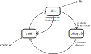{:.center width=350px}

Lorsqu'un processus est interrompu, il doit pouvoir reprendre à l'endroit même où il a été interrompu. Pour cela, le système d'exploitation conserve pour chaque processus créé une zone mémoire (appelée PCB, pour *Process Control Bloc*, ou bloc de contrôle du processus) dans laquelle sont stockées les informations sur le processus : son PIB, son état, la valeur des registres lors de sa dernière interruption, la zone mémoire allouée par le processus lors de son exécution, les ressources utilisées par le processus (fichiers ouverts, connexions réseaux en cours d'utilisation, etc.).


## Ordonnancement 

C'est le système d'exploitation qui attribue aux processus leurs états *élu*, *prêt* et *bloqué*. Plus précisément, c'est l'**ordonnanceur** (un des composants du système d'exploitation) qui réalise cette tâche appelée *ordonnancement des processus*.

L'objectif de l'ordonnanceur est de choisir le processus à exécuter à l'instant $t$ (le processus *élu*) et déterminer le temps durant lequel le processeur lui sera alloué.

{:.center}

Ce choix est à faire parmi tous les processus qui sont dans l'état *prêt*, mais lequel sera élu ? et pour combien de temps ? Des algorithmes d'ordonnancement sont utilisés et il en existe plusieurs selon la stratégie utilisée. On en présente quelques-uns ci-dessous.

### Ordonnancement First Come First Served (FCFS)

**Principe** : Les processus sont ordonnancés selon leur ordre d'arrivée ("premier arrivé, premier servi" en français)

**Exemple** : Les processus $P_1(53)$, $P_2(17)$, $P_3(68)$ et $P_4(24)$ arrivent dans cet ordre à $t=0$ :

> Cela signifie que $P_1$, $P_2$, $P_3$ et $P_4$ ont besoin de respectivement 53, 17, 68 et 24 unités de temps pour s'exécuter.

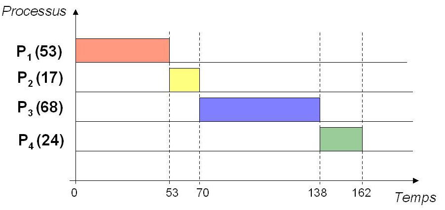{:.center}

### Ordonnancement Shortest Job First (SJF)

**Principe** : Le processus dont le temps d'exécution est le plus court est ordonnancé en premier.

**Exemple** : $P_1$, $P_2$, $P_3$ et $P_4$ arrivent à $t=0$ :

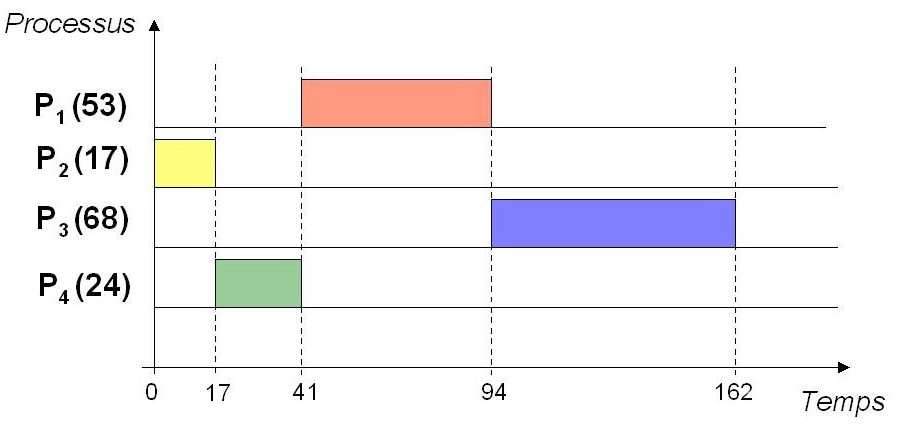{:.center}

### Ordonnancement Shortest Remaining Time (SRT)

**Principe** : Le processus dont le temps d'exécution restant est le plus court parmi ceux qui restent à exécuter est ordonnancé en premier.

**Exemple** : $P_3$ et $P_4$ arrivent à $t=0$ ; $P_2$ à $t=20$ ; $P_1$ à $t=50$ :

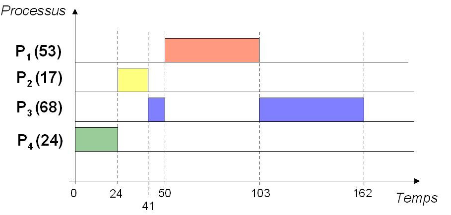{:.center}

### Ordonnancement temps-partagé (Round-Robin)

**Principe** : C'est la politique du tourniquet : allocation du processeur par tranche (= quantum $q$) de temps.

**Exemple** : quantum $q = 20$ et $n = 4$ processus

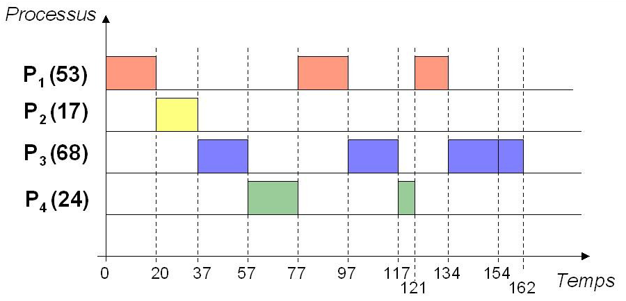{:.center}

Dans ce cas, s'il y a $n$ processus, chacun d'eux obtient le processeur au bout de $(n-1)\times q$ unités de temps au plus

### Ordonnancement à priorités statiques

**Principe** : Allocation du processeur selon des priorités *statiques* (= numéros affectés aux processus pour toute la vie de l'application)

**Exemple** : priorités $(P_1, P_2, P_3, P_4) = (3, 2, 0, 1)$ où la priorité la plus forte est 0 (attention, dans certains systèmes c'est l'inverse : 0 est alors la priorité la plus faible)

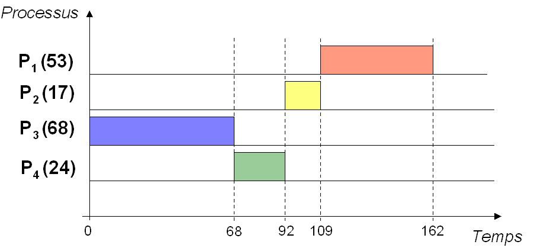{:.center}


<div style="page-break-after: always;"></div>

# Problèmes liés à l'accès concurrent aux ressources

Les processus se partagent souvent une ou plusieurs ressources, et cela peut poser des problèmes.

## Problèmes de synchronisation : illustration avec Python

### Exemple d'une variable partagée

Prenons l'exemple d'une variable (= ressource logicielle) partagée entre plusieurs processus. Plus précisément, considérons un programme de jeu multi-joueur dans lequel une variable `nb_pions` représente le nombre de pions disponibles pour tous les joueurs.

Une fonction `prendre_un_pion()` permet de prendre un pion dans le tas commun de pions disponibles, s'il reste au moins un pion évidemment.

On va se mettre dans la situation où il ne reste plus qu'un pion dans le tas commun et on suppose que deux joueurs utilisent la fonction `prendre_un_pion()`, ce qui conduit à la création de deux processus `p1` et `p2`, chacun correspondant à un joueur.

Avec Python, on peut utiliser le module `multiprocessing` pour créer des processus. Le programme Python `pions.py` suivant permet de réaliser la situation de jeu décrite :

```python
from multiprocessing import Process, Value
import time

def prendre_un_pion(nombre):
    if nombre.value >= 1:
        time.sleep(0.001)  # pour simuler un traitement avec des calculs
        temp = nombre.value 
        nombre.value = temp - 1  # on décrémente le nombre de pions
    
if __name__ == '__main__':
    # création de la variable partagée initialisée à 1
    nb_pions = Value('i', 1)
    # on crée deux processus
    p1 = Process(target=prendre_un_pion, args=[nb_pions])
    p2 = Process(target=prendre_un_pion, args=[nb_pions])
    # on démarre les deux processus 
    p1.start()
    p2.start()
    # on attend la fin des deux processus
    p1.join()
    p2.join()    
    print("nombre final de pions :", nb_pions.value)
```


**Explications** :

- Le `if __name__ = '__main'__:` permet de ne créer qu'une seule fois les processus `p1` et `p2` qui suivent (c'est nécessaire sous Windows, pas sous GNU/Linux car la création des processus ne se fait pas de la même manière, mais cela reste conseillé ne serait-ce que pour des raisons de compatibilité), on n'en dira pas davantage ici car cela dépasse le niveau de ce cours.
- On a utilisé la classe `Process` du module `multiprocessing` pour instancier deux processus `p1` et `p2`.
    - L'argument `target` est le nom de la fonction qui sera exécutée par le processus : ici les deux processus doivent exécuter la même fonction `prendre_un_pion()`
    - L'argument `args` est une liste des arguments passés à la fonction cible : ici il s'agit de la variable `nb_pions` qui est partagée par les deux processus.
- Par défaut, deux processus ne partagent pas de données en mémoire : on ne peut pas donc pas utiliser `nb_pions` comme une variable globale. Il faut utiliser la classe `Value` du module `multiprocessing` pour créer `nb_pions` dans une mémoire partagée entre les processus. L'argument `'i'` indique que `nb_pions` est un entier (signé) et le deuxième argument est la valeur initiale de la variable, ici 1.
- La fonction `prendre_un_pion()` prend un nombre en paramètre et décrémente sa valeur d'une unité si le nombre est au moins égal à 1.
    - Lors de l'exécution de la fonction par les deux processus, l'argument en question sera l'objet `nb_pions` de la classe `Value` et on accède à sa valeur avec l'attribut `value`.
    - On a ajouté une temporisation permettant de simuler d'autres calculs qui pourraient avoir lieu (par exemple, des instructions de mise à jour du nombre de pions des joueurs)
- Les dernières lignes permettent de démarrer les deux processus et attendre qu'ils soient terminés pour afficher la valeur finale de `nb_pions`.

Si on exécute ce programme, les deux processus `p1` et `p2` sont exécutés et on s'attend au comportement suivant (en supposant qu'il ne reste qu'un seule pion dans le tas commun) :

- l'un des deux est élu en premier, par exemple `p1`, et exécute la fonction `prendre_un_pion()`, le nombre de pions est égal à 1 donc `nb_pions` est décrémenté d'une unité et prend donc la valeur 0, le processus `p1` est terminé ;
- le processus `p2`, qui était en attente, est ensuite élu, et comme le nombre de pions est désormais égal à 0 rien ne se passe et `p2` termine.

Ainsi, le premier joueur a pu prendre le pion restant et le second s'est retrouvé coincé, et la valeur finale de `nb_pions` vaut 0.

Et pourtant, il est tout à fait possible que les choses ne se passent pas ainsi ! En effet, en exécutant plusieurs fois le programme `pions.py` dans un terminal, on obtient parfois une valeur finale égale à 0 et parfois égale à -1 :

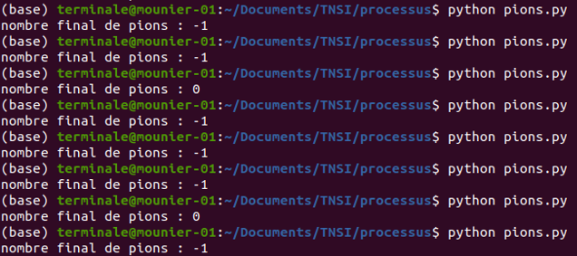{:.center}

C'est un résultat très perturbant non ? Expliquons pourquoi !

Pour cela, on peut ajouter quelques instructions d'affichage pour suivre ce qu'il se passe. On obtient le script `pions_v2.py` suivant :

```python
from multiprocessing import Process, Value
import time

def prendre_un_pion(nombre, numero_processus):
    print(f"début du processus {numero_processus}")
    if nombre.value >= 1:
        print(f"processus {numero_processus} : étape A")
        time.sleep(0.001)  # pour simuler un traitement avec des calculs
        print(f"processus {numero_processus} : étape B")
        temp = nombre.value 
        nombre.value = temp - 1  # on décrémente le nombre de pions
    print(f"nombre de pions restants à la fin du processus {numero_processus} : {nombre.value}")
    
if __name__ == '__main__':
    # création de la variable partagée initialisée à 1
    nb_pions = Value('i', 1)
    # on crée deux processus
    p1 = Process(target=prendre_un_pion, args=[nb_pions, 1])
    p2 = Process(target=prendre_un_pion, args=[nb_pions, 2])
    # on démarre les deux processus 
    p1.start()
    p2.start()
    # on attend la fin des deux processus
    p1.join()
    p2.join()
    print("nombre final de pions :", nb_pions.value)
```

**Explications** :

- Lors de la création des processus, on passe un deuxième argument à la fonction `prendre_un_pion()`, le numéro du processus : 1 pour `p1` et 2 pour `p2`.
- Cela permet d'afficher dans cette fonction le numéro du processus à des endroits stratégiques : au début, à l'entrée dans le `if`, juste avant de décrémenter le nombre de pions et à la fin du processus.

En exécutant `pions_v2.py` dans un terminal, on obtient ce genre de choses :

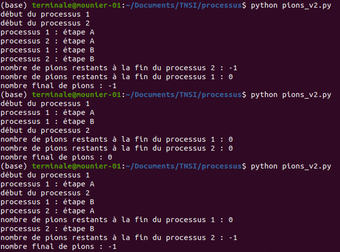{:.center}

Analysons la première exécution du programme.

- le processus `p1` est élu en premier (affichage de "début du processus 1") mais est de suite interrompu par l'ordonnanceur qui élit `p2` (affichage de "début du processus 2")
- puis c'est de nouveau le processus `p1` qui a la main et il rentre dans le `if` (affichage de "processus 1 : étape A") mais est interrompu à nouveau et l'ordonnanceur donne la main à `p2` qui rentre aussi dans le `if` (affichage de "processus 2 : étape A") : en effet, à ce stade le nombre de pions n'a pas encore été décrémenté par `p1` car il a été interrompu avant l'étape B, et donc `p2` a pu entrer dans le `if` puisque la condition `nombre.value >= 1` est toujours vraie à ce moment là !!
- ensuite le processeur est alloué alternativement à `p1` et `p2` (voir les affichages restants) mais le mal est fait puisque les deux processus sont désormais chacun entrés dans le `if`, ils vont chacun décrémenter le nombre de pions d'une unité et chacun des deux joueurs aura pioché un pion alors qu'il n'y en avait qu'un seul au départ !

> Vous remarquerez que la troisième exécution du programme met en évidence le même problème car les deux processus ont chacun pu entrer dans le `if`, même si l'ordre des instructions exécutées après n'est pas tout à fait le même.

Si on analyse la seconde exécution du programme qui donne le comportement souhaité, on constate que `p1` a eu suffisamment de temps pour décrémenter le nombre de pions (qui vaut désormais 0) *avant* que `p2` ne fasse le test `nombre.value >= 1` et se rende compte que cette condition est fausse. Dans ce cas, seul le premier joueur a pas pu piocher un pion.

Heureusement, on peut éviter le problème mis en évidence dans l'exemple précédent.

### Comment éviter les problèmes de synchronisation ?

On va utiliser ce qu'on appelle un **verrou** : un verrou est objet partagé entre plusieurs processus mais qui garantit qu'un seul processus accède à une ressource à un instant donné.

Concrètement, un verrou peut être acquis par les différents processus, et le premier à faire la demande acquiert le verrou. Si le verrou est détenu par un autre processus, alors tout autre processus souhaitant l'obtenir est bloqué jusqu'à ce qu'il soit libéré.

Le module `multiprocessing` de Python propose un objet `Lock()` correpondant à un verrou. Deux méthodes sont utilisées :

- la méthode `.acquire()` permet de demander le verrou (le processus faisant la demande est bloqué tant qu'il ne l'a pas obtenu)
- la méthode `.release()` permet de libérer le verrou (il pourra alors être obtenu par un autre processus qui en fait la demande)

On peut alors régler le problème de l'exemple précédent avec le script `pions_v3.py` suivant dans lequel on a laissé les affichages pour bien suivre :

```python
from multiprocessing import Process, Value, Lock
import time


def prendre_un_pion(v, nombre, numero_processus):
    print(f"début du processus {numero_processus}")
    v.acquire()  # acquisition du verrou
    if nombre.value >= 1:        
        print(f"processus {numero_processus} : étape A")
        time.sleep(0.001)
        print(f"processus {numero_processus} : étape B")
        temp = nombre.value 
        nombre.value = temp - 1
    v.release()  # verrou libéré
    print(f"nombre de pions restants à la fin du processus {numero_processus} : {nombre.value}")
    
if __name__ == '__main__':
    # création de la variable partagée initialisée à 1
    nb_pions = Value('i', 1)
    # verrou partagé par les deux processus
    verrou = Lock()
    # on crée deux processus
    p1 = Process(target=prendre_un_pion, args=[verrou, nb_pions, 1])
    p2 = Process(target=prendre_un_pion, args=[verrou, nb_pions, 2])
    # on démarre les deux processus 
    p1.start()
    p2.start()
    # on attend la fin des deux processus
    p1.join()
    p2.join()    
    print("nombre final de pions :", nb_pions.value)
```

En exécutant (plusieurs fois) ce script dans un terminal on constate que le nombre final de pions est toujours égal à 0.


Avant de faire le test du `if`, le processus essaye d'acquérir le verrou avec `v.acquire()`. Dès qu'il est acquis, le processus a la garantie qu'il est le seul à pouvoir exécuter le code jusqu'à l'instruction `v.release()`. Cette portion de code protégée s'appelle une *section critique*. Cela ne veut pas dire que le processus détenant le verrou ne peut pas être interrompu, mais il ne le sera pas par un processus qui est essaie d'acquérir le même verrou.

```python
def prendre_un_pion(v, nombre, numero_processus):
    v.acquire()
    # début section critique
    if nombre.value >= 1:
        time.sleep(0.001)
        temp = nombre.value 
        nombre.value = temp - 1
    # fin de la section critique
    v.release()
```


Si vous analysez l'affichage précédent dans le terminal, on voit d'ailleurs que `p1` est entré en section critique (affichage "processus 1 : étape A") mais est interrompu, puis c'est `p2` qui a la main (affichage "début processus 2") mais il va se retrouver bloquer à l'instruction `v.acquire()` puisque c'est `p1` qui détient le verrou. Lorsque `p1` reprendra la main, il pourra exécuter ses instructions jusqu'à `v.release()` sans être interrompu par `p2` (alors `nb_pions` sera décrémenté d'une unité). Lorsque `p1` libère le verrou, `p2` pourra alors l'obtenir, exécuter sa section critique et constater que la condition `nombre.value >= 1` est fausse : le deuxième joueur ne pourra alors pas prendre de pion.


Nous terminons en voyant que l'utilisation de verrous n'est pas sans risque car elle peut engendrer des problèmes d'interblocage.


## Risque d'interblocage

Les interblocages (*deadlock* en anglais) sont des situations de la vie quotidienne. L'exemple classique est celui du carrefour avec priorité à droite où chaque véhicule est bloqué car il doit laisser le passage au véhicule à sa droite.

{:.center}

En informatique l'**interblocage** peut également se produire lorsque plusieurs processus concurrents s'attendent mutuellement. Ce scénario peut se produire lorsque plusieurs ressources sont partagées par plusieurs processus et l'un d'entre eux possède indéfiniment une ressource nécessaire pour un autre.

Ce phénomène d'*attente circulaire*, où chaque processus attend une ressource détenue par un autre processus, peut être provoquée par l'utilisation de *plusieurs* verrous.

Considérons le script `interblocage.py` suivant dans lequel on a créé deux verrous `v1` et `v2` utilisés par deux fonctions `f1` et `f2` exécutées respectivement par deux processus `p1` et `p2`. Le processus `p1` essaie d'acquérir d'abord `v1` puis `v2` tandis que le processus `p2` essaie de les acquérir dans l'ordre inverse.

```python
from multiprocessing import Process, Lock
import time
import os

def f1(v1, v2):
    print("PID du processus 1:", os.getpid())
    for i in range(100):
        time.sleep(0.001)
        v1.acquire()
        v2.acquire()
        print("processus 1 en cours, itération ", i)
        v2.release()
        v1.release()
        
def f2(v1, v2):
    print("PID du processus 2:", os.getpid())
    for i in range(100):
        time.sleep(0.001)
        v2.acquire()
        v1.acquire()
        print("processus 2 en cours, itération ", i)
        v1.release()
        v2.release()

if __name__ == '__main__':
    # création de deux verrous
    v1 = Lock()
    v2 = Lock()
    # création de deux processus
    p1 = Process(target=f1, args=[v1, v2])
    p2 = Process(target=f2, args=[v1, v2])
    # on démarre les deux processus
    p1.start()
    p2.start()
    # on attend la fin des deux processus
    p1.join()
    p2.join()
```

Si on exécute ce programme, il y a de grandes chances de se retrouver bloqué. Par exemple, dans le cas de l'exécution suivante :

- le processus `p1` est élu : il s'exécute jusqu'à l'acquisition de `v1` mais avant la tentative d'acquisition de `v2`, puis est interrompu
- le processus `p2` est à son tour élu : il s'exécute et acquiert `v2` qui est toujours libre, puis bloque sur l'acquisition de `v1` (qui est détenu par `p1`).
- le processus `p1` reprend la main et bloque sur l'acquisition de `v2` (détenu par `p2`).

Chaque processus détient un verrou et attend l'autre : ils sont en interblocage et l'attente est infinie.

On peut lancer (plusieurs fois si nécessaire) le script à partir du terminal et constater que l'interblocage a lieu très souvent.

{:.center}

Il n'y a alors pas d'autres choix que d'interrompre les processus en interblocage, par exemple avec la commande `kill`.

Cependant, ce problème a lieu ici car les deux processus essaie d'acquérir les verrous dans l'ordre contraire. Si l'ordre d'acquisition est le même pour les processus, le problème n'a plus lieu (n'hésitez pas à tester !).

De manière générale, dans des problèmes complexes les situations d'interblocage sont difficiles à détecter et il se peut très bien que le programme se comporte bien pendant toute une phase de tests mais bloque lors d'une exécution ultérieure puisque l'on ne peut pas prévoir l'ordonnancement des processus.

## Simulation d'interblocage⚓︎  

Robosomes créé par Alain BUSSER , Sébastien HOARAU (Voir ici : [Robosomes - IREM de la réunion](https://irem.univ-reunion.fr/spip.php?article1128)

{:.center}

Le jeu robosomes se joue à un seul joueur sur une grille rectangulaire. Chaque case peut être

- soit vide  
- soit couverte par un obstacle fixe (en noir comme aux mots croisés)  
- soit couverte d’un pion pouvant bouger, appelé robot  

Chaque robot peut être tourné dans l’une des quatre directions cardinales ◀▲▶▼. Les robots peuvent bouger tous en même temps de l’une des façons suivantes :

- G : tous les robots tournent vers leur gauche (de 90°) en même temps  
- D : tous les robots tournent vers leur droite (de 90°) en même temps  
- A : les robots qui peuvent avancer d’une case, le font. Un robot peut avancer d’une case s’il n’y a pas d’obstacle sur cette case et si aucun robot ne s’apprête à aller sur cette case.

Les cases du bord de la grille sont toutes couvertes d’obstacles fixes, à l’exception de l’une d’entre elles appelée « sortie ». Lorsqu’un robot est sur la case de sortie, tourné vers l’extérieur de la grille, il quitte le jeu et n’est plus soumis aux ordres donnés. Le but du jeu est de faire sortir tous les robots de la grille, en écrivant un mot dans l’alphabet A,G,D, appelé programme et que les robots interpréteront comme décrit ci-dessus.

Voici quelques exemples :

[Un premier exemple](https://irem.univ-reunion.fr/IMG/html/jeu7.html) pour se mettre en route.

[Interblocage](https://irem.univ-reunion.fr/IMG/html/jeu6.html)

[Interblocage 1](https://irem.univ-reunion.fr/IMG/html/jeu1.html)

[Interblocage 2](https://irem.univ-reunion.fr/IMG/html/jeu2.html)

[Interblocage 3](https://irem.univ-reunion.fr/IMG/html/jeu3.html)

[Interblocage 4](https://irem.univ-reunion.fr/IMG/html/jeu4.html)

[Interblocage perpétuel ou pas](https://irem.univ-reunion.fr/IMG/html/jeu5.html)

[Interblocage 8](https://irem.univ-reunion.fr/IMG/html/jeu8.html)

# Et pour les systèmes multiprocesseurs ?

Les ordinateurs actuels possèdent généralement plusieurs processeurs, ce qui permet à plusieurs processus d'être exécutés parallèlement : un par processeur. Ce parallélisme permet bien évidemment une plus grande puissance de calcul.

Pour répartir les différents processus entre les différents processeurs, on distingue deux approches :

- l'approche *partitionnée* : chaque processeur possède un ordonnanceur particulier et les processus sont répartis entre les différents ordonnanceurs
- l'approche *globale* : un ordonnanceur global est chargé de déterminer la répartition des processus entre les différents processeurs

L'ordonnancement des processus des systèmes d'exploitation actuels est bien plus complexe que les quelques algorithmes évoqués dans ce cours, et cela dépasse largement le cadre du programme de NSI. Si vous souhaitez en savoir plus, voici néanmoins une vidéo intéressante (en français) sur l'ordonnancement du noyau Linux : [https://www.youtube.com/watch?v=uCGe5WWd1OI&t=195s&ab_channel=Vitonimal](https://www.youtube.com/watch?v=uCGe5WWd1OI&t=195s&ab_channel=Vitonimal).

<div style="page-break-after: always;"></div>

# Bilan

- Un programme en cours d'exécution s'appelle un *processus*. Les systèmes d'exploitation récents permettent d'exécuter plusieurs processus simultanément.
- En réalité, ces processus sont exécutés *à tour de rôle* par le système d'exploitation qui est chargé d'allouer à chacun d'eux les ressources dont il a besoin en termes de mémoire, entrées-sorties ou temps d'accès au processeur, et de s'assurer que les processus ne se gênent pas les uns les autres.
- Au cours de leur vie, les processus varient entre trois états : *élu* si le processus est exécuté par le processeur, *prêt* si le processus est prêt à être exécuté, et *bloqué* si le processus est en attente d'une ressource.
- C'est l'*ordonnanceur* qui est chargé de définir l'ordre dans lequel les processus doivent être exécutés par le processeur. Ce choix se fait grâce à des algorithmes d'ordonnancement.
- Les processus se partagent les différentes ressources, on parle d'*accès concurrent* aux ressources. Ce partage des ressources n'est pas sans risque et peut conduire à des problèmes de synchronisation. Ces problèmes peuvent être évités en utilisant un *verrou*, qui permet à un processus de ne pas être interrompu dans sa section critique par un autre processus demandant le même verrou.
- L'utilisation de plusieurs verrous peut entraîner des *interblocages*, c'est-à-dire des situations où chaque processus attend une ressource détenue par un autre, conduisant à une attente cyclique infinie. L'ordre d'acquisition des verrous est important mais pas toujours évident à écrire dans le cas de problèmes complexes.

<div style="page-break-after: always;"></div>

# Exercices

## Exercice 1 : Algorithmes d'ordonnancement

Soient les différents processus suivants :

| Processus | Date d'arrivée | Durée de traitement |
| --- | --- | --- |
| $P_1$ | 0 | 3 |
| $P_2$ | 1 | 6 |
| $P_3$ | 3 | 4 |
| $P_4$ | 6 | 5 |
| $P_5$ | 8 | 2 |

### Application de plusieurs algorithmes

**Q1** : Donnez le diagramme de Gantt pour l'exécution de ces différents processus en utilisant successivement les algorithmes FCFS, RR (quantum = 2 unités de temps) et SRT.

### Performances des algorithmes d'ordonnancement

On définit les métriques suivantes :

- le **temps de séjour (ou d'exécution)** (ou de rotation) d'un processus : c'est la différence entre la date de fin d'exécution et la date d'arrivée : $T_{\text{sej}} = \text{date fin d'exécution} - \text{date d'arrivée}$
- le **temps d'attente** d'un processus : c'est la différence entre le temps de séjour et la durée du processus : $T_{\text{att}} = T_{\text{sej}} - \text{durée du processus}$
- le **rendement** d'un processus : c'est le quotient entre la durée du processus et le temps de séjour : $\text{rendement} = \dfrac{\text{durée du processus}}{T_{\text{sej}}}$

**Q2** : Pour chacun des trois algorithmes, calculez le temps de séjour, le temps d'attente et le rendement de chaque processus.

**Q3** : Quel vous semble être le *meilleur* des trois algorithmes dans notre exemple ? Expliquer.


## Exercice 2

cet exercice est issu du sujet 2021 du bac NSI

**Partie A**

Cette partie est un questionnaire à choix multiples (QCM).
Pour chacune des questions, une seule des quatre réponses est exacte. Le candidat indiquera sur sa copie le numéro de la question et la lettre correspondant à la réponse exacte.
Aucune justification n’est demandée. Une réponse fausse ou une absence de réponse n’enlève aucun point.

1) Parmi les commandes ci-dessous, laquelle permet d’afficher les processus en cours d’exécution ?

        a. dir  
        b. ps  
        c. man  
        d. ls  

2) Quelle abréviation désigne l’identifiant d’un processus dans un système d’exploitation de type UNIX ? 

        a. PIX  
        b. SIG  
        c. PID  
        d. SID  

3) Comment s’appelle la gestion du partage du processeur entre différents processus ?

        a. L’interblocage  
        b. L’ordonnancement  
        c. La planification  
        d. La priorisation  

4) Quelle commande permet d’interrompre un processus dans un système d’exploitation de type UNIX ?

        a. stop  
        b. interrupt  
        c. end  
        d. kill  

**Partie B**

1) Un processeur choisit à chaque cycle d’exécution le processus qui doit être exécuté. Le tableau ci-dessous donne pour trois processus P1, P2, P3 :

- la durée d’exécution (en nombre de cycles),

- l’instant d’arrivée sur le processeur (exprimé en nombre de cycles à partir de 0),

- le numéro de priorité.

Le numéro de priorité est d’autant plus petit que la priorité est grande. On suppose qu’à chaque instant, c’est le processus qui a le plus petit numéro de priorité qui est exécuté, ce qui peut provoquer la suspension d’un autre processus, lequel reprendra lorsqu’il sera le plus prioritaire.


Reproduire le tableau ci-dessous sur la copie et indiquer dans chacune des cases le processus exécuté à chaque cycle.


2) On suppose maintenant que les trois processus précédents s’exécutent et utilisent une ou plusieurs ressources parmi R1, R2 et R3.
Parmi les scénarios suivants, lequel provoque un interblocage ? Justifier.

{:.center width=350px}

**Partie C**  

Dans cette partie, pour une meilleure lisibilité, des espaces sont placées dans les écritures
binaires des nombres. Il ne faut pas les prendre en compte dans les calculs.  
Pour chiffrer un message, une méthode, dite du masque jetable, consiste à le combiner avec une
chaîne de caractères de longueur comparable.  
Une implémentation possible utilise l’opérateur XOR (ou exclusif) dont voici la table de vérité :

|a|b|a XOR b|
|:---:|:---:|:---:|
|0|0|0|
|0|1|1|
|1|0|1|
|1|1|0|

Dans la suite, les nombres écrits en binaire seront précédés du préfixe 0b.

**Q1.** Pour chiffrer un message, on convertit chacun de ses caractères en binaire (à l’aide du format Unicode), et on réalise l’opération XOR bit à bit avec la clé.  
Après conversion en binaire, et avant que l’opération XOR bit à bit avec la clé n’ait été
effectuée, Alice obtient le message suivant :  

`m = 0b 0110 0011 0100 0110`

**a.** Le message m correspond à deux caractères codés chacun sur 8 bits : déterminer quels sont
ces caractères. On fournit pour cela la table ci-dessous qui associe à l’écriture hexadécimale
d’un octet le caractère correspondant (figure 2). Exemple de lecture : le caractère
correspondant à l’octet codé 4A en hexadécimal est la lettre J.

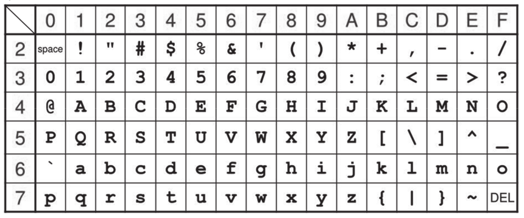{:.center width=350px}

Pour chiffrer le message d’Alice, on réalise l’opération XOR bit à bit avec la clé suivante :  
`k = 0b 1110 1110 1111 0000`  

Donner l’écriture binaire du message obtenu.

**Q2.**  
**a.** Dresser la table de vérité de l’expression booléenne suivante : 

`(a XOR b) XOR b`

**b.** Bob connaît la chaîne de caractères utilisée par Alice pour chiffrer le message. Quelle
opération doit-il réaliser pour déchiffrer son message ?


## Exercice 3

d'après le sujet du bac NSI 2021

_Cet exercice porte sur les systèmes d’exploitation : gestion des processus et des ressources._    
_Les parties A et B peuvent être traitées indépendamment_


**Partie A :**  

Dans un bureau d’architectes, on dispose de certaines ressources qui ne peuvent être utilisées simultanément par plus d’un processus, comme l’imprimante, la table traçante, le modem. Chaque programme, lorsqu’il s’exécute, demande l’allocation des ressources qui lui sont nécessaires. Lorsqu’il a fini de s’exécuter, il libère ses ressources.


**Q.2** On appelle p1, p2 et p3 les processus associés respectivement aux programmes 1, 2 et 3.

**a)** Justifier qu'une situation d'interblocage peut se produire.

**b)** Modifier l'ordre des instructions du programme 3 pour qu'une telle situation ne puisse pas se produire.

**Q.3** Supposons que le processus p1 demande la table traçante alors qu'elle est en cours
d'utilisation par le processus p3. Parmi les états suivants, quel sera l'état du processus p1
tant que la table traçante n'est pas disponible :  
a) élu  
b) bloqué  
c) prêt  
d) terminé  

**Partie B**  

Avec une ligne de commande dans un terminal sous Linux, on obtient l'affichage suivant :

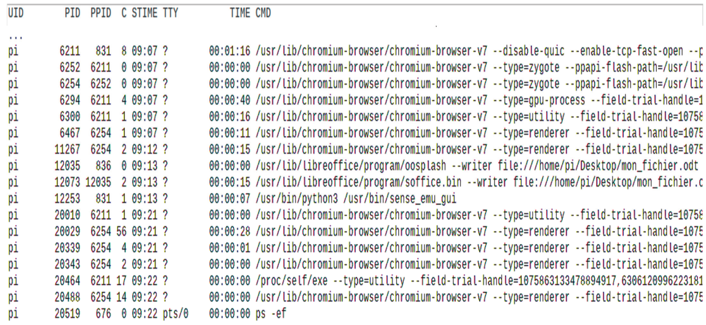

La documentation Linux donne la signification des différents champs :

- UID : identifiant utilisateur effectif ;  
- PID : identifiant de processus ;  
- PPID : PID du processus parent ;  
- C : partie entière du pourcentage d'utilisation du processeur par rapport au temps de vie des  processus ;  
- STIME : l'heure de lancement du processus ;  
- TTY : terminal de contrôle  
- TIME : temps d'exécution  
- CMD : nom de la commande du processus  

**Q.1.** Parmi les quatre commandes suivantes, laquelle a permis cet affichage ?  
a) ls -l  
b) ps –ef  
c) cd ..  
d) chmod 741 processus.txt  

**Q.2.** Quel est l'identifiant du processus parent à l'origine de tous les processus concernant le
navigateur Web (chromium-browser) ?

**Q.3.** Quel est l'identifiant du processus dont le temps d'exécution est le plus long ?

## Exercice 4

Extrait sujet BAC 2021

_Cet exercice porte sur la gestion des processus par un système d’exploitation._

**Partie A : Processus**  

La commande UNIX ps présente un cliché instantané des processus en cours d'exécution.  
Avec l’option −eo pid,ppid,stat,command, cette commande affiche dans l’ordre l’identifiant du processus PID (process identifier), le PPID (parent process identifier), l’état STAT et le nom de la commande à l’origine du processus.  

Les valeurs du champ STAT indique l’état des processus :  
- R : processus en cours d’exécution  
- S : processus endormi  

Sur un ordinateur, on exécute la commande ps −eo pid,ppid,stat,command et on obtient un affichage dont on donne ci-dessous un extrait. 

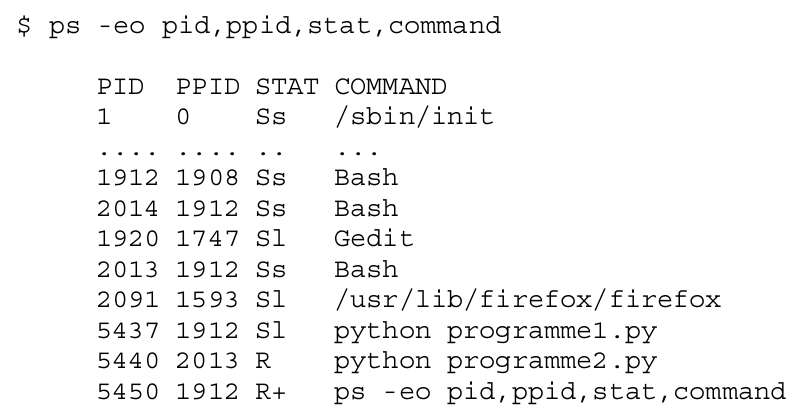{:.center width=350px}

À l'aide de cet affichage, répondre aux questions ci-dessous.

**Q.1.** Quel est le nom de la première commande exécutée par le système d'exploitation lors
du démarrage ?

**Q.2.** Quels sont les identifiants des processus actifs sur cet ordinateur au moment de
l’appel de la commande ps ? Justifier la réponse.  

**Q.3.** Depuis quelle application a-t-on exécuté la commande ps ?  
Donner les autres commandes qui ont été exécutées à partir de cette application.  

**Q.4.** Expliquer l'ordre dans lequel les deux commandes python programme1.py et python programme2.py ont été exécutées.  

**Q.5.** Peut-on prédire que l'une des deux commandes python programme1.py et python programme2.py finira avant l’autre ?