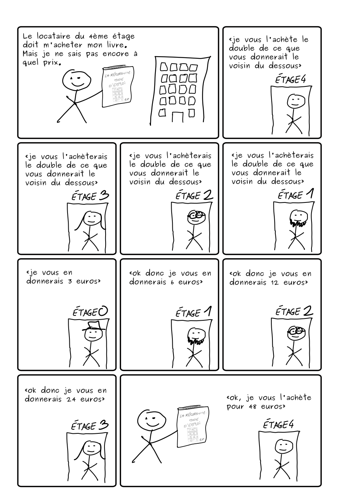
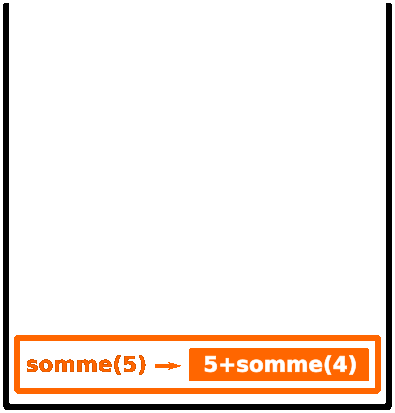
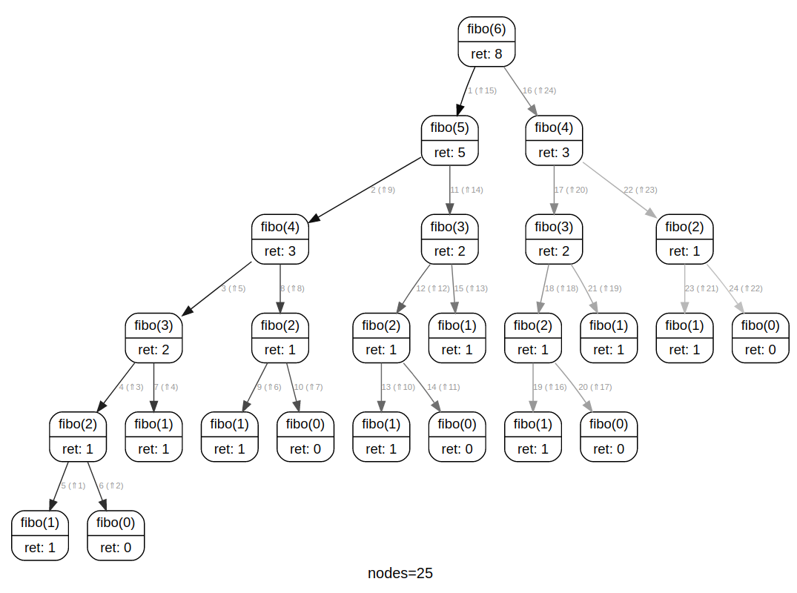
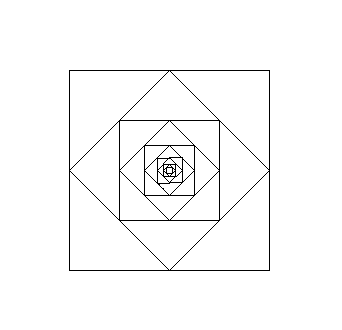

---
title : Thème 4 - Programmation
subtitle: Récursivité
subsubtitle: Terminale NSI
author : M.Meyroneinc-Condy
numbersections: true
fontsize: 10pt
geometry:
- top=20mm
- left=20mm
- right=20mm
- heightrounded    
--- 

Récursivité
===

<table  class="blueTable">
        <tr >
            <th  class="blueTh";width="100%"; style="text-align:center;border:none;font-size:15pt;">Thème 4 : Langage et programmation</th>
        </tr>
</table>
<br>

<table  class="blueTable">
        <tr >
            <th width="20%"; style="background-color: #3B444B;color:white;text-align:center;border:none;font-size:40pt;">
            04
            </th>
            <th  class="blueTh";width="80%"; style="text-align:center;border:none;font-size:25pt;">RECURSIVITE</th>
        </tr>
</table>
<br>


**Programme Terminale**  

|Contenus|Capacités attendues|Commentaires|
|:---:|:---:|:---:|
|Récursivité  |Ecrire un programme récursif. Analyser le fonctionnement d'un programme récursif. |Des exemples relevant de domaines variés sont à privilégier |

{:.center width=50%}


## Première approche

{:.center}

Faite l'essai

### Principe 

En règle générale, un objet est dit récursif s'il se définit à partir de lui-même.  
On trouve donc des acronymes récursifs, comme :  

- GNU dans GNU/Linux (GNU is Not Unix), 
- le logiciel d'émulation WINE (Wine Is Not an Emulator),  
- les cartes bancaire VISA (Visa International Service Association), 
- le moteur de recherche Bing (Bing is not Google), 
- etc.  

!!! voc " A retenir : Fonction récursive"
    Une fonction est dite récursive lorsqu'elle fait appel à elle-même dans sa propre définition.


### Premiers exemples et précautions d'usage

**Note : No infinite recursion !**   
Voici trois premiers exemples de fonctions récursives. Dans chaque cas, repérer l'appel récursif à la fonction.
    
Une seule de ces 3 fonctions est correcte, laquelle?

- **Fonction 1**  
```python
def f(n):
    print(n)
    f(n-1)
    print("Hello world!")
```

- **Fonction 2**  
```python
def f(n):
    if n == 0:
        print("Hello world!")
    else:
        print(n)
        f(n-1)
```

- **Fonction 3**  
```python
def f(n):
    if n == 0:
        print("Hello world!")
    else:
        print(n)
        f(n)
```

!!! voc "Cas de Base"
    Lorsqu'on écrit une fonction récursive, le piège classique est de créer une boucle infinie.

    Hormis les blaques de geeks d'initiés, la récursivité en informatique ne tolère pas l'auto-référence infinie: il faut prévoir une condition d'arrêt qui traite le cas de base !!!

{:.center}


Ce «cas de base» sera aussi appelé «condition d'arrêt», puisque la très grande majorité des algorithmes récursifs peuvent être perçus comme des escaliers qu'on descend marche par marche, jusqu'au sol qui assure notre arrêt.

!!! voc "Terminaison"

    Pour s'assurer qu'une fonction récursive se termine, il faut **absolument** que la chaîne d'appel conduise au cas de base. 

    - si le paramètre de la fonction est un entier, alors l'appel doit se faire avec un **entier strictement inférieur**;  
    - si le paramètre de la fonction est une liste, alors l'appel doit se faire avec une liste de **longueur strictement inférieure**;  
    - etc.



Observez bien la descente puis la remontée de notre vendeur de livre. Le cas de base est ici l'étage 0. Il empêche une descente infinie.

Nous coderons bientôt la fonction donnant le prix du livre en fonction de l'étage.

Pour l'instant, découvrons enfin à quoi ressemble une fonction récursive «bien écrite» :


```python
def mystere(n):
    if n == 0 :
        return 0
    else : 
        return n + mystere(n-1)
```

Trois choses sont essentielles et doivent se retrouver dans tout programme récursif :

- lignes 2 et 3 : le cas de base (si n vaut 0 on renvoie vraiment une valeur, en l'occurence 0)  
- ligne 5 : l'appel récursif  
- ligne 5 : la décrémentation du paramètre d'appel  


```python
mystere(5)
15
```

```python
mystere(8)
36
```

!!! note "Analyse avec Python tutor"

<iframe id="basthon-pythontutor-iframe-1" style="width: 100%; height: 400px;" frameborder="0" src="data:text/html;charset=utf-8,%3C%21DOCTYPE%20html%3E%0A%3Chtml%3E%0A%20%20%3Chead%3E%0A%20%20%20%20%3Clink%20rel%3D%22stylesheet%22%20href%3D%22https%3A//capytale2.ac-paris.fr/basthon/notebook/assets/0.41.11/modules/extern/pytutor-main.min.css%22/%3E%0A%20%20%20%20%3Cscript%20src%3D%22https%3A//capytale2.ac-paris.fr/basthon/notebook/assets/0.41.11/modules/extern/pytutor-main.min.js%22%3E%3C/script%3E%0A%20%20%20%20%3Cscript%3E%0A%20%20%20%20%20%20let%20sent_height%3B%0A%20%20%20%20%20%20%24%28document%29.ready%28function%28%29%20%7B%0A%20%20%20%20%20%20%20%20%20%20//%20managing%20iframe%20resize%0A%20%20%20%20%20%20%20%20%20%20const%20send%20%3D%20%28%29%20%3D%3E%20%7B%0A%20%20%20%20%20%20%20%20%20%20%20%20%20%20const%20new_height%20%3D%20document.body.offsetHeight%3B%0A%20%20%20%20%20%20%20%20%20%20%20%20%20%20if%20%28sent_height%20%3D%3D%3D%20new_height%29%20return%3B%0A%20%20%20%20%20%20%20%20%20%20%20%20%20%20sent_height%20%3D%20new_height%3B%0A%20%20%20%20%20%20%20%20%20%20%20%20%20%20window.parent.postMessage%28%7B%0A%20%20%20%20%20%20%20%20%20%20%20%20%20%20%20%20%20%20type%3A%20%22pytutor-iframe-resize%22%2C%0A%20%20%20%20%20%20%20%20%20%20%20%20%20%20%20%20%20%20target%3A%20%22basthon-pythontutor-iframe-1%22%2C%0A%20%20%20%20%20%20%20%20%20%20%20%20%20%20%20%20%20%20height%3A%20sent_height%2C%0A%20%20%20%20%20%20%20%20%20%20%20%20%20%20%7D%2C%20%27%2A%27%29%3B%0A%20%20%20%20%20%20%20%20%20%20%7D%3B%0A%20%20%20%20%20%20%20%20%20%20const%20o%20%3D%20new%20ResizeObserver%28send%29%3B%0A%20%20%20%20%20%20%20%20%20%20o.observe%28document.body%29%3B%0A%0A%20%20%20%20%20%20%20%20%20%20const%20t%20%3D%20%7B%22code%22%3A%20%22def%20mystere%28n%29%3A%5Cn%20%20%20%20if%20n%20%3D%3D%200%20%3A%5Cn%20%20%20%20%20%20%20%20return%200%5Cn%20%20%20%20else%20%3A%20%5Cn%20%20%20%20%20%20%20%20return%20n%20%2B%20mystere%28n-1%29%5Cn%5Cnmystere%284%29%22%2C%20%22trace%22%3A%20%5B%7B%22line%22%3A%201%2C%20%22event%22%3A%20%22step_line%22%2C%20%22func_name%22%3A%20%22%3Cmodule%3E%22%2C%20%22globals%22%3A%20%7B%7D%2C%20%22ordered_globals%22%3A%20%5B%5D%2C%20%22stack_to_render%22%3A%20%5B%5D%2C%20%22heap%22%3A%20%7B%7D%2C%20%22stdout%22%3A%20%22%22%7D%2C%20%7B%22line%22%3A%207%2C%20%22event%22%3A%20%22step_line%22%2C%20%22func_name%22%3A%20%22%3Cmodule%3E%22%2C%20%22globals%22%3A%20%7B%22mystere%22%3A%20%5B%22REF%22%2C%201%5D%7D%2C%20%22ordered_globals%22%3A%20%5B%22mystere%22%5D%2C%20%22stack_to_render%22%3A%20%5B%5D%2C%20%22heap%22%3A%20%7B%221%22%3A%20%5B%22FUNCTION%22%2C%20%22mystere%28n%29%22%2C%20null%5D%7D%2C%20%22stdout%22%3A%20%22%22%7D%2C%20%7B%22line%22%3A%201%2C%20%22event%22%3A%20%22call%22%2C%20%22func_name%22%3A%20%22mystere%22%2C%20%22globals%22%3A%20%7B%22mystere%22%3A%20%5B%22REF%22%2C%201%5D%7D%2C%20%22ordered_globals%22%3A%20%5B%22mystere%22%5D%2C%20%22stack_to_render%22%3A%20%5B%7B%22func_name%22%3A%20%22mystere%22%2C%20%22is_parent%22%3A%20false%2C%20%22frame_id%22%3A%201%2C%20%22parent_frame_id_list%22%3A%20%5B%5D%2C%20%22encoded_locals%22%3A%20%7B%22n%22%3A%204%7D%2C%20%22ordered_varnames%22%3A%20%5B%22n%22%5D%2C%20%22is_zombie%22%3A%20false%2C%20%22is_highlighted%22%3A%20true%2C%20%22unique_hash%22%3A%20%22mystere_f1%22%7D%5D%2C%20%22heap%22%3A%20%7B%221%22%3A%20%5B%22FUNCTION%22%2C%20%22mystere%28n%29%22%2C%20null%5D%7D%2C%20%22stdout%22%3A%20%22%22%7D%2C%20%7B%22line%22%3A%202%2C%20%22event%22%3A%20%22step_line%22%2C%20%22func_name%22%3A%20%22mystere%22%2C%20%22globals%22%3A%20%7B%22mystere%22%3A%20%5B%22REF%22%2C%201%5D%7D%2C%20%22ordered_globals%22%3A%20%5B%22mystere%22%5D%2C%20%22stack_to_render%22%3A%20%5B%7B%22func_name%22%3A%20%22mystere%22%2C%20%22is_parent%22%3A%20false%2C%20%22frame_id%22%3A%201%2C%20%22parent_frame_id_list%22%3A%20%5B%5D%2C%20%22encoded_locals%22%3A%20%7B%22n%22%3A%204%7D%2C%20%22ordered_varnames%22%3A%20%5B%22n%22%5D%2C%20%22is_zombie%22%3A%20false%2C%20%22is_highlighted%22%3A%20true%2C%20%22unique_hash%22%3A%20%22mystere_f1%22%7D%5D%2C%20%22heap%22%3A%20%7B%221%22%3A%20%5B%22FUNCTION%22%2C%20%22mystere%28n%29%22%2C%20null%5D%7D%2C%20%22stdout%22%3A%20%22%22%7D%2C%20%7B%22line%22%3A%205%2C%20%22event%22%3A%20%22step_line%22%2C%20%22func_name%22%3A%20%22mystere%22%2C%20%22globals%22%3A%20%7B%22mystere%22%3A%20%5B%22REF%22%2C%201%5D%7D%2C%20%22ordered_globals%22%3A%20%5B%22mystere%22%5D%2C%20%22stack_to_render%22%3A%20%5B%7B%22func_name%22%3A%20%22mystere%22%2C%20%22is_parent%22%3A%20false%2C%20%22frame_id%22%3A%201%2C%20%22parent_frame_id_list%22%3A%20%5B%5D%2C%20%22encoded_locals%22%3A%20%7B%22n%22%3A%204%7D%2C%20%22ordered_varnames%22%3A%20%5B%22n%22%5D%2C%20%22is_zombie%22%3A%20false%2C%20%22is_highlighted%22%3A%20true%2C%20%22unique_hash%22%3A%20%22mystere_f1%22%7D%5D%2C%20%22heap%22%3A%20%7B%221%22%3A%20%5B%22FUNCTION%22%2C%20%22mystere%28n%29%22%2C%20null%5D%7D%2C%20%22stdout%22%3A%20%22%22%7D%2C%20%7B%22line%22%3A%201%2C%20%22event%22%3A%20%22call%22%2C%20%22func_name%22%3A%20%22mystere%22%2C%20%22globals%22%3A%20%7B%22mystere%22%3A%20%5B%22REF%22%2C%201%5D%7D%2C%20%22ordered_globals%22%3A%20%5B%22mystere%22%5D%2C%20%22stack_to_render%22%3A%20%5B%7B%22func_name%22%3A%20%22mystere%22%2C%20%22is_parent%22%3A%20false%2C%20%22frame_id%22%3A%201%2C%20%22parent_frame_id_list%22%3A%20%5B%5D%2C%20%22encoded_locals%22%3A%20%7B%22n%22%3A%204%7D%2C%20%22ordered_varnames%22%3A%20%5B%22n%22%5D%2C%20%22is_zombie%22%3A%20false%2C%20%22is_highlighted%22%3A%20false%2C%20%22unique_hash%22%3A%20%22mystere_f1%22%7D%2C%20%7B%22func_name%22%3A%20%22mystere%22%2C%20%22is_parent%22%3A%20false%2C%20%22frame_id%22%3A%202%2C%20%22parent_frame_id_list%22%3A%20%5B%5D%2C%20%22encoded_locals%22%3A%20%7B%22n%22%3A%203%7D%2C%20%22ordered_varnames%22%3A%20%5B%22n%22%5D%2C%20%22is_zombie%22%3A%20false%2C%20%22is_highlighted%22%3A%20true%2C%20%22unique_hash%22%3A%20%22mystere_f2%22%7D%5D%2C%20%22heap%22%3A%20%7B%221%22%3A%20%5B%22FUNCTION%22%2C%20%22mystere%28n%29%22%2C%20null%5D%7D%2C%20%22stdout%22%3A%20%22%22%7D%2C%20%7B%22line%22%3A%202%2C%20%22event%22%3A%20%22step_line%22%2C%20%22func_name%22%3A%20%22mystere%22%2C%20%22globals%22%3A%20%7B%22mystere%22%3A%20%5B%22REF%22%2C%201%5D%7D%2C%20%22ordered_globals%22%3A%20%5B%22mystere%22%5D%2C%20%22stack_to_render%22%3A%20%5B%7B%22func_name%22%3A%20%22mystere%22%2C%20%22is_parent%22%3A%20false%2C%20%22frame_id%22%3A%201%2C%20%22parent_frame_id_list%22%3A%20%5B%5D%2C%20%22encoded_locals%22%3A%20%7B%22n%22%3A%204%7D%2C%20%22ordered_varnames%22%3A%20%5B%22n%22%5D%2C%20%22is_zombie%22%3A%20false%2C%20%22is_highlighted%22%3A%20false%2C%20%22unique_hash%22%3A%20%22mystere_f1%22%7D%2C%20%7B%22func_name%22%3A%20%22mystere%22%2C%20%22is_parent%22%3A%20false%2C%20%22frame_id%22%3A%202%2C%20%22parent_frame_id_list%22%3A%20%5B%5D%2C%20%22encoded_locals%22%3A%20%7B%22n%22%3A%203%7D%2C%20%22ordered_varnames%22%3A%20%5B%22n%22%5D%2C%20%22is_zombie%22%3A%20false%2C%20%22is_highlighted%22%3A%20true%2C%20%22unique_hash%22%3A%20%22mystere_f2%22%7D%5D%2C%20%22heap%22%3A%20%7B%221%22%3A%20%5B%22FUNCTION%22%2C%20%22mystere%28n%29%22%2C%20null%5D%7D%2C%20%22stdout%22%3A%20%22%22%7D%2C%20%7B%22line%22%3A%205%2C%20%22event%22%3A%20%22step_line%22%2C%20%22func_name%22%3A%20%22mystere%22%2C%20%22globals%22%3A%20%7B%22mystere%22%3A%20%5B%22REF%22%2C%201%5D%7D%2C%20%22ordered_globals%22%3A%20%5B%22mystere%22%5D%2C%20%22stack_to_render%22%3A%20%5B%7B%22func_name%22%3A%20%22mystere%22%2C%20%22is_parent%22%3A%20false%2C%20%22frame_id%22%3A%201%2C%20%22parent_frame_id_list%22%3A%20%5B%5D%2C%20%22encoded_locals%22%3A%20%7B%22n%22%3A%204%7D%2C%20%22ordered_varnames%22%3A%20%5B%22n%22%5D%2C%20%22is_zombie%22%3A%20false%2C%20%22is_highlighted%22%3A%20false%2C%20%22unique_hash%22%3A%20%22mystere_f1%22%7D%2C%20%7B%22func_name%22%3A%20%22mystere%22%2C%20%22is_parent%22%3A%20false%2C%20%22frame_id%22%3A%202%2C%20%22parent_frame_id_list%22%3A%20%5B%5D%2C%20%22encoded_locals%22%3A%20%7B%22n%22%3A%203%7D%2C%20%22ordered_varnames%22%3A%20%5B%22n%22%5D%2C%20%22is_zombie%22%3A%20false%2C%20%22is_highlighted%22%3A%20true%2C%20%22unique_hash%22%3A%20%22mystere_f2%22%7D%5D%2C%20%22heap%22%3A%20%7B%221%22%3A%20%5B%22FUNCTION%22%2C%20%22mystere%28n%29%22%2C%20null%5D%7D%2C%20%22stdout%22%3A%20%22%22%7D%2C%20%7B%22line%22%3A%201%2C%20%22event%22%3A%20%22call%22%2C%20%22func_name%22%3A%20%22mystere%22%2C%20%22globals%22%3A%20%7B%22mystere%22%3A%20%5B%22REF%22%2C%201%5D%7D%2C%20%22ordered_globals%22%3A%20%5B%22mystere%22%5D%2C%20%22stack_to_render%22%3A%20%5B%7B%22func_name%22%3A%20%22mystere%22%2C%20%22is_parent%22%3A%20false%2C%20%22frame_id%22%3A%201%2C%20%22parent_frame_id_list%22%3A%20%5B%5D%2C%20%22encoded_locals%22%3A%20%7B%22n%22%3A%204%7D%2C%20%22ordered_varnames%22%3A%20%5B%22n%22%5D%2C%20%22is_zombie%22%3A%20false%2C%20%22is_highlighted%22%3A%20false%2C%20%22unique_hash%22%3A%20%22mystere_f1%22%7D%2C%20%7B%22func_name%22%3A%20%22mystere%22%2C%20%22is_parent%22%3A%20false%2C%20%22frame_id%22%3A%202%2C%20%22parent_frame_id_list%22%3A%20%5B%5D%2C%20%22encoded_locals%22%3A%20%7B%22n%22%3A%203%7D%2C%20%22ordered_varnames%22%3A%20%5B%22n%22%5D%2C%20%22is_zombie%22%3A%20false%2C%20%22is_highlighted%22%3A%20false%2C%20%22unique_hash%22%3A%20%22mystere_f2%22%7D%2C%20%7B%22func_name%22%3A%20%22mystere%22%2C%20%22is_parent%22%3A%20false%2C%20%22frame_id%22%3A%203%2C%20%22parent_frame_id_list%22%3A%20%5B%5D%2C%20%22encoded_locals%22%3A%20%7B%22n%22%3A%202%7D%2C%20%22ordered_varnames%22%3A%20%5B%22n%22%5D%2C%20%22is_zombie%22%3A%20false%2C%20%22is_highlighted%22%3A%20true%2C%20%22unique_hash%22%3A%20%22mystere_f3%22%7D%5D%2C%20%22heap%22%3A%20%7B%221%22%3A%20%5B%22FUNCTION%22%2C%20%22mystere%28n%29%22%2C%20null%5D%7D%2C%20%22stdout%22%3A%20%22%22%7D%2C%20%7B%22line%22%3A%202%2C%20%22event%22%3A%20%22step_line%22%2C%20%22func_name%22%3A%20%22mystere%22%2C%20%22globals%22%3A%20%7B%22mystere%22%3A%20%5B%22REF%22%2C%201%5D%7D%2C%20%22ordered_globals%22%3A%20%5B%22mystere%22%5D%2C%20%22stack_to_render%22%3A%20%5B%7B%22func_name%22%3A%20%22mystere%22%2C%20%22is_parent%22%3A%20false%2C%20%22frame_id%22%3A%201%2C%20%22parent_frame_id_list%22%3A%20%5B%5D%2C%20%22encoded_locals%22%3A%20%7B%22n%22%3A%204%7D%2C%20%22ordered_varnames%22%3A%20%5B%22n%22%5D%2C%20%22is_zombie%22%3A%20false%2C%20%22is_highlighted%22%3A%20false%2C%20%22unique_hash%22%3A%20%22mystere_f1%22%7D%2C%20%7B%22func_name%22%3A%20%22mystere%22%2C%20%22is_parent%22%3A%20false%2C%20%22frame_id%22%3A%202%2C%20%22parent_frame_id_list%22%3A%20%5B%5D%2C%20%22encoded_locals%22%3A%20%7B%22n%22%3A%203%7D%2C%20%22ordered_varnames%22%3A%20%5B%22n%22%5D%2C%20%22is_zombie%22%3A%20false%2C%20%22is_highlighted%22%3A%20false%2C%20%22unique_hash%22%3A%20%22mystere_f2%22%7D%2C%20%7B%22func_name%22%3A%20%22mystere%22%2C%20%22is_parent%22%3A%20false%2C%20%22frame_id%22%3A%203%2C%20%22parent_frame_id_list%22%3A%20%5B%5D%2C%20%22encoded_locals%22%3A%20%7B%22n%22%3A%202%7D%2C%20%22ordered_varnames%22%3A%20%5B%22n%22%5D%2C%20%22is_zombie%22%3A%20false%2C%20%22is_highlighted%22%3A%20true%2C%20%22unique_hash%22%3A%20%22mystere_f3%22%7D%5D%2C%20%22heap%22%3A%20%7B%221%22%3A%20%5B%22FUNCTION%22%2C%20%22mystere%28n%29%22%2C%20null%5D%7D%2C%20%22stdout%22%3A%20%22%22%7D%2C%20%7B%22line%22%3A%205%2C%20%22event%22%3A%20%22step_line%22%2C%20%22func_name%22%3A%20%22mystere%22%2C%20%22globals%22%3A%20%7B%22mystere%22%3A%20%5B%22REF%22%2C%201%5D%7D%2C%20%22ordered_globals%22%3A%20%5B%22mystere%22%5D%2C%20%22stack_to_render%22%3A%20%5B%7B%22func_name%22%3A%20%22mystere%22%2C%20%22is_parent%22%3A%20false%2C%20%22frame_id%22%3A%201%2C%20%22parent_frame_id_list%22%3A%20%5B%5D%2C%20%22encoded_locals%22%3A%20%7B%22n%22%3A%204%7D%2C%20%22ordered_varnames%22%3A%20%5B%22n%22%5D%2C%20%22is_zombie%22%3A%20false%2C%20%22is_highlighted%22%3A%20false%2C%20%22unique_hash%22%3A%20%22mystere_f1%22%7D%2C%20%7B%22func_name%22%3A%20%22mystere%22%2C%20%22is_parent%22%3A%20false%2C%20%22frame_id%22%3A%202%2C%20%22parent_frame_id_list%22%3A%20%5B%5D%2C%20%22encoded_locals%22%3A%20%7B%22n%22%3A%203%7D%2C%20%22ordered_varnames%22%3A%20%5B%22n%22%5D%2C%20%22is_zombie%22%3A%20false%2C%20%22is_highlighted%22%3A%20false%2C%20%22unique_hash%22%3A%20%22mystere_f2%22%7D%2C%20%7B%22func_name%22%3A%20%22mystere%22%2C%20%22is_parent%22%3A%20false%2C%20%22frame_id%22%3A%203%2C%20%22parent_frame_id_list%22%3A%20%5B%5D%2C%20%22encoded_locals%22%3A%20%7B%22n%22%3A%202%7D%2C%20%22ordered_varnames%22%3A%20%5B%22n%22%5D%2C%20%22is_zombie%22%3A%20false%2C%20%22is_highlighted%22%3A%20true%2C%20%22unique_hash%22%3A%20%22mystere_f3%22%7D%5D%2C%20%22heap%22%3A%20%7B%221%22%3A%20%5B%22FUNCTION%22%2C%20%22mystere%28n%29%22%2C%20null%5D%7D%2C%20%22stdout%22%3A%20%22%22%7D%2C%20%7B%22line%22%3A%201%2C%20%22event%22%3A%20%22call%22%2C%20%22func_name%22%3A%20%22mystere%22%2C%20%22globals%22%3A%20%7B%22mystere%22%3A%20%5B%22REF%22%2C%201%5D%7D%2C%20%22ordered_globals%22%3A%20%5B%22mystere%22%5D%2C%20%22stack_to_render%22%3A%20%5B%7B%22func_name%22%3A%20%22mystere%22%2C%20%22is_parent%22%3A%20false%2C%20%22frame_id%22%3A%201%2C%20%22parent_frame_id_list%22%3A%20%5B%5D%2C%20%22encoded_locals%22%3A%20%7B%22n%22%3A%204%7D%2C%20%22ordered_varnames%22%3A%20%5B%22n%22%5D%2C%20%22is_zombie%22%3A%20false%2C%20%22is_highlighted%22%3A%20false%2C%20%22unique_hash%22%3A%20%22mystere_f1%22%7D%2C%20%7B%22func_name%22%3A%20%22mystere%22%2C%20%22is_parent%22%3A%20false%2C%20%22frame_id%22%3A%202%2C%20%22parent_frame_id_list%22%3A%20%5B%5D%2C%20%22encoded_locals%22%3A%20%7B%22n%22%3A%203%7D%2C%20%22ordered_varnames%22%3A%20%5B%22n%22%5D%2C%20%22is_zombie%22%3A%20false%2C%20%22is_highlighted%22%3A%20false%2C%20%22unique_hash%22%3A%20%22mystere_f2%22%7D%2C%20%7B%22func_name%22%3A%20%22mystere%22%2C%20%22is_parent%22%3A%20false%2C%20%22frame_id%22%3A%203%2C%20%22parent_frame_id_list%22%3A%20%5B%5D%2C%20%22encoded_locals%22%3A%20%7B%22n%22%3A%202%7D%2C%20%22ordered_varnames%22%3A%20%5B%22n%22%5D%2C%20%22is_zombie%22%3A%20false%2C%20%22is_highlighted%22%3A%20false%2C%20%22unique_hash%22%3A%20%22mystere_f3%22%7D%2C%20%7B%22func_name%22%3A%20%22mystere%22%2C%20%22is_parent%22%3A%20false%2C%20%22frame_id%22%3A%204%2C%20%22parent_frame_id_list%22%3A%20%5B%5D%2C%20%22encoded_locals%22%3A%20%7B%22n%22%3A%201%7D%2C%20%22ordered_varnames%22%3A%20%5B%22n%22%5D%2C%20%22is_zombie%22%3A%20false%2C%20%22is_highlighted%22%3A%20true%2C%20%22unique_hash%22%3A%20%22mystere_f4%22%7D%5D%2C%20%22heap%22%3A%20%7B%221%22%3A%20%5B%22FUNCTION%22%2C%20%22mystere%28n%29%22%2C%20null%5D%7D%2C%20%22stdout%22%3A%20%22%22%7D%2C%20%7B%22line%22%3A%202%2C%20%22event%22%3A%20%22step_line%22%2C%20%22func_name%22%3A%20%22mystere%22%2C%20%22globals%22%3A%20%7B%22mystere%22%3A%20%5B%22REF%22%2C%201%5D%7D%2C%20%22ordered_globals%22%3A%20%5B%22mystere%22%5D%2C%20%22stack_to_render%22%3A%20%5B%7B%22func_name%22%3A%20%22mystere%22%2C%20%22is_parent%22%3A%20false%2C%20%22frame_id%22%3A%201%2C%20%22parent_frame_id_list%22%3A%20%5B%5D%2C%20%22encoded_locals%22%3A%20%7B%22n%22%3A%204%7D%2C%20%22ordered_varnames%22%3A%20%5B%22n%22%5D%2C%20%22is_zombie%22%3A%20false%2C%20%22is_highlighted%22%3A%20false%2C%20%22unique_hash%22%3A%20%22mystere_f1%22%7D%2C%20%7B%22func_name%22%3A%20%22mystere%22%2C%20%22is_parent%22%3A%20false%2C%20%22frame_id%22%3A%202%2C%20%22parent_frame_id_list%22%3A%20%5B%5D%2C%20%22encoded_locals%22%3A%20%7B%22n%22%3A%203%7D%2C%20%22ordered_varnames%22%3A%20%5B%22n%22%5D%2C%20%22is_zombie%22%3A%20false%2C%20%22is_highlighted%22%3A%20false%2C%20%22unique_hash%22%3A%20%22mystere_f2%22%7D%2C%20%7B%22func_name%22%3A%20%22mystere%22%2C%20%22is_parent%22%3A%20false%2C%20%22frame_id%22%3A%203%2C%20%22parent_frame_id_list%22%3A%20%5B%5D%2C%20%22encoded_locals%22%3A%20%7B%22n%22%3A%202%7D%2C%20%22ordered_varnames%22%3A%20%5B%22n%22%5D%2C%20%22is_zombie%22%3A%20false%2C%20%22is_highlighted%22%3A%20false%2C%20%22unique_hash%22%3A%20%22mystere_f3%22%7D%2C%20%7B%22func_name%22%3A%20%22mystere%22%2C%20%22is_parent%22%3A%20false%2C%20%22frame_id%22%3A%204%2C%20%22parent_frame_id_list%22%3A%20%5B%5D%2C%20%22encoded_locals%22%3A%20%7B%22n%22%3A%201%7D%2C%20%22ordered_varnames%22%3A%20%5B%22n%22%5D%2C%20%22is_zombie%22%3A%20false%2C%20%22is_highlighted%22%3A%20true%2C%20%22unique_hash%22%3A%20%22mystere_f4%22%7D%5D%2C%20%22heap%22%3A%20%7B%221%22%3A%20%5B%22FUNCTION%22%2C%20%22mystere%28n%29%22%2C%20null%5D%7D%2C%20%22stdout%22%3A%20%22%22%7D%2C%20%7B%22line%22%3A%205%2C%20%22event%22%3A%20%22step_line%22%2C%20%22func_name%22%3A%20%22mystere%22%2C%20%22globals%22%3A%20%7B%22mystere%22%3A%20%5B%22REF%22%2C%201%5D%7D%2C%20%22ordered_globals%22%3A%20%5B%22mystere%22%5D%2C%20%22stack_to_render%22%3A%20%5B%7B%22func_name%22%3A%20%22mystere%22%2C%20%22is_parent%22%3A%20false%2C%20%22frame_id%22%3A%201%2C%20%22parent_frame_id_list%22%3A%20%5B%5D%2C%20%22encoded_locals%22%3A%20%7B%22n%22%3A%204%7D%2C%20%22ordered_varnames%22%3A%20%5B%22n%22%5D%2C%20%22is_zombie%22%3A%20false%2C%20%22is_highlighted%22%3A%20false%2C%20%22unique_hash%22%3A%20%22mystere_f1%22%7D%2C%20%7B%22func_name%22%3A%20%22mystere%22%2C%20%22is_parent%22%3A%20false%2C%20%22frame_id%22%3A%202%2C%20%22parent_frame_id_list%22%3A%20%5B%5D%2C%20%22encoded_locals%22%3A%20%7B%22n%22%3A%203%7D%2C%20%22ordered_varnames%22%3A%20%5B%22n%22%5D%2C%20%22is_zombie%22%3A%20false%2C%20%22is_highlighted%22%3A%20false%2C%20%22unique_hash%22%3A%20%22mystere_f2%22%7D%2C%20%7B%22func_name%22%3A%20%22mystere%22%2C%20%22is_parent%22%3A%20false%2C%20%22frame_id%22%3A%203%2C%20%22parent_frame_id_list%22%3A%20%5B%5D%2C%20%22encoded_locals%22%3A%20%7B%22n%22%3A%202%7D%2C%20%22ordered_varnames%22%3A%20%5B%22n%22%5D%2C%20%22is_zombie%22%3A%20false%2C%20%22is_highlighted%22%3A%20false%2C%20%22unique_hash%22%3A%20%22mystere_f3%22%7D%2C%20%7B%22func_name%22%3A%20%22mystere%22%2C%20%22is_parent%22%3A%20false%2C%20%22frame_id%22%3A%204%2C%20%22parent_frame_id_list%22%3A%20%5B%5D%2C%20%22encoded_locals%22%3A%20%7B%22n%22%3A%201%7D%2C%20%22ordered_varnames%22%3A%20%5B%22n%22%5D%2C%20%22is_zombie%22%3A%20false%2C%20%22is_highlighted%22%3A%20true%2C%20%22unique_hash%22%3A%20%22mystere_f4%22%7D%5D%2C%20%22heap%22%3A%20%7B%221%22%3A%20%5B%22FUNCTION%22%2C%20%22mystere%28n%29%22%2C%20null%5D%7D%2C%20%22stdout%22%3A%20%22%22%7D%2C%20%7B%22line%22%3A%201%2C%20%22event%22%3A%20%22call%22%2C%20%22func_name%22%3A%20%22mystere%22%2C%20%22globals%22%3A%20%7B%22mystere%22%3A%20%5B%22REF%22%2C%201%5D%7D%2C%20%22ordered_globals%22%3A%20%5B%22mystere%22%5D%2C%20%22stack_to_render%22%3A%20%5B%7B%22func_name%22%3A%20%22mystere%22%2C%20%22is_parent%22%3A%20false%2C%20%22frame_id%22%3A%201%2C%20%22parent_frame_id_list%22%3A%20%5B%5D%2C%20%22encoded_locals%22%3A%20%7B%22n%22%3A%204%7D%2C%20%22ordered_varnames%22%3A%20%5B%22n%22%5D%2C%20%22is_zombie%22%3A%20false%2C%20%22is_highlighted%22%3A%20false%2C%20%22unique_hash%22%3A%20%22mystere_f1%22%7D%2C%20%7B%22func_name%22%3A%20%22mystere%22%2C%20%22is_parent%22%3A%20false%2C%20%22frame_id%22%3A%202%2C%20%22parent_frame_id_list%22%3A%20%5B%5D%2C%20%22encoded_locals%22%3A%20%7B%22n%22%3A%203%7D%2C%20%22ordered_varnames%22%3A%20%5B%22n%22%5D%2C%20%22is_zombie%22%3A%20false%2C%20%22is_highlighted%22%3A%20false%2C%20%22unique_hash%22%3A%20%22mystere_f2%22%7D%2C%20%7B%22func_name%22%3A%20%22mystere%22%2C%20%22is_parent%22%3A%20false%2C%20%22frame_id%22%3A%203%2C%20%22parent_frame_id_list%22%3A%20%5B%5D%2C%20%22encoded_locals%22%3A%20%7B%22n%22%3A%202%7D%2C%20%22ordered_varnames%22%3A%20%5B%22n%22%5D%2C%20%22is_zombie%22%3A%20false%2C%20%22is_highlighted%22%3A%20false%2C%20%22unique_hash%22%3A%20%22mystere_f3%22%7D%2C%20%7B%22func_name%22%3A%20%22mystere%22%2C%20%22is_parent%22%3A%20false%2C%20%22frame_id%22%3A%204%2C%20%22parent_frame_id_list%22%3A%20%5B%5D%2C%20%22encoded_locals%22%3A%20%7B%22n%22%3A%201%7D%2C%20%22ordered_varnames%22%3A%20%5B%22n%22%5D%2C%20%22is_zombie%22%3A%20false%2C%20%22is_highlighted%22%3A%20false%2C%20%22unique_hash%22%3A%20%22mystere_f4%22%7D%2C%20%7B%22func_name%22%3A%20%22mystere%22%2C%20%22is_parent%22%3A%20false%2C%20%22frame_id%22%3A%205%2C%20%22parent_frame_id_list%22%3A%20%5B%5D%2C%20%22encoded_locals%22%3A%20%7B%22n%22%3A%200%7D%2C%20%22ordered_varnames%22%3A%20%5B%22n%22%5D%2C%20%22is_zombie%22%3A%20false%2C%20%22is_highlighted%22%3A%20true%2C%20%22unique_hash%22%3A%20%22mystere_f5%22%7D%5D%2C%20%22heap%22%3A%20%7B%221%22%3A%20%5B%22FUNCTION%22%2C%20%22mystere%28n%29%22%2C%20null%5D%7D%2C%20%22stdout%22%3A%20%22%22%7D%2C%20%7B%22line%22%3A%202%2C%20%22event%22%3A%20%22step_line%22%2C%20%22func_name%22%3A%20%22mystere%22%2C%20%22globals%22%3A%20%7B%22mystere%22%3A%20%5B%22REF%22%2C%201%5D%7D%2C%20%22ordered_globals%22%3A%20%5B%22mystere%22%5D%2C%20%22stack_to_render%22%3A%20%5B%7B%22func_name%22%3A%20%22mystere%22%2C%20%22is_parent%22%3A%20false%2C%20%22frame_id%22%3A%201%2C%20%22parent_frame_id_list%22%3A%20%5B%5D%2C%20%22encoded_locals%22%3A%20%7B%22n%22%3A%204%7D%2C%20%22ordered_varnames%22%3A%20%5B%22n%22%5D%2C%20%22is_zombie%22%3A%20false%2C%20%22is_highlighted%22%3A%20false%2C%20%22unique_hash%22%3A%20%22mystere_f1%22%7D%2C%20%7B%22func_name%22%3A%20%22mystere%22%2C%20%22is_parent%22%3A%20false%2C%20%22frame_id%22%3A%202%2C%20%22parent_frame_id_list%22%3A%20%5B%5D%2C%20%22encoded_locals%22%3A%20%7B%22n%22%3A%203%7D%2C%20%22ordered_varnames%22%3A%20%5B%22n%22%5D%2C%20%22is_zombie%22%3A%20false%2C%20%22is_highlighted%22%3A%20false%2C%20%22unique_hash%22%3A%20%22mystere_f2%22%7D%2C%20%7B%22func_name%22%3A%20%22mystere%22%2C%20%22is_parent%22%3A%20false%2C%20%22frame_id%22%3A%203%2C%20%22parent_frame_id_list%22%3A%20%5B%5D%2C%20%22encoded_locals%22%3A%20%7B%22n%22%3A%202%7D%2C%20%22ordered_varnames%22%3A%20%5B%22n%22%5D%2C%20%22is_zombie%22%3A%20false%2C%20%22is_highlighted%22%3A%20false%2C%20%22unique_hash%22%3A%20%22mystere_f3%22%7D%2C%20%7B%22func_name%22%3A%20%22mystere%22%2C%20%22is_parent%22%3A%20false%2C%20%22frame_id%22%3A%204%2C%20%22parent_frame_id_list%22%3A%20%5B%5D%2C%20%22encoded_locals%22%3A%20%7B%22n%22%3A%201%7D%2C%20%22ordered_varnames%22%3A%20%5B%22n%22%5D%2C%20%22is_zombie%22%3A%20false%2C%20%22is_highlighted%22%3A%20false%2C%20%22unique_hash%22%3A%20%22mystere_f4%22%7D%2C%20%7B%22func_name%22%3A%20%22mystere%22%2C%20%22is_parent%22%3A%20false%2C%20%22frame_id%22%3A%205%2C%20%22parent_frame_id_list%22%3A%20%5B%5D%2C%20%22encoded_locals%22%3A%20%7B%22n%22%3A%200%7D%2C%20%22ordered_varnames%22%3A%20%5B%22n%22%5D%2C%20%22is_zombie%22%3A%20false%2C%20%22is_highlighted%22%3A%20true%2C%20%22unique_hash%22%3A%20%22mystere_f5%22%7D%5D%2C%20%22heap%22%3A%20%7B%221%22%3A%20%5B%22FUNCTION%22%2C%20%22mystere%28n%29%22%2C%20null%5D%7D%2C%20%22stdout%22%3A%20%22%22%7D%2C%20%7B%22line%22%3A%203%2C%20%22event%22%3A%20%22step_line%22%2C%20%22func_name%22%3A%20%22mystere%22%2C%20%22globals%22%3A%20%7B%22mystere%22%3A%20%5B%22REF%22%2C%201%5D%7D%2C%20%22ordered_globals%22%3A%20%5B%22mystere%22%5D%2C%20%22stack_to_render%22%3A%20%5B%7B%22func_name%22%3A%20%22mystere%22%2C%20%22is_parent%22%3A%20false%2C%20%22frame_id%22%3A%201%2C%20%22parent_frame_id_list%22%3A%20%5B%5D%2C%20%22encoded_locals%22%3A%20%7B%22n%22%3A%204%7D%2C%20%22ordered_varnames%22%3A%20%5B%22n%22%5D%2C%20%22is_zombie%22%3A%20false%2C%20%22is_highlighted%22%3A%20false%2C%20%22unique_hash%22%3A%20%22mystere_f1%22%7D%2C%20%7B%22func_name%22%3A%20%22mystere%22%2C%20%22is_parent%22%3A%20false%2C%20%22frame_id%22%3A%202%2C%20%22parent_frame_id_list%22%3A%20%5B%5D%2C%20%22encoded_locals%22%3A%20%7B%22n%22%3A%203%7D%2C%20%22ordered_varnames%22%3A%20%5B%22n%22%5D%2C%20%22is_zombie%22%3A%20false%2C%20%22is_highlighted%22%3A%20false%2C%20%22unique_hash%22%3A%20%22mystere_f2%22%7D%2C%20%7B%22func_name%22%3A%20%22mystere%22%2C%20%22is_parent%22%3A%20false%2C%20%22frame_id%22%3A%203%2C%20%22parent_frame_id_list%22%3A%20%5B%5D%2C%20%22encoded_locals%22%3A%20%7B%22n%22%3A%202%7D%2C%20%22ordered_varnames%22%3A%20%5B%22n%22%5D%2C%20%22is_zombie%22%3A%20false%2C%20%22is_highlighted%22%3A%20false%2C%20%22unique_hash%22%3A%20%22mystere_f3%22%7D%2C%20%7B%22func_name%22%3A%20%22mystere%22%2C%20%22is_parent%22%3A%20false%2C%20%22frame_id%22%3A%204%2C%20%22parent_frame_id_list%22%3A%20%5B%5D%2C%20%22encoded_locals%22%3A%20%7B%22n%22%3A%201%7D%2C%20%22ordered_varnames%22%3A%20%5B%22n%22%5D%2C%20%22is_zombie%22%3A%20false%2C%20%22is_highlighted%22%3A%20false%2C%20%22unique_hash%22%3A%20%22mystere_f4%22%7D%2C%20%7B%22func_name%22%3A%20%22mystere%22%2C%20%22is_parent%22%3A%20false%2C%20%22frame_id%22%3A%205%2C%20%22parent_frame_id_list%22%3A%20%5B%5D%2C%20%22encoded_locals%22%3A%20%7B%22n%22%3A%200%7D%2C%20%22ordered_varnames%22%3A%20%5B%22n%22%5D%2C%20%22is_zombie%22%3A%20false%2C%20%22is_highlighted%22%3A%20true%2C%20%22unique_hash%22%3A%20%22mystere_f5%22%7D%5D%2C%20%22heap%22%3A%20%7B%221%22%3A%20%5B%22FUNCTION%22%2C%20%22mystere%28n%29%22%2C%20null%5D%7D%2C%20%22stdout%22%3A%20%22%22%7D%2C%20%7B%22line%22%3A%203%2C%20%22event%22%3A%20%22return%22%2C%20%22func_name%22%3A%20%22mystere%22%2C%20%22globals%22%3A%20%7B%22mystere%22%3A%20%5B%22REF%22%2C%201%5D%7D%2C%20%22ordered_globals%22%3A%20%5B%22mystere%22%5D%2C%20%22stack_to_render%22%3A%20%5B%7B%22func_name%22%3A%20%22mystere%22%2C%20%22is_parent%22%3A%20false%2C%20%22frame_id%22%3A%201%2C%20%22parent_frame_id_list%22%3A%20%5B%5D%2C%20%22encoded_locals%22%3A%20%7B%22n%22%3A%204%7D%2C%20%22ordered_varnames%22%3A%20%5B%22n%22%5D%2C%20%22is_zombie%22%3A%20false%2C%20%22is_highlighted%22%3A%20false%2C%20%22unique_hash%22%3A%20%22mystere_f1%22%7D%2C%20%7B%22func_name%22%3A%20%22mystere%22%2C%20%22is_parent%22%3A%20false%2C%20%22frame_id%22%3A%202%2C%20%22parent_frame_id_list%22%3A%20%5B%5D%2C%20%22encoded_locals%22%3A%20%7B%22n%22%3A%203%7D%2C%20%22ordered_varnames%22%3A%20%5B%22n%22%5D%2C%20%22is_zombie%22%3A%20false%2C%20%22is_highlighted%22%3A%20false%2C%20%22unique_hash%22%3A%20%22mystere_f2%22%7D%2C%20%7B%22func_name%22%3A%20%22mystere%22%2C%20%22is_parent%22%3A%20false%2C%20%22frame_id%22%3A%203%2C%20%22parent_frame_id_list%22%3A%20%5B%5D%2C%20%22encoded_locals%22%3A%20%7B%22n%22%3A%202%7D%2C%20%22ordered_varnames%22%3A%20%5B%22n%22%5D%2C%20%22is_zombie%22%3A%20false%2C%20%22is_highlighted%22%3A%20false%2C%20%22unique_hash%22%3A%20%22mystere_f3%22%7D%2C%20%7B%22func_name%22%3A%20%22mystere%22%2C%20%22is_parent%22%3A%20false%2C%20%22frame_id%22%3A%204%2C%20%22parent_frame_id_list%22%3A%20%5B%5D%2C%20%22encoded_locals%22%3A%20%7B%22n%22%3A%201%7D%2C%20%22ordered_varnames%22%3A%20%5B%22n%22%5D%2C%20%22is_zombie%22%3A%20false%2C%20%22is_highlighted%22%3A%20false%2C%20%22unique_hash%22%3A%20%22mystere_f4%22%7D%2C%20%7B%22func_name%22%3A%20%22mystere%22%2C%20%22is_parent%22%3A%20false%2C%20%22frame_id%22%3A%205%2C%20%22parent_frame_id_list%22%3A%20%5B%5D%2C%20%22encoded_locals%22%3A%20%7B%22n%22%3A%200%2C%20%22__return__%22%3A%200%7D%2C%20%22ordered_varnames%22%3A%20%5B%22n%22%2C%20%22__return__%22%5D%2C%20%22is_zombie%22%3A%20false%2C%20%22is_highlighted%22%3A%20true%2C%20%22unique_hash%22%3A%20%22mystere_f5%22%7D%5D%2C%20%22heap%22%3A%20%7B%221%22%3A%20%5B%22FUNCTION%22%2C%20%22mystere%28n%29%22%2C%20null%5D%7D%2C%20%22stdout%22%3A%20%22%22%7D%2C%20%7B%22line%22%3A%205%2C%20%22event%22%3A%20%22return%22%2C%20%22func_name%22%3A%20%22mystere%22%2C%20%22globals%22%3A%20%7B%22mystere%22%3A%20%5B%22REF%22%2C%201%5D%7D%2C%20%22ordered_globals%22%3A%20%5B%22mystere%22%5D%2C%20%22stack_to_render%22%3A%20%5B%7B%22func_name%22%3A%20%22mystere%22%2C%20%22is_parent%22%3A%20false%2C%20%22frame_id%22%3A%201%2C%20%22parent_frame_id_list%22%3A%20%5B%5D%2C%20%22encoded_locals%22%3A%20%7B%22n%22%3A%204%7D%2C%20%22ordered_varnames%22%3A%20%5B%22n%22%5D%2C%20%22is_zombie%22%3A%20false%2C%20%22is_highlighted%22%3A%20false%2C%20%22unique_hash%22%3A%20%22mystere_f1%22%7D%2C%20%7B%22func_name%22%3A%20%22mystere%22%2C%20%22is_parent%22%3A%20false%2C%20%22frame_id%22%3A%202%2C%20%22parent_frame_id_list%22%3A%20%5B%5D%2C%20%22encoded_locals%22%3A%20%7B%22n%22%3A%203%7D%2C%20%22ordered_varnames%22%3A%20%5B%22n%22%5D%2C%20%22is_zombie%22%3A%20false%2C%20%22is_highlighted%22%3A%20false%2C%20%22unique_hash%22%3A%20%22mystere_f2%22%7D%2C%20%7B%22func_name%22%3A%20%22mystere%22%2C%20%22is_parent%22%3A%20false%2C%20%22frame_id%22%3A%203%2C%20%22parent_frame_id_list%22%3A%20%5B%5D%2C%20%22encoded_locals%22%3A%20%7B%22n%22%3A%202%7D%2C%20%22ordered_varnames%22%3A%20%5B%22n%22%5D%2C%20%22is_zombie%22%3A%20false%2C%20%22is_highlighted%22%3A%20false%2C%20%22unique_hash%22%3A%20%22mystere_f3%22%7D%2C%20%7B%22func_name%22%3A%20%22mystere%22%2C%20%22is_parent%22%3A%20false%2C%20%22frame_id%22%3A%204%2C%20%22parent_frame_id_list%22%3A%20%5B%5D%2C%20%22encoded_locals%22%3A%20%7B%22n%22%3A%201%2C%20%22__return__%22%3A%201%7D%2C%20%22ordered_varnames%22%3A%20%5B%22n%22%2C%20%22__return__%22%5D%2C%20%22is_zombie%22%3A%20false%2C%20%22is_highlighted%22%3A%20true%2C%20%22unique_hash%22%3A%20%22mystere_f4%22%7D%5D%2C%20%22heap%22%3A%20%7B%221%22%3A%20%5B%22FUNCTION%22%2C%20%22mystere%28n%29%22%2C%20null%5D%7D%2C%20%22stdout%22%3A%20%22%22%7D%2C%20%7B%22line%22%3A%205%2C%20%22event%22%3A%20%22return%22%2C%20%22func_name%22%3A%20%22mystere%22%2C%20%22globals%22%3A%20%7B%22mystere%22%3A%20%5B%22REF%22%2C%201%5D%7D%2C%20%22ordered_globals%22%3A%20%5B%22mystere%22%5D%2C%20%22stack_to_render%22%3A%20%5B%7B%22func_name%22%3A%20%22mystere%22%2C%20%22is_parent%22%3A%20false%2C%20%22frame_id%22%3A%201%2C%20%22parent_frame_id_list%22%3A%20%5B%5D%2C%20%22encoded_locals%22%3A%20%7B%22n%22%3A%204%7D%2C%20%22ordered_varnames%22%3A%20%5B%22n%22%5D%2C%20%22is_zombie%22%3A%20false%2C%20%22is_highlighted%22%3A%20false%2C%20%22unique_hash%22%3A%20%22mystere_f1%22%7D%2C%20%7B%22func_name%22%3A%20%22mystere%22%2C%20%22is_parent%22%3A%20false%2C%20%22frame_id%22%3A%202%2C%20%22parent_frame_id_list%22%3A%20%5B%5D%2C%20%22encoded_locals%22%3A%20%7B%22n%22%3A%203%7D%2C%20%22ordered_varnames%22%3A%20%5B%22n%22%5D%2C%20%22is_zombie%22%3A%20false%2C%20%22is_highlighted%22%3A%20false%2C%20%22unique_hash%22%3A%20%22mystere_f2%22%7D%2C%20%7B%22func_name%22%3A%20%22mystere%22%2C%20%22is_parent%22%3A%20false%2C%20%22frame_id%22%3A%203%2C%20%22parent_frame_id_list%22%3A%20%5B%5D%2C%20%22encoded_locals%22%3A%20%7B%22n%22%3A%202%2C%20%22__return__%22%3A%203%7D%2C%20%22ordered_varnames%22%3A%20%5B%22n%22%2C%20%22__return__%22%5D%2C%20%22is_zombie%22%3A%20false%2C%20%22is_highlighted%22%3A%20true%2C%20%22unique_hash%22%3A%20%22mystere_f3%22%7D%5D%2C%20%22heap%22%3A%20%7B%221%22%3A%20%5B%22FUNCTION%22%2C%20%22mystere%28n%29%22%2C%20null%5D%7D%2C%20%22stdout%22%3A%20%22%22%7D%2C%20%7B%22line%22%3A%205%2C%20%22event%22%3A%20%22return%22%2C%20%22func_name%22%3A%20%22mystere%22%2C%20%22globals%22%3A%20%7B%22mystere%22%3A%20%5B%22REF%22%2C%201%5D%7D%2C%20%22ordered_globals%22%3A%20%5B%22mystere%22%5D%2C%20%22stack_to_render%22%3A%20%5B%7B%22func_name%22%3A%20%22mystere%22%2C%20%22is_parent%22%3A%20false%2C%20%22frame_id%22%3A%201%2C%20%22parent_frame_id_list%22%3A%20%5B%5D%2C%20%22encoded_locals%22%3A%20%7B%22n%22%3A%204%7D%2C%20%22ordered_varnames%22%3A%20%5B%22n%22%5D%2C%20%22is_zombie%22%3A%20false%2C%20%22is_highlighted%22%3A%20false%2C%20%22unique_hash%22%3A%20%22mystere_f1%22%7D%2C%20%7B%22func_name%22%3A%20%22mystere%22%2C%20%22is_parent%22%3A%20false%2C%20%22frame_id%22%3A%202%2C%20%22parent_frame_id_list%22%3A%20%5B%5D%2C%20%22encoded_locals%22%3A%20%7B%22n%22%3A%203%2C%20%22__return__%22%3A%206%7D%2C%20%22ordered_varnames%22%3A%20%5B%22n%22%2C%20%22__return__%22%5D%2C%20%22is_zombie%22%3A%20false%2C%20%22is_highlighted%22%3A%20true%2C%20%22unique_hash%22%3A%20%22mystere_f2%22%7D%5D%2C%20%22heap%22%3A%20%7B%221%22%3A%20%5B%22FUNCTION%22%2C%20%22mystere%28n%29%22%2C%20null%5D%7D%2C%20%22stdout%22%3A%20%22%22%7D%2C%20%7B%22line%22%3A%205%2C%20%22event%22%3A%20%22return%22%2C%20%22func_name%22%3A%20%22mystere%22%2C%20%22globals%22%3A%20%7B%22mystere%22%3A%20%5B%22REF%22%2C%201%5D%7D%2C%20%22ordered_globals%22%3A%20%5B%22mystere%22%5D%2C%20%22stack_to_render%22%3A%20%5B%7B%22func_name%22%3A%20%22mystere%22%2C%20%22is_parent%22%3A%20false%2C%20%22frame_id%22%3A%201%2C%20%22parent_frame_id_list%22%3A%20%5B%5D%2C%20%22encoded_locals%22%3A%20%7B%22n%22%3A%204%2C%20%22__return__%22%3A%2010%7D%2C%20%22ordered_varnames%22%3A%20%5B%22n%22%2C%20%22__return__%22%5D%2C%20%22is_zombie%22%3A%20false%2C%20%22is_highlighted%22%3A%20true%2C%20%22unique_hash%22%3A%20%22mystere_f1%22%7D%5D%2C%20%22heap%22%3A%20%7B%221%22%3A%20%5B%22FUNCTION%22%2C%20%22mystere%28n%29%22%2C%20null%5D%7D%2C%20%22stdout%22%3A%20%22%22%7D%2C%20%7B%22line%22%3A%207%2C%20%22event%22%3A%20%22return%22%2C%20%22func_name%22%3A%20%22%3Cmodule%3E%22%2C%20%22globals%22%3A%20%7B%22mystere%22%3A%20%5B%22REF%22%2C%201%5D%7D%2C%20%22ordered_globals%22%3A%20%5B%22mystere%22%5D%2C%20%22stack_to_render%22%3A%20%5B%5D%2C%20%22heap%22%3A%20%7B%221%22%3A%20%5B%22FUNCTION%22%2C%20%22mystere%28n%29%22%2C%20null%5D%7D%2C%20%22stdout%22%3A%20%22%22%7D%5D%7D%3B%0A%20%20%20%20%20%20%20%20%20%20function%20redraw%28%29%20%7B%20if%20%28window.v%29%20window.v.redrawConnectors%28%29%3B%20%7D%0A%20%20%20%20%20%20%20%20%20%20window.v%20%3D%20new%20ExecutionVisualizer%28%0A%20%20%20%20%20%20%20%20%20%20%20%20%20%20%27main%27%2C%20t%2C%0A%20%20%20%20%20%20%20%20%20%20%20%20%20%20%7BembeddedMode%3A%20false%2C%0A%20%20%20%20%20%20%20%20%20%20%20%20%20%20%20%20heightChangeCallback%3A%20redraw%7D%0A%20%20%20%20%20%20%20%20%20%20%29%3B%0A%0A%20%20%20%20%20%20%20%20%20%20//%20message%20of%20type%20%27redraw%27%20from%20parent%20triggers%20a%20full%20redraw%0A%20%20%20%20%20%20%20%20%20%20//%20%28usefull%20when%20iframe%20is%20added%20to%20a%20non%20visible%20parent%29%0A%20%20%20%20%20%20%20%20%20%20window.addEventListener%28%27message%27%2C%20function%20%28event%29%20%7B%0A%20%20%20%20%20%20%20%20%20%20%20%20%20%20const%20data%20%3D%20event.data%3B%0A%20%20%20%20%20%20%20%20%20%20%20%20%20%20if%28%20data.type%20%3D%3D%3D%20%27redraw%27%20%29%0A%20%20%20%20%20%20%20%20%20%20%20%20%20%20%20%20%20%20window.v.updateOutput%28%29%3B%0A%20%20%20%20%20%20%20%20%20%20%7D%29%3B%0A%0A%20%20%20%20%20%20%20%20%20%20%24%28window%29.resize%28redraw%29%3B%0A%20%20%20%20%20%20%20%20%20%20redraw%28%29%3B%0A%20%20%20%20%20%20%7D%29%3B%0A%20%20%20%20%3C/script%3E%0A%20%20%3C/head%3E%0A%20%20%3Cbody%20style%3D%22overflow-y%3A%20hidden%3B%22%3E%0A%20%20%20%20%3Cdiv%20id%3D%22main%22%3E%3C/div%3E%0A%20%20%3C/body%3E%0A%3C/html%3E%0A"></iframe>


Que se passe-t-il lorsqu'on appelle ```mystere(4)``` ?

\begin{align}
  \rm{mystere(4)} &= 4+ \rm{mystere(3)}\\
   &= 4+ (3+\rm{mystere(2)}) \\
   &= 4+ (3+(2+\rm{mystere(1)} )) \\
   &= 4+ (3+(2+(1+\rm{mystere(0)} ))) \\   
   &= 4+ (3+(2+(1+0 ))) \\  
\end{align}


On voit que l'existence du cas de base pour $n=0$ est primordiale pour éviter la récursion infinie.


Cette fonction ```mystere(n)``` calcule donc la somme des entiers positifs inférieurs ou égaux à $n$.


Une anecdote raconte que [Carl Friedrich Gauss](https://fr.wikipedia.org/wiki/Carl_Friedrich_Gauss) trouva cette valeur de 5050 en quelques secondes, devant son instituteur ébahi.  
Il venait pour cela d'inventer la formule : $1+2+3+\dots+n=\frac{n(n+1)}{2}$

Ici, $1+2+3+\dots+100=\dfrac{(100\times 101)}{2}=50 \times 101=5050$

!!! example "A Connaitre : Somme des n premiers entiers"

    On souhaite calculer la somme suivante:  $S = 0 + 1 + 2 + 3 + \dots + (n-1) + n$

    === "Version itérative"
        En première, on a vu comment construire une fonction *itérative* le permettant, à l'aide d'une boucle `for` (d'où le terme *itératif*) et d'une variable accumulatrice:

        ```python
        def somme_iter(n):
            s = 0
            for k in range(n+1):
             s += k
            return s
        somme_iter(100)
        5050
        ```
    === "Version récursive"
        Une autre façon de voir le problème, c'est de se dire que cette somme peut s'écrire $S = n + (n-1) + \dots + 3 + 2 + 1 + 0$ et que c'est la somme de $n$ et **de la somme des $n-1$ premiers entiers** : $S = n + \underbrace{(n-1) + \dots + 3 + 2 + 1 + 0}_{\text{somme des entiers jusqu'à } n-1}$.

        On écrit alors de façon «assez naturelle» la fonction récursive suivante (qui est la fonction mystère précédente) :


        ```python
        def somme_rec(n):
            if n == 0:
                return 0
            else:
                return n + somme(n-1)
        somme_rec(100)
        5050  
        ```


!!! exo "{{ exercice() }} :heart: "
    On considère la fonction ```factorielle(n)``` (notée $n!$ en mathématiques), qui calcule le produit d'un entier $n$ par les entiers positifs qui lui sont inférieurs:
    $$ n! = n \times (n-1) \times (n-2) \times  \dots \times 3 \times 2 \times 1$$
    Exemple : $5!=5\times4\times3\times2\times1=120$


    S'inspirer des fonctions `somme` précédentes pour écrire deux fonctions `facto_iter` (itérative) et `facto_rec` (récursive) renvoyant la factorielle d'un nombre entier `n` strictement positif.


### Mécanisme - Notion de pile

Maintenant qu'on a vu le principe d'une fonction récursive, il faut comprendre comment se passent les appels successifs à la fonction, pour un paramètre différent. 

Reprenons l'exemple de la fonction récursive `somme`. Si on appelle cette fonction:
```python
>>> somme(5)
```
Puisque l'argument `5` ne correspond pas au cas de base, la fonction va faire appel à `somme(4)`. Il faut retenir que l'exécution de la fonction `somme` est interrompue (avec l'argument `5`) pour rappeler la fonction `somme` (avec l'argument `4`)... 

Pour gérer ces différents appels, le système utilise une **pile d'exécution** :   

(Dans la notion de pile (qui sera traitée plus tard dans le programme de Terminale), seule l'instruction «en haut de la pile» peut être traitée et enlevée (on dit «dépilée»).)

{:.center width=25%}

### Limitation de la taille de la pile  
Nous venons de voir que notre appel à ```somme(5)``` générait une pile de hauteur 6 (on parlera plutôt de *profondeur* 6). Cette profondeur est-elle limitée ?


```python
somme_rec(3000)
```

Dans l'exemple précédent, la pile a une *profondeur* de 6. La profondeur de la pile n'est pas illimitée:
```python
>>> somme(3000)
Traceback (most recent call last):
    File "<console>", line 1, in <module>
    File "<tmp 1>", line 5, in somme
        return n + somme(n-1)
    File "<tmp 1>", line 5, in somme
        return n + somme(n-1)
    File "<tmp 1>", line 5, in somme
        return n + somme(n-1)
    [Previous line repeated 984 more times]
    File "<tmp 1>", line 2, in somme
        if n == 0:
    RecursionError: maximum recursion depth exceeded in comparison
```

Vous venons de provoquer un «débordement de pile», le célèbre **stack overflow**.

De manière générale, les programmes récursifs sont souvent proches de la définition du problème à résoudre et assez naturels à écrire, mais ils sont susceptibles de générer un trop grand nombre d'appels à eux-mêmes et de nécessiter un temps d'exécution trop grand ou un débordement de pile. Il est parfois possible de les optimiser, comme nous le verrons dans le cours concernant la **programmation dynamique**.  

Nous reparlerons aussi de récursivité lorsque nous l'inscrirons dans un paradigme plus global de programmation, qui est **« diviser pour régner »** (en anglais *divide and conquer*).


## Premiers Exercices 

!!! exo "{{ exercice() }}"
    Coder la fonction `prix(etage)` de la BD présentée plus haut.


!!! exo "{{ exercice() }}"
    Écrire une fonction récursive ```puissance(x,n)``` qui calcule le nombre $x^n$.


!!! exo "{{ exercice() }}"
    Dans une grande boite de Pétri contenant un mileu nutritif riche sont déposées 10 bactéries.  
    On suppose que chaque heure le nombre de bactéries est multiplié par 4.  
    Ecrire une fonction récursive nb_bact qui renvoie le nombre de bactéries au bout de $n$ jours, $n$ étant un entier naturel saisi comme argument.	


## Exemples de récursivité double
Les expressions qui définissent une fonction peuvent aussi dépendre de plusieurs appels à la fonction en cours de définition.

### La suite de Fibonnaci

Considérons la suite numérique ainsi définie :
- $F_0 = 0$
- $F_1 = 1$
- $ \forall n \in \mathbb{N}, F_{n+2} = F_{n+1}+F_n$

On a donc $F_2=0+1=1, F_3=F_2+F_1=1+1=2, F_4=F_3+F_2=2+1=3, F_5=F_4+F_3=3+2=5$ ...

!!! exo "{{ exercice() }}" 
    Implémenter de façon récursive la suite de Fibonnaci.


**Observation de la pile d'exécution**

Appelons ```F(n)``` la fonction calculant de manière récursive le n-ième terme de la suite. Observons en détail la pile d'exécution lors du calcul de ```F(4)```.


```python
from tutor import tutor


fibo(4)
tutor()
```

On s'aperçoit notamment que :

- les appels récursifs ne sont PAS simultanés (rappelons que la simultanéité n'existe théoriquement pas en informatique). On pourrait s'imaginer que la relation $F_4=F_3+F_2$ allait déclencher deux «fils» récursifs calculant respectivement $F_3$ et $F_2$. Il n'en est rien, on va jusqu'au bout du calcul de $F_3$ avant de s'intéresser à $F_2$.
- conséquence de la remarque précédente : le calcul de $F_2$ s'effectue 2 fois. Une amélioration future (appelée **mémoïsation**, voir le cours de programmation dynamique) sera de conserver cette valeur de $F_2$ afin d'améliorer les calculs.


On peut y construire par exemple l'arbre d'appel de ```fibo(6)``` :


```python
from rcviz import viz
```


```python
@viz
def fibo(n):
    if n == 0:
        return 0
    if n == 1:
        return 1
    else:
        return fibo(n-1)+fibo(n-2)
```


```python 
fibo(6)
8
```


```
fibo.callgraph()
```


    

    


On y remarque (par exemple) que ```fibo(2)``` est calculé 5 fois... 

## Exercices 

!!! exo "{{ exercice() }}"
    On veut réaliser un château de cartes géants qui prolonge la château de l'image ci-dessous :

    {:.center}

    On note $n$ le nombre d'étages du château et  $nb\_cartes(n)$ le nombre de cartes nécessaires pour réaliser un château à $n$ étages.  
    On admet que l'on peut connaître le nombre $nb\_cartes(n+1)$ de cartes nécessaires pour un château à $n+1$ étages si on connaît déjà le nombre $nb\_cartes(n)$ en utilisant la relation suivante (appelée relation de récurrence en mathématiques) : 

    $$nb\_cartes(n+1)=nb\_cartes(n)+2+3 \times n$$

    (à retrouver pour ceux suivant la spécialité maths)

    On veut à partir de ces informations construire une fonction récursive nommée $nb\_cartes$ qui renvoie finalement le nombre $nb\_cartes(n)$ si en argument lui est entré le nombre $n$ d'étages voulus au château.  


    1. Ecrire la fonction correspondante
    2 Testez votre fonction obtenue.  
    Vous pouvez utiliser l'image ci-dessus pour connaître quelques valeurs à obtenir.

    ```python
    def nb_cartes(n):
        pass
    
    nb_cartes(15)
    345
    ```


!!! exo "{{ exercice() }}"
    Soit $(u_n)$ la suite d'entiers définie par : 
	
    $u_{n+1}= \left\{\begin{array}{ll}
	\dfrac{u_n}{2}  & \text{si } u_n \text{ est pair}\\
	3 \times u_n +1  & \text{sinon}\\
	\end{array} \right.$
	
    avec $u_0$ un entier quelconque plus grand que 1.  
    Ecrire une fonction récursive <code>syracuse(u_n)</code> qui affiche les valeurs successives de la suite $u_n$ tant que $u_n$ est plus grand que 1.  
    La conjecture de Syracuse affirme que, quelle que soit la valeur de $u_0$, il existe un indice $n$ dans la liste tel que $u_n=1$;  
    Cette conjecture défie toujours les mathématiciens.


!!! exo "{{ exercice() }}"
    Voici une fonction mystère nommée `myst` :
    ```python
    def myst(l: list) -> int:
        if l==[]:
            return 0
        else:          
            l.pop(0)          # suppression du premier terme de la liste l
            return 1+myst(l)
    ```

    1. Pourquoi cette fonction myst est une fonction récursive ?
    2. Testez cette fonction avec quelques listes.
    3. Quel est le rôle de cette fonction myst ?


!!! exo "{{ exercice() }}"
    Soit $(u_n)$ la suite d'entiers définie par : 
	    $u_{n}= \left\{\begin{array}{ll}
	    a \in R  & \text{si } n =0\\
	    b \in R  & \text{si } n=1\\
	    3u_{n-1}+2u_{n-2}+5 & \forall n \geq 2
	    \end{array} \right.$

    Ecrire une fonction récursive <code>serie(n,a,b)</code> qui renvoie le $n$-ième terme de cette suite pour les valeurs de $a$ et $b$ données en paramètres.


!!! exo "{{ exercice() }}"
    Un palindrome est une chaîne de caractères qui est identique lue de gauche à droite ou de droite à gauche. Par exemple, la chaîne GIRAFARIG est un palindrome : si on inverse le mot, il reste identique.  
    Pour coder récursivement un test de palindrome (cf. dessin ci-dessous), il suffit de vérifier que  

    * les lettres aux extrémités sont les mêmes (les lettres en bleu sur la figure);  
    * le mot privé de ses deux extrémités est encore un palindrome (en orange sur le dessin), d’où appel récursif.	


**Précaution :** quand on vérifie que le mot privé de ses deux extrémités est encore un palindrome, il faut faire attention à ce que le retrait des extrémités soit possible. Ce problème ne se pose que si le mot a une lettre ou n’a aucune lettre. Dans ces cas, le mot est un palindrome, ce qui donne le cas de base de la récursivité. Remarquons que si le mot a deux lettres, ce n’est pas un cas de base car quand on lui retire ses extrémités, la chaîne devient vide et on tombe sur un cas de base.

**Remarque :**  
mot[1:-1] est un slice : c’est la chaîne mot amputée de son premier caractère (elle commence à l’indice 1 et se termine juste avant l’indice -1, ce dernier indice référençant le dernier caractère de la chaîne).


##  Annexe : dessins récursifs grâce au module `turtle`
    
Le module ```turtle``` permet de faire des tracés basiques. Mais dès l'instant où on met de la récursivité dans le code, les résultats peuvent devenir très surprenants, et aboutir à des structures [fractales](https://fr.wikipedia.org/wiki/Fractale).

```python
from turtle import *

ang = 40

def trace(n,l):
    
    if n == 0 :
        return None
    else :
        forward(l)
        left(ang)
        trace(n-1,0.7*l)
        right(2*ang)
        trace(n-1,0.7*l)
        left(ang)
        forward(-l)

        
penup()        
goto(0,-80)
pendown()
left(90)
speed(0)

trace(5,100)
```


```
from turtle import *

ang = 40

def trace(n,l):

    if n == 0 :
        return None
    else :
        forward(l)
        left(ang)
        trace(n-1,0.65*l)
        right(2*ang)
        trace(n-1,0.65*l)
        left(ang)
        forward(-l)


penup()        
goto(0,-80)
pendown()
left(90)
speed(0)

trace(12,100)
mainloop()
```


    

    


```

```

!!! exo "{{ exercice() }} Facultatif"

    Reproduire le dessin suivant, à l'aide du module ```turtle```.  

    ```turtle``` est un hommage au langage LOGO inventé par [Seymour Papert](https://fr.wikipedia.org/wiki/Seymour_Papert) au MIT à la fin des années 60.

    


