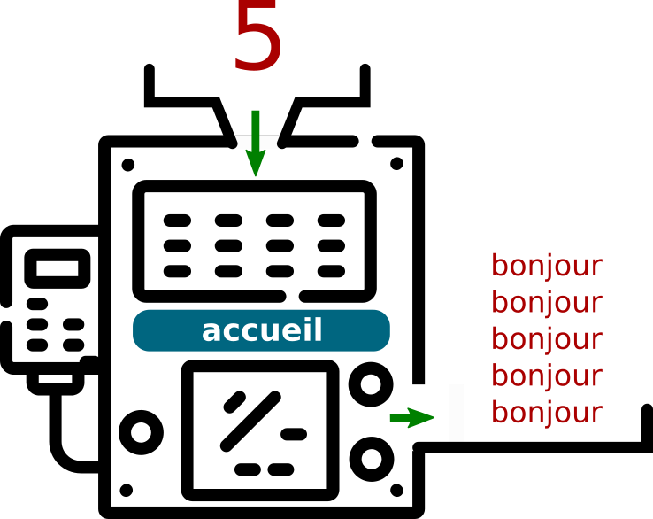
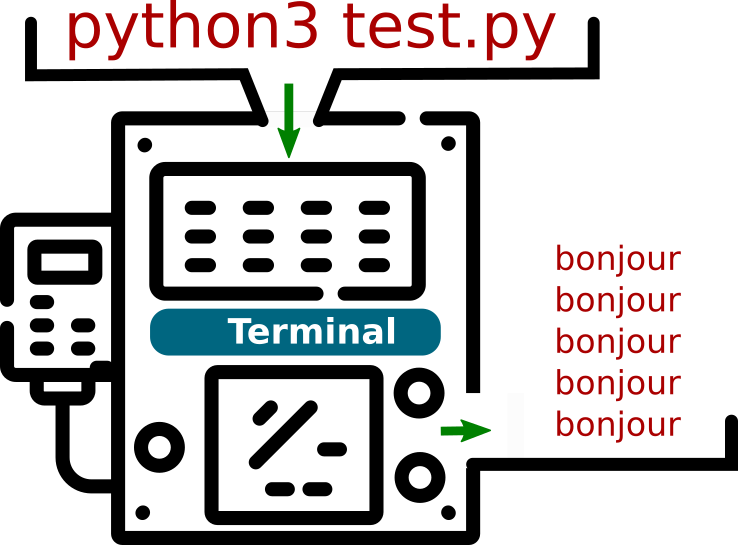
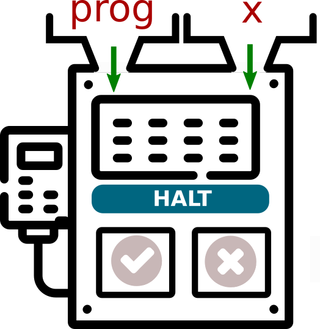
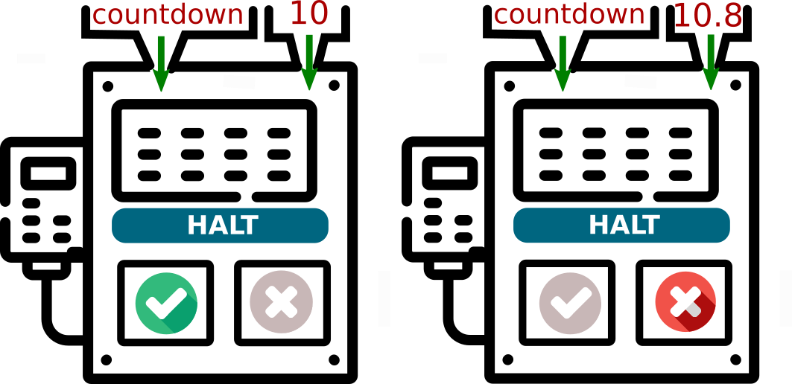
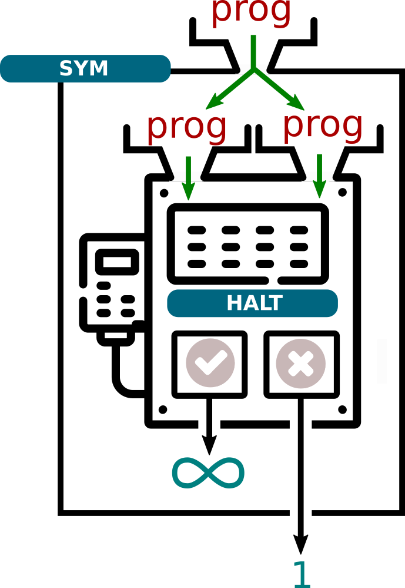
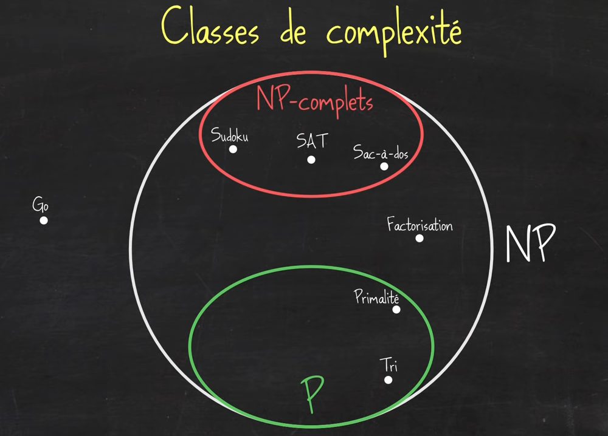




 


{{ titre_chapitre(num,titre,theme,niveau)}}


## Un programme comme paramètre d'un programme

Les codes que nous manipulons ressemblent souvent à cela :
```python
def accueil(n):
    for k in range(n):
        print("bonjour")
```

Le programme s'appelle ```accueil```, et pour fonctionner il a besoin d'un paramètre, qui sera ici un nombre entier ```n```.

Voici comment nous pouvons représenter notre machine ```accueil```, son paramètre d'entrée (5) et sa sortie (les 5 «bonjour»)

{: .center width="30%"}


Maintenant, enregistrons le code suivant dans un fichier ```test.py``` :
```python
def accueil(n):
    for k in range(n):
        print("bonjour")

accueil(5)
```

Pour exécuter ce code, nous devons taper dans un terminal l'instruction suivante :
```python3 test.py```, ce qui donnera 
{: .center}


Le programme utilisé est alors ```python3```, qui prend comme paramètre le programme ```test.py```. Ce paramètre ```test.py``` est un ensemble de caractères qui contient les instructions que le programme ```python3``` va interpréter. 

L'illustration correspondante sera donc :

{: .center width="30%"}
 

Mais nous pouvons aller encore plus loin : l'instruction ```python3 test.py``` est tapée dans mon Terminal Linux, qui lui-même est un programme appelé ```Terminal```.

Et donc :
{: .center width="30%"}


Conclusion :

**Il n'y a donc aucun obstacle à considérer un programme comme une simple donnée, pouvant être reçue en paramètre par un autre programme.** (voire par lui-même !)

> À titre anecdotique, on pourra exécuter avec intérêt cette instruction Python :
> ```a='a=%r;print(a%%a)';print(a%a)``` 
> Ce type de code (magique !) existe dans tous les langages et s'appelle un [quine](https://fr.wikipedia.org/wiki/Quine_(informatique)){. target="_blank"}.


## Mon programme va-t-il s'arrêter ?

### Un exemple

Considérons le programme suivant :

```python
def countdown(n):
    while n != 0:
        print(n)
        n = n - 1
    print("fini")
```

En l'observant attentivement, je peux prévoir que ```countdown(10)``` affichera les nombres de 10 à 1 avant d'écrire "fini". Puis le programme s'arrêtera.

Mais que va provoquer ```countdown(10.8)``` ?

Comme la variable ```n``` ne sera jamais égale à 0, le programme va rentrer dans une boucle infinie, il ne s'arrêtera jamais. Mauvaise nouvelle. 
J'ai pu prévoir ceci en regardant attentivement le code de mon programme. J'ai «remarqué» qu'une variable ```n``` non entière provoquerait une boucle infinie.

**Question :**
Est-ce qu'un programme d'_analyse de programmes_ aurait pu faire cela à ma place ?


### Une machine pour prédire l'arrêt ou non d'un programme.
Après tout, un programme est une suite d'instructions (le code-source), et peut donc être, comme on l'a vu, le paramètre d'entrée d'un autre programme qui l'analyserait. 
Un tel programme (appelons-le ```halt```) prendrait en entrées :

- un paramètre ```prog``` (le code-source du programme)
- un paramètre  ```x```, qui serait le paramètre d'entrée de ```prog```.

 L'instruction ```halt(prog, x)``` renverrait ```True``` si ```prog(x)``` s'arrête, et ```False``` si ```prog(x)``` ne s'arrête pas.
 

{: .center width="30%"}


**Exemple** : 

- ```halt(countdown, 10)``` renverrait ```True```.
- ```halt(countdown, 10.8)``` renverrait ```False```. 

{: .center width="60%"}


**Tentative d'écriture de ```halt``` en Python :**

```python
def halt(prog, x):
    if "prog(x) s'arrête":   # mes excuses, je n'ai pas eu le temps de finir totalement ce code
        return True
    else :
        return False
```

Nous en resterons là pour l'instant dans l'écriture de ce programme. Nous allons nous en servir pour construire d'autres programmes.

### Amusons-nous avec ce programme ```halt```.

Considérons le programme :

```python
def sym(prog):
    if halt(prog, prog) == True:
        while True:
            print("vers l'infini et au-delà !")
    else:
        return 1
```

On peut remarquer que le programme ```halt``` est appelé avec comme paramètres ```prog, prog```, ce qui signifie que ```prog``` se prend lui-même en paramètre. On rappelle que ce n'est pas choquant, un code-source étant une donnée comme une autre.

{: .center width="40%"}

Ce programme ```sym``` reçoit donc en paramètre un programme ```prog```, et :

- va rentrer dans une boucle infinie si ```prog(prog)``` s'arrête.
- va renvoyer 1 si  ```prog(prog)``` ne s'arrête pas.

### Un léger problème ...

Puisqu'un programme peut prendre en paramètre son propre code-source, que donnerait l'appel à ```sym(sym)``` ?

Deux cas peuvent se présenter, suivant si ```halt(sym, sym)``` renvoie ```True``` ou ```False```.

{: .center width="80%"}

* **cas n°1** : ```halt(sym, sym)``` renvoie ```True```, ce qui signifie que ```sym(sym)```  devrait s'arrêter. Mais dans ce cas-là, l'exécution de ```sym(sym)``` rentre dans une boucle infinie. C'est une contradiction.


* **cas n°2** : ```halt(sym, sym)``` renvoie ```False```, ce qui signifie que ```sym(sym)```  rentre dans une boucle infinie. Mais dans ce cas-là, l'exécution de ```sym(sym)``` se termine correctement et renvoie la valeur 1. C'est une contradiction.


### Conclusion

Nous venons de prouver que notre programme ```halt```, censé prédire si un programme ```prog``` peut s'arrêter sur une entrée ```x```, **NE PEUT PAS EXISTER**.

Ce résultat théorique, d'une importance cruciale, s'appelle **le problème de l'arrêt**.

!!! note "Problème de l'arrêt :heart: :heart: :heart:"
    Il **ne peut pas exister** de programme universel qui prendrait en entrées :

     - un programme P 
     - une entrée E de ce programme P

    et qui déterminerait si ce programme P, lancé avec l'entrée E, va s'arrêter ou non. 

{: .center width="40%"}


Ce résultat a été démontré par [Alan Turing](https://fr.wikipedia.org/wiki/Alan_Turing){. target="_blank"} en 1936, dans un article intitulé *«On computable numbers, with an application to the Entscheidungsproblem»*.

{: .center }


Pour sa démonstration, il présente un modèle théorique de machine capable d'exécuter des instructions basiques sur un ruban infini, les [machines de Turing](https://fr.wikipedia.org/wiki/Machine_de_Turing){. target="_blank"}.

À la même époque, le mathématicien [Alonzo Church](https://fr.wikipedia.org/wiki/Alonzo_Church){. target="_blank"} démontre lui aussi ce théorème de l'arrêt, mais par un moyen totalement différent, en inventant le [lambda-calcul](https://fr.wikipedia.org/wiki/Lambda-calcul){. target="_blank"}.

Tous deux mettent ainsi un terme au rêve du mathématicien allemand [David Hilbert](https://fr.wikipedia.org/wiki/David_Hilbert){. target="_blank"}, qui avait en 1928 posé la question de l'existence d'un algorithme capable de répondre «oui» ou «non» à n'importe quel énoncé mathématique posé sous forme décisionnelle («un triangle rectangle peut-il être isocèle ?», «existe-t-il un nombre premier pair ?»)

Cette question, appelée «problème de la décision», ou *Entscheidungsproblem* en allemand, est définitivement tranchée par le problème de l'arrêt : un tel théorème ne peut pas exister, puisque par exemple, aucun algorithme ne peut répondre «oui» ou «non» à la question «ce programme va-t-il s'arrêter ?».


Le théorème de l'arrêt sera étendu plus tard par [le théorème de Rice](https://fr.wikipedia.org/wiki/Th%C3%A9or%C3%A8me_de_Rice){. target="_blank"}.

Ce résultat démontre que toutes les questions sémantiques (non évidentes) au sujet d'un programme sont indécidables :

- «ce programme va-t-il s'arrêter ?» (le théorème de l'arrêt)
- «ce programme va renvoyer la valeur 12 ?» 
- «ce programme va-t-il un jour renvoyer un message d'erreur ?» 
- ...

[Rice](https://en.wikipedia.org/wiki/Henry_Gordon_Rice){. target="_blank"} démontre que toutes ces questions peuvent être ramenées (on dit *réduites*) au théorème de l'arrêt, qui est indécidable.

## Calculabilité

!!! note "Décidabilité et calculabilité"
    Le problème de l'arrêt est dit **indécidable** car la fonction qui le résout (notre brave programme ```halt```) n'est pas **calculable**. 

### Notion de calculabilité
Qu'y a-t-il derrière cette notion de calculabilité ?
Cette notion, qui jette un pont entre les mathématiques (la vision de Church, pour schématiser) et l'informatique (la vision de Turing) n'est pas simple à définir !

Le *calcul* mathématique peut se réduire à une succession d'opérations élémentaires (songez à la multiplication entière comme une série d'additions). Les nombres calculables sont les nombres qui sont générables en un nombre fini d'opérations élémentaires. 
De la même manière, une fonction mathématique sera dite calculable s'il existe une suite finie d'opérations élémentaires permettant de passer d'un nombre x à son image f(x).

On retrouve cette notion d'opérations élémentaires dans les [machines de Turing](https://fr.wikipedia.org/wiki/Machine_de_Turing){. target="_blank"}. 
Cette machine (théorique) permet de simuler tout ce qu'un programme informatique (une suite d'instructions) est capable d'exécuter. Un algorithme peut se réduire à une suite d'opérations élementaires, comme une fonction mathématique peut se réduire à une suite de calculs.
Dès lors, on pourra considérer un algorithme comme une fonction.

 
Turing a démontré que l'ensemble des fonctions calculables, au sens de Church, était équivalent à l'ensemble des fonctions programmables sur sa machine.
Certaines fonctions peuvent être calculables, *ou ne pas l'être* : c'est notamment le cas de notre fonction du problème de l'arrêt. 

### Langages Turing-complets
Ce résultat ne dépend pas du langage utilisé : le fait que nous ayons utilisé Python au paragraphe précédent n'a pas d'influence sur notre démonstration. Nous savons depuis les machines de Turing que tous nos langages de programmation sont **Turing-complets** : ils sont tous capables de faire la même chose (avec plus ou moins de facilité !). 
Scratch, C, Python, Java, Basic, Haskell, Brainfuck... tous ces langages sont théoriquement équivalents : **la calculabilité ne dépend pas du langage utilisé**.


### (HP) Calculable, oui, mais facilement ? -> 1 million de $ à gagner ci-dessous.
L'étude de la calculabilité d'une fonction (à prendre au sens le plus large, c'est-à-dire un algorithme) ne se limite pas à un choix binaire : «calculable» vs «non calculable».  
Parmi les fonctions calculables, certaines peuvent l'être rapidement, et d'autre beaucoup moins.

On retrouve alors la notion bien connue de **complexité** algorithmique, qui permet de classifier les algorithmes suivant leur dépendance à la taille de leurs données d'entrée.

On peut regrouper les problèmes suivant la complexité de l'algorithme qui permet de les résoudre.

#### la classe P

!!! note "Définition de la classe **P**"
    On dira que sont de **«classe P»** tous les problèmes dont l'algorithme de recherche de solution est de **complexité polynomiale**.

Que retrouve-t-on dans la classe P ? Tous les problèmes dont la solution est un algorithme de complexité linéraire, quadratique, logarithmique... Tout mais surtout pas un algorithme de complexité exponentielle.

Pour le résumer très grossièrement, un problème de classe P est un problème que l'on sait résoudre en temps raisonnable (même grand). 

- le problème du tri d'une liste est dans P.
- le problème de la factorisation d'un grand nombre (sur lequel repose la sécurité du RSA) n'est *a priori* **pas** dans P.
- le problème de la primalité («ce nombre est-il premier ?») a longtemps été considéré comme n'étant pas dans P... jusqu'en 2002, où a été découvert le [test de primalité AKS](https://fr.wikipedia.org/wiki/Test_de_primalit%C3%A9_AKS){. target="_blank"}, de complexité polynomiale (d'ordre 6). Ce test est donc maintenant dans P.


#### la classe NP

!!! note "Définition de la classe **NP**"
    On dira que sont de **«classe NP»** tous les problèmes dont l'algorithme de recherche de solution est **Non-déterministe Polynomial**.
 

> Warning : :warning: NP ne signifie **pas** Non-Polynomial !!! :warning:

Que veut dire la formulation «non-déterministe polynomial» ? Cela fait référence à ce que serait capable de faire une machine de Turing (donc, n'importe quel ordinateur) travaillant de manière **non-déterministe**, donc capable d'explorer simultanément plusieurs solutions possibles. On peut imaginer un arbre dont le parcours se ferait simultanément dans toutes les branches, et non en largeur ou profondeur comme nous l'avons vu.

Sur une machine non-déterministe, si la solution à un problème se trouve en temps polynomial, alors ce problème appartient à la classe NP. 

Très bien, mais les machines non-déterministes... cela n'existe pas réellement. Comment caractériser concrètement cette classe de problème ?

Si la solution peut être trouvée de manière polynomiale par une machine non-déterministe, une machine déterministe *qui aurait de la chance* en partant directement vers la bonne solution la trouverait elle aussi de manière polynomiale. On simplifie souvent cela en disant «la vérification de la solution est polynomiale». Cela nous donnne cette définition plus accessible de la classe NP :

!!! note "Définition (plus simple) de la classe **NP**"
    On dira que sont de **«classe NP»** tous les problèmes dont l'algorithme de **vérification** de solution est **polynomial**.

Pour le résumer très grossièrement, un problème de classe NP est un problème dont on sait vérifier facilement si une solution proposée marche ou pas :

- la résolution d'un sudoku est dans NP : si quelqu'un vous montre un sudoku rempli, vous pouvez très rapidement lui dire si sa solution est valable ou pas.
- la factorisation d'un nombre est dans NP : si quelqu'un vous propose 4567*6037 comme décomposition de 27570979, vous pouvez très rapidement lui dire s'il a raison. (oui.)
- le problème du sac à dos (en version décisionnelle) est dans NP. Une proposition de butin peut facilement être examinée pour savoir si elle est possible ou non.
- le problème du voyageur de commerce (ou TSP : Traveller Sales Problem), en version décisionnelle, est dans NP. Si on vous propose un trajet, vous pouvez facilement vérifier que sa longueur est (par exemple) inférieure à 150 km.


Malheureusement, aucun de ces problèmes cités n'a (à ce jour) d'algorithme de **résolution** meilleur qu'exponentiel...

#### P = NP, ou pas ?

Tous les problèmes de P ont une solution qui peut être **trouvée** de manière polynomiale. Donc évidemment, la vérification de cette solution est aussi polynomiale. Donc tous les problèmes de P sont dans NP. On dit que P est inclus dans NP, que l'on écrit **P ⊂ NP**.

Voici une capture d'écran de l'excellente vidéo [Nos algorithmes pourraient-ils être BEAUCOUP plus rapides ? (P=NP ?)](https://www.youtube.com/watch?v=AgtOCNCejQ8){. target="_blank"} de l'excellent David Louapre :

{: .center width="80%"}

On y retrouve (en vert) la classe P, qui contient les algorithmes de tri.
En blanc, la classe NP, qui contient les problèmes de factorisation, du sudoku, du sac-à-dos...


Si quelqu'un trouve un jour un algorithme de polynomial de factorisation, alors le problème de factorisation viendra se ranger dans P. (accessoirement, le RSA sera sans doute détruit par cette découverte, sauf si l'ordre de complexité est très grand)

Mais certains de ces problèmes dans NP ont une propriété remarquable : la résolution polynomiale d'un seul d'entre eux ferait ramener la **totalité** des problèmes NP dans P. On dit que ces problèmes sont NP-complets (marqués en rouge ci-dessus)
Concrètement, si vous trouvez une solution polynomiale de résolution du sudoku, vous entrainez avec lui dans P tous les autres problèmes NP, et vous aurez ainsi prouvé que P = NP.
Accessoirement, vous gagnerez aussi le prix d'[un million de dollars](https://fr.wikipedia.org/wiki/Probl%C3%A8mes_du_prix_du_mill%C3%A9naire){. target="_blank"} promis par la fondation Clay à qui tranchera cette question...
(prix que vous partagerez bien évidemment avec votre professeur de NSI)


Actuellement, à part le grand [Donald Knuth](https://fr.wikipedia.org/wiki/Donald_Knuth){. target="_blank"}, la plupart des chercheurs qui travaillent à ce problème sont plutôt pessimistes, et pensent que P ≠ NP. 
Cela signifie qu'ils pensent que certains problèmes ne pourront jamais avoir une solution polynomiale. 

Alors, P = NP ou P ≠ NP ? Réponse peut-être un jour...


---
## Bibliographie
- D'aprés Gilles Glassus
- Numérique et Sciences Informatiques, Terminale, T. BALABONSKI, S. CONCHON, J.-C. FILLIATRE, K. NGUYEN, éditions ELLIPSES.
- Prépabac NSI, Terminale, G. CONNAN, V. PETROV, G. ROZSAVOLGYI, L. SIGNAC, éditions HATIER.
- https://interstices.info/pnp-elementaire-ma-chere-watson/
- https://interstices.info/alan-turing-du-calculable-a-lindecidable/
- https://www.labri.fr/perso/betrema/MC/MC8.html
- https://scienceetonnante.com/2020/07/17/est-ce-que-p-np/


