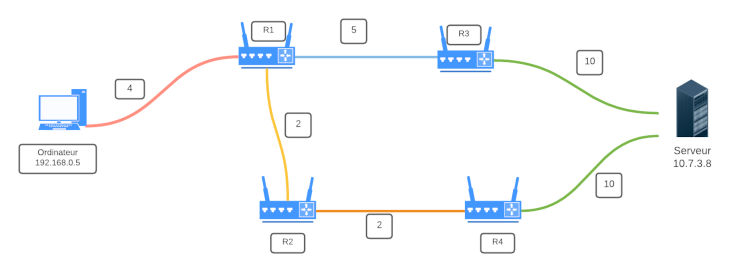
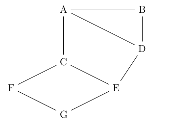
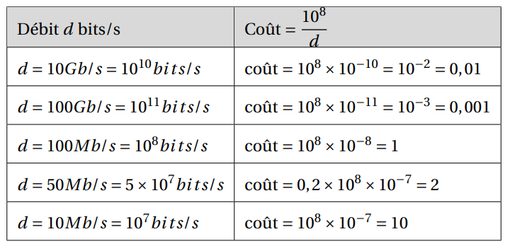
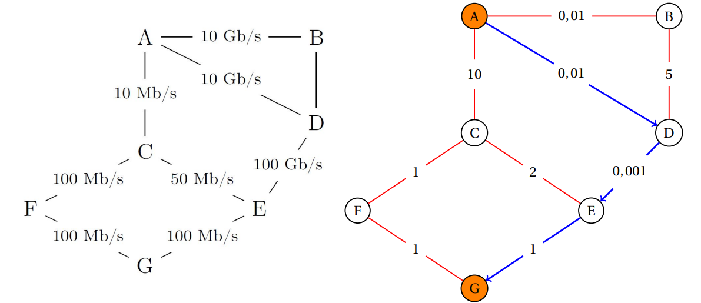
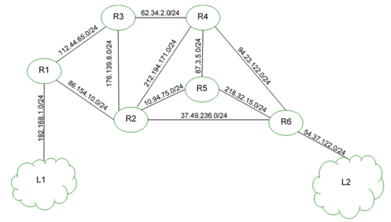
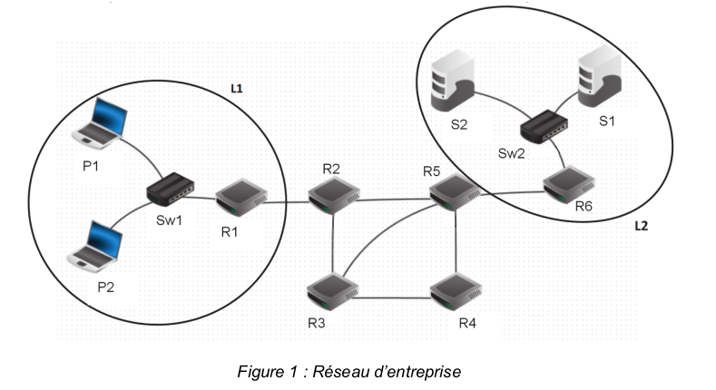
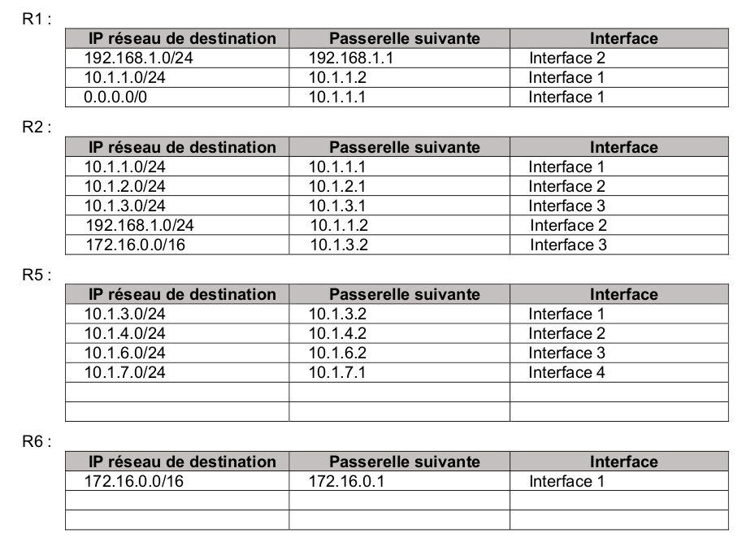

<table  style="background-color: #87A96B; width:100%;color:black;">
    <thead>
        <tr>
            <th style="text-align:center;border:solid;border-width:1px;font-size:20pt;width:70%;">TD n°19 : Protocoles de routage</th>
            <th style="text-align:center;border:solid;border-width:1px;font-size:12pt;width:30%">Thème 3 : Architecture, OS et réseaux  </th>
        </tr>
          <tr>
            <th style="text-align:center;border:solid;border-width:1px;font-size:15pt;width:70%;">COURS et EXERCICES</th>
            <th style="text-align:center;border:solid;border-width:1px;font-size:12pt;width:30%"></th>
        </tr>
    </thead>
</table>


{:.center}

# Résumé des épisodes précédents


## Notion d'adressage

Deux types d'adresses existent :
!!! savoir "Adresse MAC"
    Une adresse matérielle, ou **adresse MAC**, parfois nommée adresse physique, est un identifiant physique stocké dans une carte réseau ou une interface réseau similaire (Wifi par exemple). À moins qu’elle n’ait été modifiée par l’utilisateur, elle est unique au monde.  
    Elle constitue la couche inférieure de la couche de liaison, c'est-à-dire la couche deux du modèle OSI. Elle est constituée de six octets, il existe donc potentiellement $2^{48}$ (environ 281 000 milliards) d'adresses MAC possibles.


!!! savoir "Adresse IP"
    Une **adresse IP (Internet Protocol)** est un numéro d'identification qui est attribué de façon permanente ou provisoire à chaque périphérique relié à un réseau informatique qui utilise l'Internet Protocol. L'adresse IP est à la base du système d'acheminement (le routage) des paquets de données sur Internet.

**Notions essentielles :**
Lorsqu'une machine A, d'adresse IP_A veut discuter avec une machine B, d'adresse IP_B :  

- La machine A calcule (grâce au masque de sous-réseau) si B est dans le même sous-réseau qu'elle, ou pas.  
- Si oui, elle peut donc connaître l'adresse MAC de la carte réseau de la machine B (soit elle la possède déjà dans sa table ARP, soit elle la demande en envoyant un message de broadcast à tout le sous-réseau : «qui possède cette adresse IP_B ?»).  

Elle envoie donc dans le sous-réseau une trame ayant pour entête l'adresse MAC de B : le switch lit cette trame, sait sur quel port est branché la machine B et lui envoie spécifiquement donc le message.  

- Si B n'est pas dans le même sous-réseau que A, A mettra en entête de sa trame l'adresse MAC de la carte réseau du routeur, qui joue le rôle de passerelle. Le routeur va ouvrir la trame et va observer l'IP_B, à qui il doit remettre ce message. C'est maintenant que vont intervenir les protocoles de routage :  

    - est-ce que B est dans le même sous-réseau que le routeur ?
    - est-ce que B est dans un autre sous-réseau connu du routeur ?
    - est-ce que B est totalement inconnu du routeur ?


Ces questions trouveront des réponses grâce à **table de routage** du routeur.

## Tables de routage


{:.center}


Les tables de routage sont des informations stockées dans le routeur permettant d'aiguiller intelligemment les données qui lui sont transmises.

Dans le réseau ci-dessus, si l'ordinateur d'adresse ```192.168.0.5``` veut interroger le serveur ```10.7.3.8``` :  

- l'adresse ```10.7.3.8``` n'étant pas dans le sous-réseau F (d'adresse ```192.168.0.0 / 24```), la requête est confiée au routeur via son adresse passerelle dans le réseau F (ici ```192.168.0.254```).  
- le routeur observe si l'IP recherchée appartient à un autre des sous-réseaux auquel il est connecté. Ici, l'IP recherchée ```10.7.3.8``` n'appartient ni au sous-réseau A ou E.   
- le routeur va donc regarder dans sa table de routage l'adresse passerelle d'un autre routeur vers qui elle doit rediriger les données. Si le sous-réseau C fait partie de sa table de routage, le routeur R1 saura alors que le meilleur chemin est (par exemple) de confier les données au routeur R3.  
- si le sous-réseau C ne fait pas partie de la table de routage, le routeur R1 va alors le rediriger vers une route «par défaut» (que l'on peut assimiler au panneau «toutes directions» sur les panneaux de signalisation).

Par exemple, la table de routage du routeur R1 pourrait être :

| Destination | Passerelle |
|-|-|
| 192.168.0.0 /24 | 192.168.0.254 |
| 172.17.1.0 /24 | 172.17.1.254 |
| 10.0.5.0 /24 | 10.0.5.152 |
| 10.5.2.0 /24 | 172.17.1.254 |
| 10.7.3.0 /24 | 10.0.5.135 |


### Comment sont construites les tables de routage ?  

- Soit à la main par l'administrateur réseau, quand le réseau est petit : on parle alors de table **statique**.
- Soit de manière **dynamique** : les réseaux s'envoient eux-mêmes des informations permettant de mettre à jour leurs tables de routages respectives. Des algorithmes de détermination de meilleur chemin sont alors utilisés : nous allons en découvrir deux, le protocole RIP et le protocole OSPF.

# Le protocole RIP 


!!! savoir " RIP"
    Le Routing Information Protocol est basé sur l'échange (toutes les 30 secondes) des tables de routage de chaque routeur.

Au début, chaque routeur ne connaît que les réseaux auquel il est directement connecté, associé à la distance 1.

Ensuite, chaque routeur reçoit périodiquement la table des réseaux auquel il est connecté :  

- s'il découvre une route vers un nouveau réseau inconnu, il l'ajoute à sa table en augmentant de 1 la distance annoncée par le routeur qui lui a transmis sa table.
- s'il découvre une route vers un réseau connu mais plus courte (en rajoutant 1) que celle qu'il possède dans sa table,  il actualise sa table.
- s'il découvre une route vers un réseau connu mais plus longue que celle qu'il possède dans sa table, il ignore cette route.
- s'il reçoit une route vers un réseau connu en provenance d'un routeur déjà existant dans sa table, s'il met à jour sa table car la topologie du réseau a été modifiée.
- si le réseau n'évolue pas (panne ou ajout de nouveau matériel), les tables de routage _convergent_ vers une valeur stable. Elles n'évoluent plus.
- si un routeur ne reçoit pas pendant 3 minutes d'information de la part d'un routeur qui lui avait auparavant communiqué sa table de routage, ce routeur est considéré comme en panne, et toutes les routes passant par lui sont affectées de la distance infinie : 16.

**Remarques et incovénients:**   

- Le protocole RIP n'admet qu'une distance maximale égale à 15 (ceci explique que 16 soit considéré comme la distance infinie), ce qui le limite aux réseaux de petite taille.

- Chaque routeur n'a jamais connaissance de la topologie du réseau tout entier : il ne le connaît que par ce que les autres routeurs lui ont raconté. On dit que ce protocole de routage est du _routing by rumor_.

- La _métrique_ utilisée (le nombre de sauts) ne tient pas compte de la qualité de la liaison, contrairement au protocole OSPF.    


# Le protocole OSPF


!!! voc "OSPF"
    OSPF : *Open Shortest Path First*

Un inconvénient majeur du protocole RIP précédent est la non-prise en compte de la bande passante reliant les routeurs.

En voiture, le chemin le plus rapide n'est pas forcément le plus court.


{:.center}

_En gris, le chemin RIP. En bleu, l'OSPF._


Dans le protocole OSPF, les tables de routage vont prendre en considération la vitesse de communication entre les routeurs.

Dans une première phase d'initialisation, chaque routeur va acquérir (par succession de messages envoyés et reçus) la connaissance **totale** du réseau (différence fondamentale avec RIP) et de la qualité technique de la liaison entre chaque routeur.

## Les différents types de liaison et leur coût
On peut, approximativement, classer les types de liaison suivant ce tableau de débits **théoriques** :


| Technologie | BP descendante | BP montante |
|:---:|:---:|:---:|
| Modem | 56 kbit/s | 48 kbit/s |
| Bluetooth | 3 Mbit/s | 3 Mbit/s |
| Ethernet | 10 Mbit/s | 10 Mbit/s |
| Wi-Fi |  10 Mbit/s ~ 10 Gbits/s | 10 Mbit/s ~ 10 Gbits/s |
| ADSL | 13 Mbit/s | 1 Mbit/s |
| 4G | 100 Mbit/s | 50 Mbit/s |
| Satellite | 50 Mbit/s | 1 Mbit/s |
| Fast Ethernet | 100 Mbit/s | 100 Mbit/s |
| FFTH (fibre) | 10 Gbit/s | 10 Gbit/s |
| 5G | 20 Gbit/s | 10 Gbit/s |


L'idée du protocole OSPF est de pondérer chaque trajet entre routeurs (comptant simplement pour «1» dans le protocole RIP) par une valeur de **coût** inversement proportionnelle au débit de transfert.

Par exemple, si le débit _d_ est exprimé en bits/s, on peut calculer le coût de chaque liaison par la formule :

!!! savoir "A connaitre" 
    $\text{coût} = \dfrac{10^8}{d}$


Cette formule de calcul peut être différente suivant les exercices, et sera normalement redonnée. Néanmoins la valeur _d_ sera toujours au dénominateur, pour assurer la proportionnalité inverse du débit.


Avec cette convention, un route entre deux routeurs reliés en Fast Ethernet (100 Mbits/s) aura a un poids de 1, une liaison satellite de 20 Mbits/s aura un poids de 5, etc.

## Exemple

Reprenons le réseau suivant :

{:.center}

et simplifions-le en ne gardant que les liens entre routeurs, en indiquant leur débit :


{:.center}

Notre réseau est devenu un **graphe**. Nous allons pondérer ses arêtes avec la fonction coût introduite précédemment. L'unité étant le Mbit/s, l'arête entre R1 et R3 aura un poids de 100/20=5.

Le graphe pondéré est donc :


{:.center}

Le chemin le plus rapide pour aller de l'ordinateur au serveur est donc R1-R2-R4, et non plus R1-R3 comme l'aurait indiqué le protocole RIP.

## Trouver le plus court chemin dans un graphe pondéré
L'exemple précédent était très simple et de solution intuitive. Dans le cas d'un graphe pondéré complexe, existe-t-il un algorithme de détermination du plus court chemin d'un point à un autre ?

La réponse est **oui**, depuis la découverte en 1959 par Edsger Dijkstra de l'algorithme qui porte son nom, **l'algorithme de Dijkstra**.

Pour le comprendre, vous pouvez regarder la vidéo d'un célèbre YouTuber :


<a href="https://www.youtube.com/watch?v=rHylCtXtdNs">


{:.center}</a>

Cet algorithme, ici exécuté de manière manuelle, est bien sûr programmable. Et c'est donc grâce à lui que chaque routeur calcule la route la plus rapide pour acheminer les données qu'il reçoit.

**Exemple** d'application de l'algorithme de Dijkstra :


{:.center}

Donner le plus court chemin pour aller de A à H.

# Exercices BAC 

## Sujet n°1 : sujet zéro 

 On considère un réseau composé de plusieurs routeurs reliés de la façon suivante :


 {:.center}

### &#10145; Le protocole RIP  

Le protocole RIP permet de construire les tables de routage des différents routeurs, en indiquant pour chaque routeur la distance, en nombre de sauts, qui le sépare d’un autre routeur. Pour le réseau ci-dessus, on dispose des tables de routage suivantes :

 {:.center}

 {:.center}

 {:.center}

!!! question "Question 1"
    === "Enoncé"
        1. Le routeur A doit transmettre un message au routeur G, en effectuant un nombre minimal de sauts. Déterminer le trajet parcouru.  
        2. Déterminer une table de routage possible pour le routeur G obtenu à l’aide du protocole RIP.

    === "Solution"
        trjet possible ACFG 'Lecture des table de routage. La distance est de 3.


!!! question "Question 2"
    === "Enoncé"
        Le routeur C tombe en panne. Reconstruire la table de routage du routeur A en suivant le protocole RIP.

    === "Solution"
        {:.center}

### &#10145; Le protocole OSPF  

Contrairement au protocole RIP, l’objectif n’est plus de minimiser le nombre de routeurs traversés par un paquet. La notion de distance utilisée dans le protocole OSPF est uniquement liée aux coûts des liaisons.  
L’objectif est alors de minimiser la somme des coûts des liaisons traversées.  
Le coût d’une liaison est donné par la formule suivante :  

$coût = \dfrac{10^8}{d}$

où $d$ est la bande passante en bits/s entre les deux routeurs.  

On a rajouté sur le graphe représentant le réseau précédent les différents débits des liaisons.  
On rappelle que 1 Gb/s = 1 000 Mb/s = $10^9$ bits/s.

{:.center}


!!! question "Question 3"
    === "Enoncé"
        1. Vérifier que le coût de la liaison entre les routeurs A et B est 0,01.
        2. La liaison entre le routeur B et D a un coût de 5. Quel est le débit de cette liaison ?

    === "Solution 3.1"
        A -> B : 10 Gb/s soit un coût : $\dfrac{10^8}{10 \times 10^9}=0.01$
    === "Solution 3.2"
        $\dfrac{10^8}{d}=5 \rightarrow d=\dfrac{10^8}{5} = 2 \times 10^7$ b/s soit 20 Mb/s


!!! question "Question 4"
    === "Enoncé"
        Le routeur A doit transmettre un message au routeur G, en empruntant le chemin dont la somme des coûts sera la plus petite possible. Déterminer le chemin parcouru. On indiquera le raisonnement utilisé.


    === "Solution"
        {:.center}
        {:.center}
        {:.center}  

        Le parcourt avec un coût minimal pour aller de A à G est donc ADEG dont le coût est 1,011.

        [Correction](data_sujet_0/corr_tab.png) du tableau de l'algorithme de Dijkstra


## Sujet n°2

_Cet exercice porte sur les réseaux et les protocoles de routage._  

On représente ci-dessous un réseau dans lequel R1, R2, R3, R4, R5 et R6 sont des routeurs. Le réseau local L1 est relié au routeur R1 et le réseau local L2 au routeur R6.

{:.center}

**Rappels et notations**  
Dans cet exercice, les adresses IP sont composées de 4 octets, soit 32 bits. Elles sont notées X1.X2.X3.X4, où X1, X2, X3 et X4 sont les valeurs des 4 octets, convertis en notation décimale.  
La notation X1.X2.X3.X4/n signifie que les n premiers bits de poids forts de l’adresse IP représentent la partie « réseau », les bits suivants représentent la partie « hôte ».  
Toutes les adresses des hôtes connectés à un réseau local ont la même partie réseau et peuvent donc communiquer directement. L’adresse IP dont tous les bits de la partie « hôte » sont à 0 est appelée « adresse du réseau ».  

On donne également des extraits de la table de routage des routeurs R1 à R5 dans le tableau suivant :

|Routeur|Réseau destinataire|Passerelle|Interface|
|:---:|:---:|:---:|:---:|
|R1|54.37.122.0/24|86.154.10.1|86.154.10.56|
|R2|54.37.122.0/24|37.49.236.22|37.49.236.23|
|R3|54.37.122.0/24|62.34.2.8|62.34.2.9|
|R4|54.37.122.0/24|94.23.122.10|94.23.122.11|
|R5|54.37.122.0/24|218.32.15.1|218.32.15.2|


!!! question "Question 1" 
    === "Enoncé" 
        Un paquet part du réseau local L1 à destination du réseau local L2.  

        a. En utilisant l’extrait de la table de routage de R1, vers quel routeur R1 envoie-t-il ce paquet : R2 ou R3 ? Justifier.  
        b. A l’aide des extraits de tables de routage ci-dessus, nommer les routeurs traversés par ce paquet, lorsqu’il va du réseau L1 au réseau L2.

    === "Solution 1.a"
        L’extrait de la table de routage de R1 montre que pour atteindre le réseau L2 (57.37.122.0/24) les paquets doivent être envoyés via l’interface 86.154.10.56. Cette interface fait partie du réseau 86.154.10.0/24. Le routeur R2 fait aussi partie de ce réseau. On peut donc affirmer que depuis R1, les paquets seront dirigés vers R2.

    === "Solution 1.b"
        L1 -> R1 -> R2 -> R6 -> L2


!!! question "Question 2"
    === "Enoncé" 
        La liaison entre R1 et R2 est rompue.  
        
        a. Sachant que ce réseau utilise le protocole RIP (distance en nombre de sauts), donner l’un des deux chemins possibles que pourra suivre un paquet allant de L1 vers L2.  
        b. Dans les extraits de tables de routage ci-dessus, pour le chemin de la question 2.a, quelle(s) ligne(s) sera (seront) modifiée(s) ?
    === "Solution 2.a"
        L1 -> R1 -> R3 -> R4 -> R6 -> L2

    === "Solution 2.b"
        Vu le chemin choisi à la question 2a, seule la ligne R1 sera modifiée (réseau 112.44.65.0 à la place du réseau 86.154.10.0).

!!! question "Question 3"
    === "Enoncé"
        On a rétabli la liaison entre R1 et R2.  
        Par ailleurs, pour tenir compte du débit des liaisons, on décide d’utiliser le protocole OSPF (distance liée au coût minimal des liaisons) pour effectuer le routage. Le coût des liaisons entre les routeurs est donné par le tableau suivant : 

        |Liaison |R1-R2 |R1-R3 |R2-R3 |R2-R4 |R2-R5 |R2-R6 |R3-R4 |R4-R5 |R4-R6 |R5-R6|
        |:---:|:---:|:---:|:---:|:---:|:---:|:---:|:---:|:---:|:---:|:---:|
        |Coût | 100|100|?|1|10|10|10|1|10|1|

        a. Le coût $C$ d'une liaison est donné ici par la formule ଽ  

        $C=\dfrac{10^9}{BP}$
    
        où $BP$ est la bande passante de la connexion en bps (bit par seconde).  
        Sachant que la bande passante de la liaison R2-R3 est de 10 Mbps, calculer le coût correspondant.  
        b. Déterminer le chemin parcouru par un paquet partant du réseau L1 et arrivant au réseau L2, en utilisant le protocole OSPF.  
        c. Indiquer pour quel(s) routeur(s) l’extrait de la table de routage sera modifié pour un paquet à destination de L2, avec la métrique OSPF.


    === "Solution 2.b"
        $C = \dfrac{10^9}{10^7} = 100$

    === "Solution 2.b"
        La route avec le coût minimum (103) est la suivante :  
        L1 -> R1 -> R2 -> R4 -> R5 -> R6 -> L2

    === "Solution 2.b"
        Les tables de routage R2 et R4 seront modifiées.

# Sujet n°3 

Cet exercice porte sur les réseaux et les protocoles de routage.

{:.center}

La figure 1 ci-dessus représente le schéma d’un réseau d’entreprise. Il y figure deux réseaux locaux L1 et L2. Ces deux réseaux locaux sont interconnectés par les routeurs R2, R3, R4 et R5. Le réseau local L1 est constitué des PC portables P1 et P2 connectés à la passerelle R1 par le switch Sw1. Les serveurs S1 et S2 sont connectés à la passerelle R6 par le switch Sw2.  
Le tableau 1 suivant indique les adresses IPv4 des machines constituants le réseau de l’entreprise.  

|Nom|Type|Adresse IPv4|
|:---:|:---:|---:|
|R1|routeur (passerelle)|Interface 1 : 192.168.1.1/24  
|||Interface 2 : 10.1.1.2/24|
|R2|routeur|Interface 1 : 10.1.1.1/24
|||Interface 2 : 10.1.2.1/24|
|||Interface 3 : 10.1.3.1/24|
|R3|routeur|Interface 1 : 10.1.2.2/24|
|||Interface 2 : 10.1.4.2/24|
|||Interface 3 : 10.1.5.2/24|
|R4|routeur|Interface 1 : 10.1.5.1/24|
|||Interface 2 : 10.1.6.1/24|
|R5|routeur (passerelle)|Interface 1 : 10.1.3.2/24|
|||Interface 2 : 10.1.4.1/24|
|||Interface 3 : 10.1.6.2/24|
|||Interface 4 : 10.1.7.1/24|
|R6| routeur (passerelle) |Interface 1 : 172.16.0.1/16|
|||Interface 2 : 10.1.7.2/24|
|P1|ordinateur portable|192.168.1.40/24|
|P2|ordinateur portable|192.168.1.46/24|
|S1|serveur|172.16.8.10/16|
|S2|serveur|172.16.9.12/16|

**Rappels et notations**  
Rappelons qu’une adresse IP est composée de 4 octets, soit 32 bits. Elle est notée X1.X2.X3.X4, où X1, X2, X3 et X4 sont les valeurs des 4 octets. Dans le tableau 1, les valeurs des 4 octets ont été converties en notation décimale.  
La notation X1.X2.X3.X4/n signifie que les n premiers bits de poids forts de l’adresse IP représentent la partie « réseau », les bits suivants de poids faibles représentent la partie « machine ».  
Toutes les adresses des machines connectées à un réseau local ont la même partie réseau.  
L’adresse IP dont tous les bits de la partie « machine » sont à 0 est appelée « adresse du réseau ». L’adresse IP dont tous les bits de la partie « machine » sont à 1 est appelée « adresse de diffusion ».

!!! question "Question 1"
    === "Enoncé" 
        a. Quelles sont les adresses des réseaux locaux L1 et L2 ?  
        b. Donner la plus petite et la plus grande adresse IP valides pouvant être attribuées à un ordinateur portable ou un serveur sur chacun des réseaux L1 et L2 sachant que l’adresse du réseau et l’adresse de diffusion ne peuvent pas être attribuées à une machine.  
        c. Combien de machines peut-on connecter au maximum à chacun des réseaux locaux L1 et L2 ? On donne ci-dessous les valeurs de quelques puissances de 2 ?

        |$2^6$|$2^7$|$2^8$|$2^9$|$2^{10}$|$2^{11}$|$2^{12}$|$2^{13}$|$2^{14}$|$2^{15}$|$2^{16}$|$2^{17}$|
        |:--:|:--:|:--:|:--:|:--:|:--:|:--:|:--:|:--:|:--:|:--:|:--:|
        |64|128|256|512|1024|2048|4096|8192|16384 |32768| 65536 |131072|

    === "Solution 1.a"
        L1 : 192.168.1.0/24    L2 : 172.16.0.0/16

    === "Solution 1.b"
        
        - réseau L1 : plus “petite : 192.168.1.1 ; plus “grande” : 192.168.1.254  
        - réseau L2 : plus “petite” : 172.16.0.1 ; plus “grande” : 172.16.255.254

    === "Solution 1.c"
        réseau L1 : 256 - 2 = 254 adresses réseau L2 : $256^2 - 2 = 2^{16} - 2 = 65534$ adresses

!!! question "Question 2"
    === "Enoncé"
        a. Expliquer l’utilité d’avoir plusieurs chemins possibles reliant les réseaux L1 et L2.  
        b. Quel est le chemin le plus court en nombre de sauts pour relier R1 et R6 ? Donner le nombre de sauts de ce chemin et préciser les routeurs utilisés.  
        c. La bande passante d’une liaison Ether (quantité d’information qui peut être transmise en bits/s) est de 107 bits/s et celle d’une liaison FastEther est de 108 bits/s. Le coût d’une liaison est défini par 10଼ ⁄d, où d est sa bande passante en bits/s.

        |Liaison |R1-R2 |R2-R5 |R5-R6 |R2-R3|R3-R4|R4-R5|R3-R5|
        |:---:|:---:|:---:|:---:|:---:|:---:|:---:|:---:|
        |Type |Ether |Ether |Ether |FastEther |FastEther |FastEther |Ether|

        Quel est le chemin reliant R1 et R6 qui a le plus petit coût ? Donner le coût de ce chemin et préciser les routeurs utilisés.


    === "Solution 2.a"
        Il est utile d’avoir plusieurs chemins possibles en cas de panne (routeur ou connexion entre routeurs) ou encore en cas de trafic réseau trop important au niveau d’un routeur.

    === "Solution 2.b"
        Pour relier R1 à R6 il est possible d’effectuer seulement 2 sauts : R1 -> R2 -> R5 -> R6

    === "Solution 3.c"
        
        |Liaison|R1-R2|R2-R5|R5-R6|R2-R3|R3-R4|R4-R5|R3-R5|
        |:---:|:---:|:---:|:---:|:---:|:---:|:---:|:---:|
        |coût|10|10|10|1|1|1|10|
        
         Le chemin reliant R1 à R6 ayant le plus petit coût est R1 -> R2 -> R3 -> R4 -> R5 -> R6 avec un coût de :   
         10 (R1-R2) + 1 (R2-R3) + 1 (R3-R4) + 1 (R4-R5) + 10 (R5-R6) = 23


!!! question "Question 3"
    === "Enoncé"
        Dans l’annexe A figurent les tables de routages des routeurs R1, R2, R5 et R6 au démarrage du réseau. Indiquer sur votre copie ce qui doit figurer dans les lignes laissées vides des tables de routage des routeurs R5 et R6 pour que les échanges entre les ordinateurs des réseaux L1 et L2 se fassent en empruntant le chemin le plus court en nombre de sauts.

    === "Solution 3"
        Il est utile d’avoir plusieurs chemins possibles en cas de panne (routeur ou connexion entre routeurs) ou encore en cas de trafic réseau trop important au niveau d’un routeur.


!!! info "Annexe"
    {:.center}