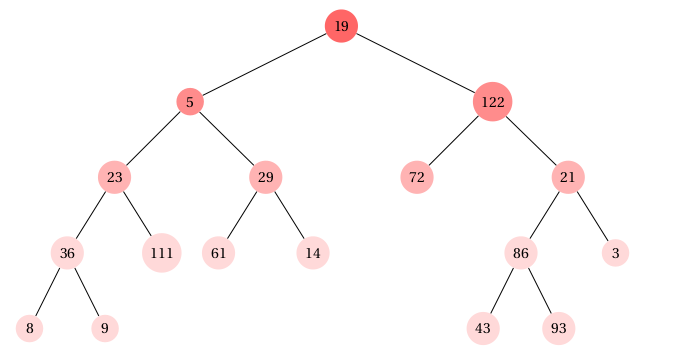

<table  style="background-color: #d2d924; width:100%;color:black;">
    <thead>
        <tr>
            <th style="text-align:center;border:solid;border-width:1px;font-size:20pt;width:70%;">Révision : Structures de données - Les Arbres</th>
            <th style="text-align:center;border:solid;border-width:1px;font-size:12pt;width:30%">Structures de donnée </th>
        </tr>
          <tr>
            <th style="text-align:center;border:solid;border-width:1px;font-size:15pt;width:70%;">COURS et EXERCICES</th>
            <th style="text-align:center;border:solid;border-width:1px;font-size:12pt;width:30%"></th>
        </tr>
    </thead>
</table>


!!! example "Exercice n°1 :"
    $((2 − 10) × 2 + (3 + 7) × 6)/(9 + (8 × (1 + 4)))$  

    Représenter cette expression par un arbre binaire dans lequel les noeuds sont les opérations et les feuilles, les nombres.

!!! example "Exercice n°2 :"
    On donne une liste aléatoire de 13 entiers : [22, 31, 56, 12, 51, 8, 35, 7, 3, 14, 44, 2, 6]  
    Question 1. Construire dans l’ordre de la liste l’arbre binaire de recherche associé.  
    Question 2. Quelle est la hauteur de cet arbre ?  
    Question 3. Construire un arbre équilibré pour cette même liste d’entiers.  
    Question 4. Quelle est la hauteur de l’arbre équilibré ?  

!!! example "Exercice n°3 :"
    On considère la class suivante et l’arbre suivant :

    ```python 
    class Arbre:
        def __init__(self,valeur):
            """Initialisation de l'arbre racine+sous-arbre gauche et sous-arbre droit"""
            self.v=valeur
            self.fg=None
            self.fd=None
            
        def ajout_gauche(self,val):
            """Ajout valeur dans le sous-arbre gauche sous la forme [val,None,None]"""
            self.fg=Arbre(val)
        
        def ajout_droit(self,val):
            """ Ajout valeur dans le sous-arbre droit sous la forme [val,None,None]"""
            self.fd=Arbre(val)

        def affiche(self):
            """permet d'afficher un arbre"""
            if self==None:
                return None
            else :
                return [self.v,Arbre.affiche(self.fg),Arbre.affiche(self.fd)]
                
        def get_valeur(self):
            """ renvoie la valeur du noeud"""
            if self==None:
                return None
            else:
                return print(self.v)
    ```

    {:.center}

    Question 1 : Implémenter l’arbre suivant avec la class donnée.  
    Question 2 : Donner le résultat du parcours en profondeur infixe.  
    Question 3 : Donner le résultat du parcours en profondeur préfixe.  
    Question 4 : Donner le résultat du parcours en profondeur sufixe.  
    Question 5 : Donner le résultat du parcours en largeur.


!!! example "Exercice n°4 :"
    On considère le labyrinthe ci-dessous :  

    {:.center}

    Construire un arbre binaire représentant ce labyrinthe dans lequel chaque case est représentée par un noeud. On partira du noeud noté (4, 0) et chaque noeud sera noté $(i , j)$ où $i$ et $j$ représentent respectivement la ligne et la colonne de la case correspondante.  

        