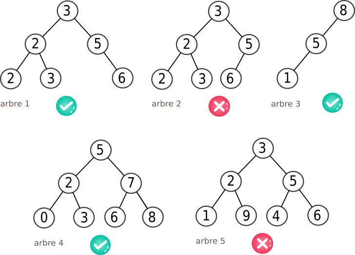
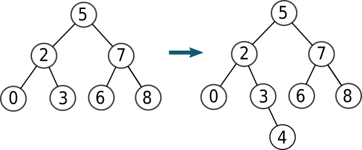




 


{{ titre_chapitre(num,titre,theme,niveau)}}


## Arbres binaires de recherche (ABR)

!!! jeretiens "Définition d'un ABR :heart:"
    Un **arbre binaire de recherche** est un arbre binaire dont les valeurs des nœuds (valeurs qu'on appelle étiquettes, ou clés) vérifient la propriété suivante :

    - l'étiquette d'un nœud est **supérieure ou égale** à celle de **chaque** nœud de son **sous-arbre gauche**.  
    - l'étiquette d'un nœud est **strictement inférieure** à celle du **chaque** nœud de son **sous-arbre droit**.  

{: .center}

À noter que l'arbre 3 (qui est bien un ABR) est appelé **arbre filiforme**. 

L'arbre 5 n'est pas un ABR à cause de la feuille 9, qui fait partie du sous-arbre gauche de 3 sans lui être inférieure.

**Remarque :** on pourrait aussi définir un ABR comme un arbre dont le parcours infixe est une suite croissante.

### Déterminer si un arbre est un ABR

Employer une méthode récursive imposerait de garder en mémoire dans l'exploration des sous-arbres la valeur maximale ou minimale. Nous allons plutôt utiliser la remarque précédente, et nous servir du parcours infixe.

!!! method
    récupérer le parcours infixe dans une liste, et faire un test sur cette liste.


!!! note "Être ou ne pas être un ABR :heart:"
    ```python linenums='1'
    def infixe(arbre, s = None):
        if s is None:
            s = []
        if arbre is None :
            return None
        infixe(arbre.left, s)
        s.append(arbre.data)
        infixe(arbre.right, s)
        return s


    def est_ABR(arbre):
        '''renvoie un booléen indiquant si arbre est un ABR'''
        parcours = infixe(arbre)
        return parcours == sorted(parcours) # on regarde si le parcours est égal au parcours trié 

    ```


```python
# arbres-tests 

#arbre n°4
a = Arbre(5)
a.left = Arbre(2)
a.right = Arbre(7)
a.left.left = Arbre(0)
a.left.right = Arbre(3)
a.right.left = Arbre(6)
a.right.right = Arbre(8)

#arbre n°5
b = Arbre(3)
b.left = Arbre(2)
b.right = Arbre(5)
b.left.left = Arbre(1)
b.left.right = Arbre(9)
b.right.left = Arbre(4)
b.right.right = Arbre(6)


```


```python
>>> est_ABR(a)
True
>>> est_ABR(b)
False
```


### Rechercher une clé dans un ABR

Un arbre binaire de taille $n$ contient $n$ clés (pas forcément différentes). Pour savoir si une valeur particulière fait partie des clés, on peut parcourir tous les nœuds de l'arbre, jusqu'à trouver (ou pas) cette valeur dans l'arbre. Dans le pire des cas, il faut donc faire $n$ comparaisons.

Mais si l'arbre est un ABR, le fait que les valeurs soient «rangées» va considérablement améliorer la vitesse de recherche de cette clé, puisque la moitié de l'arbre restant sera écartée après chaque comparaison.

!!! note "Recherche d'une clé dans un ABR :heart:"
    ```python
    def contient_valeur(arbre, valeur):
        if arbre is None :
            return False
        if arbre.data == valeur :
            return True
        if valeur < arbre.data :
            return contient_valeur(arbre.left, valeur)
        else:
            return contient_valeur(arbre.right, valeur)

    ```

**Exemple** 

L'arbre ```a``` contient la valeur 8, mais l'arbre ```b``` ne la contient pas :


```python
>>> contient_valeur(a,8)
True
>>> contient_valeur(b,8)
False
```


### Coût de la recherche dans un ABR équilibré 

{: .center}

Imaginons un arbre équilibré de taille $n$. Combien d'étapes faudra-t-il, dans le pire des cas, pour trouver (ou pas) une clé particulière dans cet arbre ?

Après chaque nœud, le nombre de nœuds restant à explorer est divisé par 2. On retrouve là le principe de recherche dichotomique.

S'il faut parcourir tous les étages de l'arbre avant de trouver (ou pas) la clé recherchée, le nombre de nœuds parcourus est donc égal à la hauteur $h$ de l'arbre.

Pour un arbre complet, cette hauteur vérifie la relation $2^h -1= n$. et donc $2^h = n+1$.

$h$ est donc le «nombre de puissance de 2» que l'on peut mettre dans $n+1$. Cette notion s'appelle le logarithme de base 2 et se note $\log_2$.

Par exemple, $\log_2(64)=6$ car $2^6=64$.

Le nombre maximal de nœuds à parcourir pour rechercher une clé dans un ABR équilibré de taille $n$ est donc de l'ordre de $\log_2(n)$, ce qui est très performant !

Pour arbre contenant 1000 valeurs, 10 étapes suffisent.

Cette **complexité logarithmique** est un atout essentiel de la structure d'arbre binaire de recherche.

### Insertion dans un ABR
L'insertion d'une clé va se faire au niveau d'une feuille, donc au bas de l'arbre. Dans la version récursive de l'algorithme d'insertion, que nous allons implémenter, il n'est pourtant pas nécessaire de descendre manuellement dans l'arbre jusqu'au bon endroit : il suffit de distinguer dans lequel des deux sous-arbres gauche et droit doit se trouver la future clé, et d'appeler récursivement la fonction d'insertion dans le sous-arbre en question.

**Algorithme :**

- Si l'arbre est vide, on renvoie un nouvel objet Arbre contenant la clé.
- Sinon, on compare la clé à la valeur du nœud sur lequel on est positionné :
    - Si la clé est inférieure à cette valeur, on va modifier le sous-arbre gauche en le faisant pointer vers ce même sous-arbre une fois que la clé y aura été injecté, par un appel récursif.
    - Si la clé est supérieure, on fait la même chose avec l'arbre de droite.
    - on renvoie le nouvel arbre ainsi créé.

!!! jeretiens "Insertion dans un ABR :heart:"
    ```python
    def insertion(arbre, valeur):
        if arbre is None :
            return Arbre(valeur)
        else :
            v = arbre.data
            if valeur <= v :
                arbre.left = insertion(arbre.left, valeur)
            else:
                arbre.right = insertion(arbre.right, valeur)
            return arbre
    ```

**Exemple :** Nous allons insérer la valeur 4 dans l'arbre ```a``` et vérifier par un parcours infixe (avant et après l'insertion) que la valeur 4 a bien été insérée au bon endroit.

{: .center}


```python
a = Arbre(5)
a.left = Arbre(2)
a.right = Arbre(7)
a.left.left = Arbre(0)
a.left.right = Arbre(3)
a.right.left = Arbre(6)
a.right.right = Arbre(8)
```


```python
>>> infixe(a)
0-2-3-5-6-7-8-
>>> insertion(a,4)
<__main__.Arbre at 0x7f46f0507e80>
>>> infixe(a)
0-2-3-4-5-6-7-8-
```


La valeur 4 a donc bien été insérée au bon endroit.


---
## Bibliographie
- Numérique et Sciences Informatiques, Terminale, T. BALABONSKI, S. CONCHON, J.-C. FILLIATRE, K. NGUYEN, éditions ELLIPSES.


