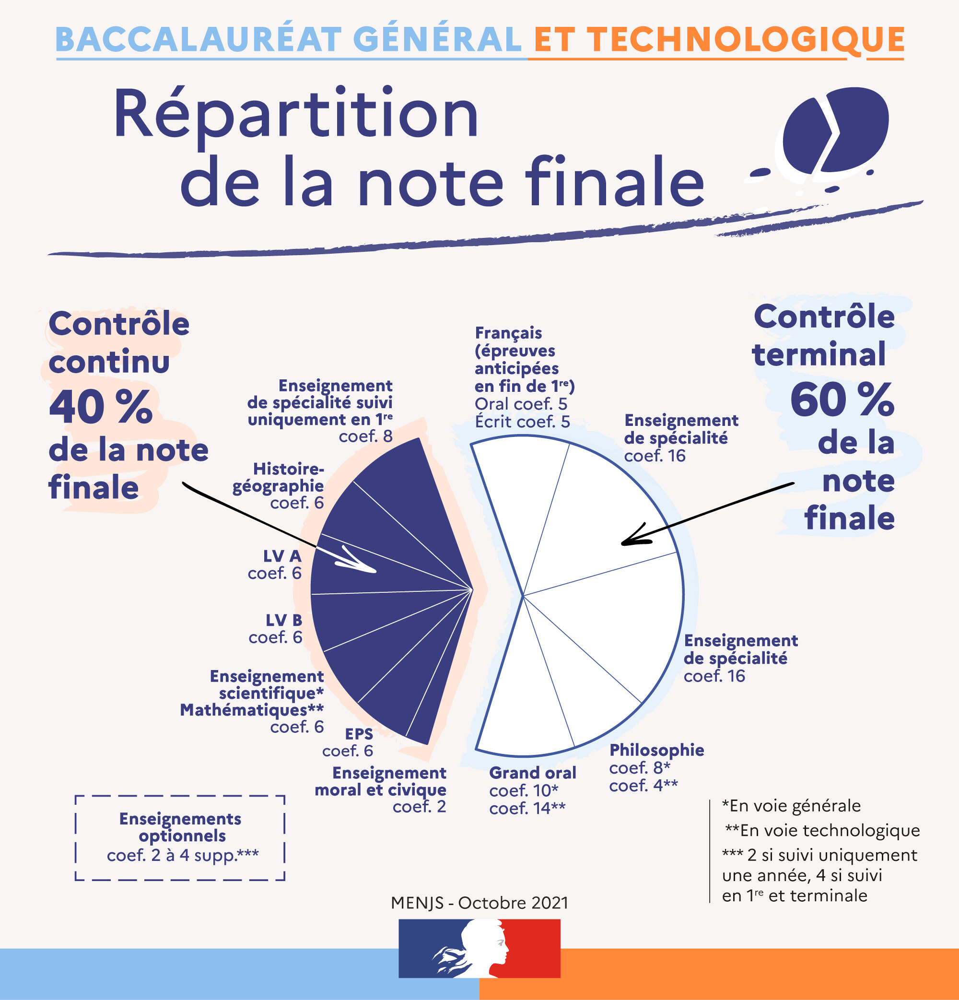

Ce site est dédié aux élèves de Terminales NSI du Lycée Murat à Issoire afin de retrouver les divers TP & TD travaillés en classe.  

Les notebooks sont corrigés et les cellules peuvent être copiées pour être testées dans vos notebooks Capytale.

!!! info "Actualités" 
    - **Thème en cours** : [T5 - Les tris](https://nsimeyroneinc.github.io/NSITerm/Algo/T5_2_algo_tri/)   
    - [Correction des exercices BAC Routage disponibles](https://nsimeyroneinc.github.io/NSITerm/Archi_Materielle/T3_1_Routage_BAC_Correction/)   
    - [Correction des exercices BAC Piles et Files disponibles](StructureDonnees/T2_2_Pile_File_BAC_Correction.md)  
    - **&#127381; : Bientôt disponible** un onglet annales de BAC épreuves écrites.  

## Progression sur l'année

### Liste des chapitres 

{{ affiche_progression("terminale") }}
    

!!! info  "Epreuve BAC 2023"  
    - Les épreuves de spécialité se dérouleront les 20 et 21 mars 2023 pour la N.S.I.  
    - Les épreuves pratiques seront organisées je Jeudi 30 mars 2023.

Le sujet de l’épreuve écrite de la spécialité numérique et sciences informatiques, comporte trois exercices indépendants les uns des autres, qui permettent d’évaluer les connaissances et compétences des candidats. Le sujet comprend obligatoirement au moins un exercice relatif à chacune des trois rubriques suivantes :   

- traitement de données en tables et bases de données;  
- architectures matérielles, systèmes d’exploitation et réseaux;   
- algorithmique, langages et programmation.  
 
## Notions à l'épreuve écrite de Mars 2023 (mis à jours 30/09/2022): 

### &#10145; Thème : Structure de données  

🗹 Structure de données abstraites( file) : interface et implémentation  
🗹 Vocabulaire de la programmation objet : classes, attributs, méthodes, objets 
🗹 Listes, piles, files : structures linéaires. 
□ Dictionnaires, index et clé  
□ Arbres : structures hiérarchiques. Arbres binaires : nœuds, racines, feuilles, sous-arbres gauches, sous-arbres droits

### &#10145; Thème : Base de données  

🗹 Modèle relationnel : relation, attribut, domaine, clef primaire, clef étrangère, schéma relationnel 
🗹 Base de données relationnelle et SGBD.  
🗹 Langage SQL : requêtes d'interrogation et de mise à jour d'une base de données  

### &#10145; Thème : Architectures matérielles, système d’exploitation et réseaux(ARSE)  

□ Gestion des processus et des ressources par un système d'exploitation  
🗹 Protocoles de routage  

### &#10145; Thème : Langage de programmation(LP)  
	
🗹 Récursivité  
□ Modularité  	
□ Mise au point des programmes. Gestion des bugs.

### &#10145; Thème : Algorithmique(A)

□ Algorithmes sur les arbres binaires et sur les arbres binaires de recherche.

□ Méthode « diviser pour régner »

## Comment calculer sa note au BAC 2023 et Répartition des notes :

[Fiche pour calculer sa note au BAC 2023](divers/data/el-ve-de-premiere-comment-calculer-note-bac-2022-94490.pdf){:target="_blank"} 

